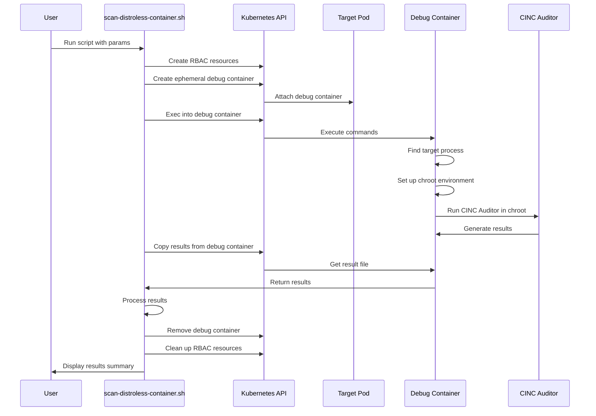

# Debug Container Approach Implementation

This document outlines the technical implementation of the Debug Container approach for scanning distroless containers.

## Core Concept

The Debug Container approach leverages Kubernetes ephemeral containers to:

1. Attach a temporary container with debugging tools to a pod with distroless containers
2. Share process and filesystem namespaces with the target container
3. Access the target container's filesystem through the process filesystem
4. Execute CINC Auditor scans through the debug container
5. Remove the debug container when scanning is complete

## Technical Workflow

### Step 1: Create an Ephemeral Debug Container

```bash
kubectl debug -n <namespace> <pod-name> \
  --image=docker.io/cincproject/auditor:latest \
  --target=<container-name> \
  --container=debug-container \
  --share-processes \
  -- sleep 300
```

This command:

- Attaches a debug container running CINC Auditor to the target pod
- Targets the specific distroless container
- Shares the process namespace
- Makes the debug container sleep to keep it alive during scanning

### Step 2: Access the Target Container's Filesystem

Once the debug container is running:

1. Find the process IDs of the target container

   ```bash
   ps aux
   ```

2. Identify the main process of the target application

   ```bash
   ps aux | grep <app-process-name>
   ```

3. Access the container's filesystem through the process namespace

   ```bash
   cd /proc/<PID>/root/
   ```

### Step 3: Execute CINC Auditor Scan

The scan can be executed in two ways:

#### Option 1: Direct Filesystem Scanning

```bash
cinc-auditor exec <profile-path> \
  --target=/proc/<PID>/root \
  --reporter json:/tmp/results.json
```

This approach:

- Directly targets the filesystem path
- Works for filesystem-based controls
- Has limitations for process and system resource inspections

#### Option 2: Chroot-Based Scanning

```bash
mkdir -p /tmp/target
mount --bind /proc/<PID>/root /tmp/target
chroot /tmp/target cinc-auditor exec <profile-path> \
  --reporter json:/tmp/results.json
```

This approach:

- Creates a more complete environment for scanning
- Makes the target filesystem appear as root
- Allows more accurate scanning of filesystem resources
- Requires elevated permissions for chroot

### Step 4: Retrieve and Process Results

```bash
kubectl cp <namespace>/<pod-name>:/tmp/results.json ./results.json -c debug-container
```

### Step 5: Clean Up Resources

```bash
# Remove the ephemeral container
kubectl delete pod <pod-name> --now
```

## Script Implementation

The project implements this approach in the `scan-distroless-container.sh` script:

```bash
#!/bin/bash
# Usage: ./kubernetes-scripts/scan-distroless-container.sh <namespace> <pod-name> <container-name> <profile-path> [threshold_file]

# Script implementation details...
```

The script automates the following:

1. Create temporary RBAC permissions
2. Generate temporary kubeconfig
3. Detect if the container is distroless
4. Launch debug container with CINC Auditor
5. Execute scan with appropriate chroot
6. Retrieve and process results
7. Clean up temporary resources

## Technical Implementation Details

### Ephemeral Container Definition

The ephemeral container is defined as:

```yaml
ephemeralContainers:
- name: debug-container
  image: docker.io/cincproject/auditor:latest
  command: ["sleep", "300"]
  targetContainerName: <container-name>
  securityContext:
    privileged: true
  shareProcessNamespace: true
```

Key elements:

- `targetContainerName`: Specifies which container to attach to
- `privileged: true`: Required for chroot operations
- `shareProcessNamespace: true`: Enables access to the target container's processes

### RBAC Requirements

Additional RBAC permissions are needed:

```yaml
apiVersion: rbac.authorization.k8s.io/v1
kind: Role
metadata:
  name: scanner-role-distroless
  namespace: ${NAMESPACE}
rules:
- apiGroups: [""]
  resources: ["pods"]
  verbs: ["get", "list"]
- apiGroups: [""]
  resources: ["pods/ephemeralcontainers"]
  verbs: ["get", "create", "update"]
- apiGroups: [""]
  resources: ["pods/exec"]
  verbs: ["create"]
  resourceNames: ["${POD_NAME}"]
- apiGroups: [""]
  resources: ["pods/log"]
  verbs: ["get"]
  resourceNames: ["${POD_NAME}"]
```

The key addition is the `pods/ephemeralcontainers` resource permission.

### Chroot Implementation

The chroot-based scanning uses the following approach:

```bash
# Find the PID of the main process
PID=$(ps aux | grep -v grep | grep -m 1 "<app-identifier>" | awk '{print $2}')

# Create mount point
mkdir -p /tmp/target

# Mount the filesystem
mount --bind /proc/$PID/root /tmp/target

# Execute scan in chroot environment
chroot /tmp/target cinc-auditor exec <profile-path> \
  --reporter json:/tmp/results.json

# Unmount when done
umount /tmp/target
```

## Technical Diagram



## Special Considerations

### Detection of Distroless Containers

The script detects distroless containers by:

1. Attempting to execute a basic command
2. Checking for common shells
3. Looking for specific distroless container patterns

```bash
kubectl exec -n $NAMESPACE $POD_NAME -c $CONTAINER_NAME -- ls /bin/sh &>/dev/null
if [ $? -ne 0 ]; then
  # Container is likely distroless
fi
```

### Security Context Requirements

For chroot-based scanning, the debug container needs:

```yaml
securityContext:
  privileged: true
```

Without this, the chroot operation will fail.

### Limitations and Fallbacks

The script implements fallbacks:

1. First attempts direct filesystem scanning
2. Falls back to chroot if more complete environment access is needed
3. Can operate without chroot but with reduced scan capabilities

## Related Resources

- [Kubernetes Ephemeral Containers Documentation](https://kubernetes.io/docs/concepts/workloads/pods/ephemeral-containers/)
- [Distroless Container Basics](distroless-basics.md)
- [Security Considerations](../index.md)
- [RBAC Configuration](../index.md)
