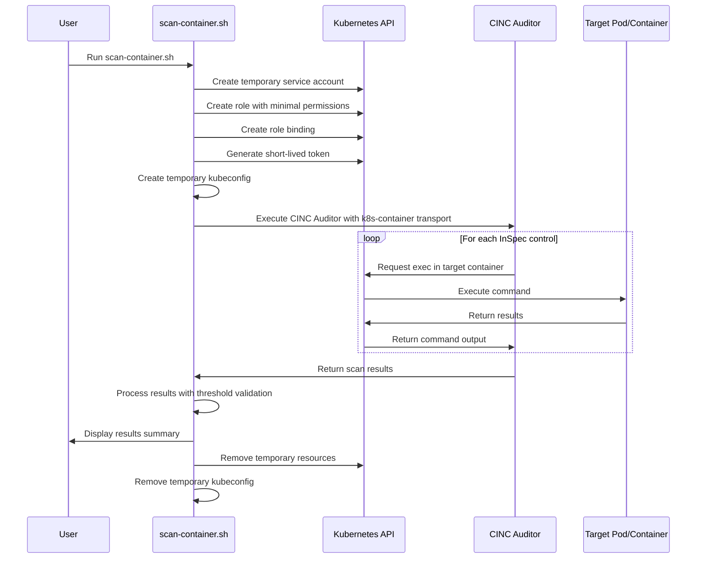

# Kubernetes API Approach Implementation

This document outlines the technical implementation of container scanning using the Kubernetes API approach with CINC Auditor.

## How It Works

The `train-k8s-container` transport connects to pods using the Kubernetes API:

```
inspec exec my-profile -t k8s-container://namespace/pod-name/container-name
```

This transport:

1. Uses `kubectl exec` to run commands inside target containers
2. Accesses container filesystem and system information
3. Executes InSpec controls based on command output and file analysis
4. Generates compliance reports in multiple formats

## Implementation Steps

Our implemented workflow consists of:

1. **Setup minimal RBAC permissions**:
   - Create a temporary service account
   - Assign role with minimal permissions (get, list pods; exec into specific pod)
   - Bind role to service account

2. **Generate temporary access credentials**:
   - Create short-lived token (typically 1-hour expiration)
   - Generate minimal kubeconfig file

3. **Execute scan**:
   - Run CINC Auditor with the k8s-container transport
   - Pass namespace, pod, and container information
   - Utilize InSpec profiles appropriate for the target

4. **Process results**:
   - Generate standard InSpec reports
   - Apply compliance thresholds
   - Integrate with reporting systems

5. **Cleanup**:
   - Remove temporary RBAC resources
   - Delete temporary kubeconfig

## Script Implementation

The project includes the `scan-container.sh` script that implements this approach with the following capabilities:

- Dynamic RBAC creation with minimal permissions
- Short-lived token generation
- Configuration of temporary kubeconfig
- Execution of CINC Auditor scan
- Integration with MITRE SAF-CLI for threshold validation
- Automatic cleanup of resources

```bash
# Example usage:
./kubernetes-scripts/scan-container.sh my-namespace my-pod my-container ./profiles/linux-baseline
```

## Transport Plugin Details

The train-k8s-container transport plugin operates as follows:

1. **Connection Initialization**:
   - Load kubeconfig from KUBECONFIG environment variable or default path
   - Create connection to Kubernetes API server
   - Validate access to target namespace and pod

2. **Command Execution**:
   - For each InSpec resource that needs to execute a command:
     - Create an exec request to the Kubernetes API
     - Execute the command in the target container
     - Capture and return the command output

3. **File Access**:
   - When InSpec needs to access file content or attributes:
     - Use exec with cat or appropriate commands
     - Process the data as needed for the InSpec resource

4. **Resource Mapping**:
   - Map standard InSpec resources to Kubernetes exec calls
   - Handle special cases like process inspection and package management

This approach allows InSpec to "see" the container as if it were directly connected while maintaining the security boundaries of the Kubernetes API.

## Technical Diagram



## Advanced Options

The train-k8s-container plugin supports several advanced options:

- **Command Timeout**: Adjust timeout for long-running commands
- **Error Handling**: Configure how to handle command execution errors
- **Transport Configuration**: Specify custom kubectl path or options
- **Authentication**: Multiple authentication methods (cert, token, username/password)

For additional options, refer to the [InSpec train-k8s-container transport documentation](https://github.com/inspec/train-k8s-container).
