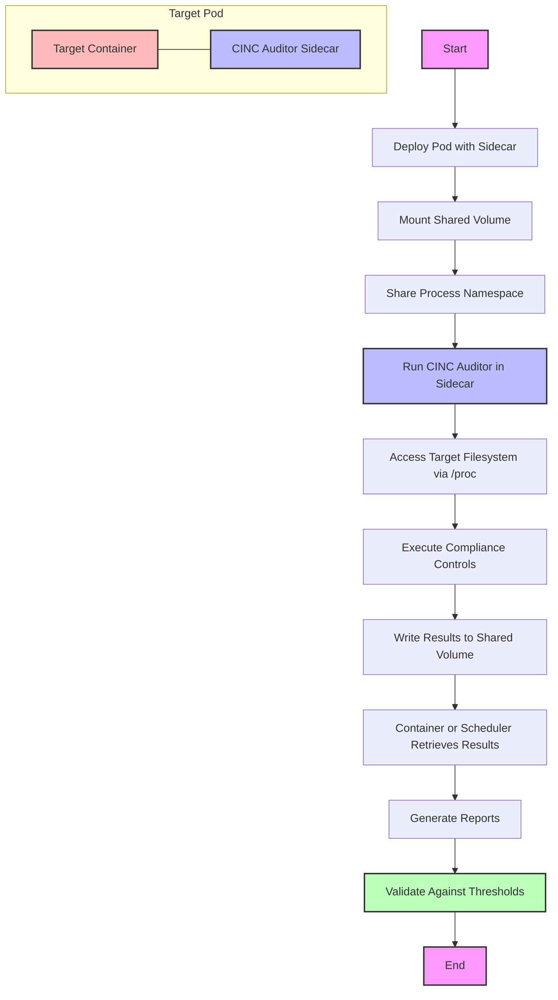

# CINC Auditor Sidecar Container Approach

This document outlines an alternative approach for container scanning using a CINC Auditor sidecar container. This approach is particularly useful for scanning distroless containers and can be an alternative to the ephemeral container approach.

## Overview

The sidecar container approach involves deploying a CINC Auditor container alongside the target container within the same pod. This allows the CINC Auditor container to access the target container's filesystem through the shared process namespace.



## Key Components

1. **Target Container**: The container to be scanned, which could be a regular container or a distroless container.
2. **CINC Auditor Sidecar**: A container with CINC Auditor pre-installed, deployed in the same pod.
3. **Shared Process Namespace**: Enables the sidecar to access the target container's filesystem through /proc.
4. **Shared Volume**: Optional component to make it easier to retrieve scan results.

## Implementation

### Prerequisites

- Kubernetes cluster with support for shared process namespaces (v1.17+)
- RBAC permissions to create pods with shared process namespaces
- A CINC Auditor container image

### Pod Definition

```yaml
apiVersion: v1
kind: Pod
metadata:
  name: app-with-scanner
  namespace: inspec-test
spec:
  shareProcessNamespace: true  # Enable shared process namespace
  containers:
  - name: app
    image: your-app-image:latest
    # Application container configuration
    volumeMounts:
    - name: shared-results
      mountPath: /results
  
  - name: cinc-scanner
    image: cinc-auditor:latest
    command: 
    - "/bin/sh"
    - "-c"
    - |
      # Wait for the main container to start
      sleep 5
      
      # Find the main process of the target container
      TARGET_PID=$(ps aux | grep -v grep | grep -m 1 "app process identifier" | awk '{print $2}')
      
      # Run CINC Auditor against the target filesystem
      cd /
      cinc-auditor exec /opt/profiles/container-baseline \
        -b os=linux \
        --target=/proc/$TARGET_PID/root \
        --reporter json:/results/scan-results.json
      
      # Indicate completion
      touch /results/scan-complete
      
      # Keep the container running to allow result retrieval
      sleep 3600
    volumeMounts:
    - name: shared-results
      mountPath: /results
    - name: profiles
      mountPath: /opt/profiles
  
  volumes:
  - name: shared-results
    emptyDir: {}
  - name: profiles
    configMap:
      name: inspec-profiles
```

### Retrieving Results

Results can be retrieved in several ways:

1. **Kubernetes API**: Retrieve the results from the shared volume using the API
2. **kubectl cp**: Copy results from the pod to the local filesystem
3. **Result Collection Container**: Add a third container to the pod that processes and uploads the results

Example:

```bash
# Wait for scan to complete
kubectl wait --for=condition=ready pod/app-with-scanner -n inspec-test

# Check if scan is complete
kubectl exec -it app-with-scanner -n inspec-test -c cinc-scanner -- ls -la /results

# Copy results if scan-complete file exists
kubectl cp inspec-test/app-with-scanner:/results/scan-results.json ./scan-results.json -c cinc-scanner

# Process results with SAF CLI
saf summary --input ./scan-results.json --output-md ./summary.md
```

## Advantages Over Other Approaches

1. **No Modifications to Train-k8s-container Plugin**: Works with standard CINC Auditor installations.
2. **Deployed Alongside Application**: Can be included in application deployment pipelines.
3. **Works with Any Container Type**: Effective for both standard and distroless containers.
4. **No Need for Ephemeral Containers**: Works with older Kubernetes clusters.
5. **Simpler Implementation**: Requires less custom code than the transport plugin modification approach.

## Limitations

1. **Pod Modification Required**: The target pod must be defined with the sidecar and shared process namespace.
2. **Security Implications**: Sharing process namespaces has security implications that should be considered.
3. **Not Suitable for Existing Pods**: The approach requires creating a new pod with the sidecar, not modifying existing pods.
4. **More Resource Intensive**: Running an additional container consumes more resources than other approaches.

## Example Implementation

### Step 1: Create a ConfigMap with InSpec Profiles

```bash
kubectl create configmap inspec-profiles --from-file=container-baseline=/path/to/profiles/container-baseline -n inspec-test
```

### Step 2: Deploy the Pod with Sidecar

```bash
kubectl apply -f sidecar-scanner-pod.yaml -n inspec-test
```

### Step 3: Wait for the Scan to Complete

```bash
kubectl wait --for=condition=ready pod/app-with-scanner -n inspec-test
until kubectl exec -it app-with-scanner -n inspec-test -c cinc-scanner -- ls /results/scan-complete 2>/dev/null; do
  echo "Waiting for scan to complete..."
  sleep 5
done
```

### Step 4: Retrieve and Process Results

```bash
kubectl cp inspec-test/app-with-scanner:/results/scan-results.json ./scan-results.json -c cinc-scanner
saf summary --input ./scan-results.json --output-md ./summary.md
```

## CI/CD Integration

For CI/CD environments, the sidecar approach can be integrated as follows:

1. **Build Stage**: Build and push the application container.
2. **Test Stage**: Deploy the application with the CINC Auditor sidecar.
3. **Scan Stage**: Wait for the scan to complete and retrieve results.
4. **Validation Stage**: Process results against thresholds.
5. **Cleanup Stage**: Remove the test pod.

Example GitLab CI configuration:

```yaml
stages:
  - build
  - test
  - scan
  - validate
  - cleanup

build:
  stage: build
  script:
    - docker build -t $CI_REGISTRY_IMAGE:$CI_COMMIT_SHA .
    - docker push $CI_REGISTRY_IMAGE:$CI_COMMIT_SHA

deploy_with_sidecar:
  stage: test
  script:
    - envsubst < sidecar-scanner-pod.yaml | kubectl apply -f -

scan:
  stage: scan
  script:
    - kubectl wait --for=condition=ready pod/app-with-scanner -n inspec-test
    - |
      until kubectl exec -it app-with-scanner -n inspec-test -c cinc-scanner -- ls /results/scan-complete 2>/dev/null; do
        echo "Waiting for scan to complete..."
        sleep 5
      done
    - kubectl cp inspec-test/app-with-scanner:/results/scan-results.json ./scan-results.json -c cinc-scanner

validate:
  stage: validate
  script:
    - saf threshold -i ./scan-results.json -t threshold.yml
    - saf summary --input ./scan-results.json --output-md ./summary.md

cleanup:
  stage: cleanup
  script:
    - kubectl delete pod app-with-scanner -n inspec-test
```

## Security Considerations

When implementing the sidecar container approach, consider the following security implications:

1. **Shared Process Namespace**: All containers in the pod can see each other's processes, which could be a security concern.
2. **Temporary Deployments**: For production environments, consider using this approach only for temporary test deployments.
3. **RBAC Restrictions**: Implement strict RBAC to limit which users/systems can deploy pods with shared process namespaces.
4. **Resource Isolation**: Ensure the sidecar container has appropriate resource limits.

## Future Enhancements

Potential improvements to this approach:

1. **Automated Sidecar Injection**: Use a mutating webhook to automatically inject the scanner sidecar.
2. **Results Aggregation**: Implement a results collector that aggregates results from multiple scanned pods.
3. **Optimized CINC Image**: Create a minimal CINC Auditor image specifically designed for sidecars.
4. **Integration with Helm**: Add support for this approach in our Helm charts.

## References

- [Kubernetes Shared Process Namespace Documentation](https://kubernetes.io/docs/tasks/configure-pod-container/share-process-namespace/)
- [CINC Auditor Documentation](https://cinc.sh/start/auditor/)
- [Sidecar Container Pattern](https://kubernetes.io/docs/concepts/workloads/pods/sidecar-containers/)
