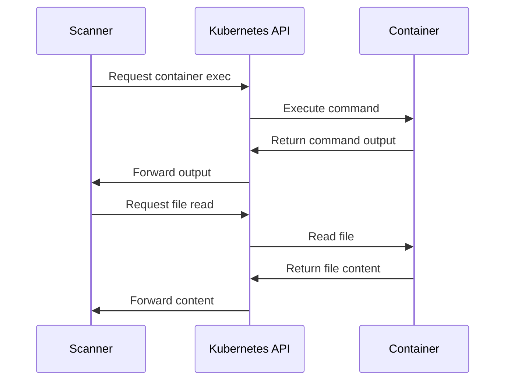
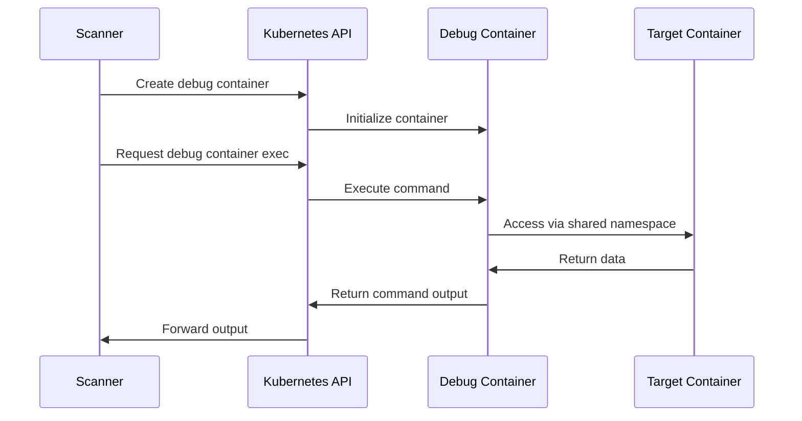
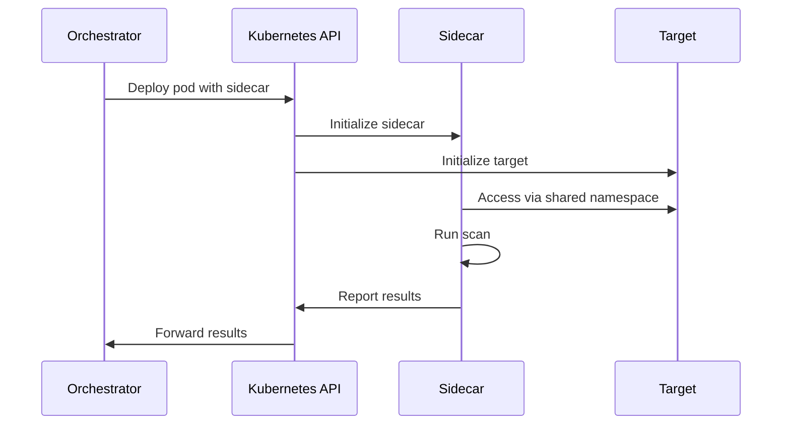

# Component Communication Patterns

This document details how the components of the Kubernetes CINC Secure Scanner communicate with each other and with external systems.

## Communication Flow Overview

The scanning system uses several communication patterns to enable secure container scanning:

1. **API-Based Communication**: Interaction with the Kubernetes API server
2. **Container Exec Communication**: Direct communication with containers
3. **Filesystem Access**: Reading container filesystems
4. **Results Communication**: Transferring scan results
5. **External Integration**: Communication with CI/CD systems

## Kubernetes API Communication

The scanner communicates with the Kubernetes API server to access containers and manage resources.

- **Protocol**: HTTPS with TLS encryption
- **Authentication**: Service account tokens with limited lifespan
- **Authorization**: RBAC-enforced least-privilege access
- **Communication Flow**:
  1. Scanner authenticates to Kubernetes API
  2. API validates token and permissions
  3. Scanner requests container access
  4. API grants or denies access based on RBAC
  5. Scanner performs operations within permission constraints

## Container Access Patterns

Different container types require different access patterns:

### Standard Container Access

### Distroless Container Access

### Sidecar Container Access

## Results Communication

Scan results are communicated through several mechanisms:

- **File-Based**: Results written to files in JSON format
- **Standard Output**: Results streamed through standard output
- **API-Based**: Results sent to configured endpoints
- **Volume-Based**: Results stored in shared volumes (for sidecar approach)

## External Communication

The scanning system communicates with external systems for integration:

- **CI/CD Systems**: Sending scan status and results
- **Compliance Systems**: Reporting compliance status
- **Monitoring Systems**: Reporting scan metrics
- **Alert Systems**: Sending security alerts

## Security Considerations

Communication security is ensured through:

1. **Encryption**: All API communications are encrypted with TLS
2. **Authentication**: Service account tokens authenticate all requests
3. **Authorization**: RBAC enforces least-privilege access
4. **Isolation**: Communication is isolated to specific namespaces
5. **Ephemeral Credentials**: Communication credentials have limited lifespans
6. **Clean Up**: Communication channels are properly closed after use

## Communication Failure Handling

The system handles communication failures through:

1. **Retry Mechanisms**: Failed communications are retried with backoff
2. **Timeout Handling**: Communications have appropriate timeouts
3. **Graceful Degradation**: Partial results are handled appropriately
4. **Error Reporting**: Communication errors are properly logged
5. **Circuit Breaking**: Repeated failures lead to circuit breaking