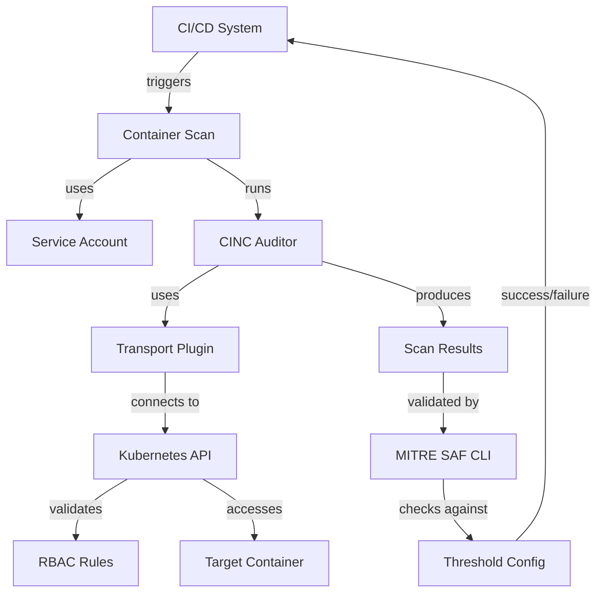

# Architectural Components

This section provides detailed information about the core architectural components of the Kubernetes CINC Secure Scanner.

!!! info "Directory Contents"
    For a complete listing of all files in this section, see the [Components Documentation Inventory](inventory.md).

## Core Components Overview

The Kubernetes CINC Secure Scanner is built on several key components that work together to provide a secure container scanning solution:

1. **CINC Auditor** - The open-source security scanning engine based on InSpec
2. **Transport Plugin** - The train-k8s-container plugin for Kubernetes communication
3. **Service Accounts** - Identity management for secure scanner access
4. **RBAC Rules** - Access control mechanisms for least-privilege scanning
5. **Container Adapters** - Specialized adapters for different container types
6. **Threshold Validation** - MITRE SAF CLI integration for compliance checking

## Component Documentation

For detailed information about specific components, see these documents:

- [Core Components](core-components.md) - Detailed information about the main system components
- [Security Components](security-components.md) - Security-focused components and their roles
- [Communication Patterns](communication.md) - How components communicate with each other

## Component Relationship Diagram

## Next Steps

- Explore the [Workflows](../workflows/index.md) to understand how these components interact
- See [Diagram Visualizations](../diagrams/index.md) for visual representations of system architecture
- Review [Deployment Architectures](../deployment/index.md) to learn about deployment options