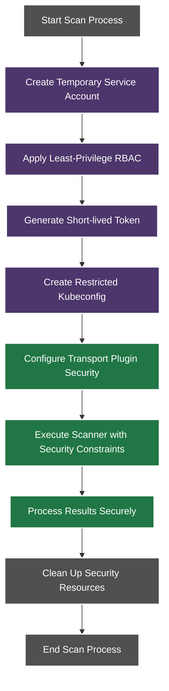

# Security Components

This document details the security-focused components of the Kubernetes CINC Secure Scanner architecture.

## Service Accounts

Service accounts provide identity management for secure scanner access.

- **Purpose**: Establish a secure identity for the scanner within Kubernetes
- **Features**:
  - Temporary/ephemeral accounts for scanning operations
  - Limited lifespan to reduce potential attack surface
  - Namespace-specific isolation
  - No permanent elevated privileges

## RBAC Rules

RBAC (Role-Based Access Control) rules enforce least-privilege access for scanning operations.

- **Purpose**: Restrict scanner access to only what is necessary
- **Features**:
  - Granular permission control
  - Namespace-specific permissions
  - Time-limited access
  - Resource-specific limitations
  - Label-based selection for targeted scanning

## Security Token Management

Security token management provides controlled access to Kubernetes resources.

- **Purpose**: Secure authentication for scanning operations
- **Features**:
  - Short-lived token generation
  - Automatic token expiration
  - No persistent credential storage
  - Rotation mechanisms for long-running scans

## Kubeconfig Security

Kubeconfig security ensures that Kubernetes configuration is properly secured.

- **Purpose**: Secure storage and management of Kubernetes access configurations
- **Features**:
  - Temporary kubeconfig generation
  - Restricted permissions
  - No shared kubeconfig files
  - Context-specific configurations

## Secure Plugin Configuration

Secure plugin configuration ensures that the transport plugin operates securely.

- **Purpose**: Configure the transport plugin with secure defaults
- **Features**:
  - No privilege escalation
  - Restricted filesystem access
  - Command execution limitations
  - Secure parameter handling

## Security Component Interaction Diagram

## Security Component Design Principles

The security components adhere to the following design principles:

1. **Least Privilege**: Components only have access to the resources they need
2. **Defense in Depth**: Multiple security layers protect the system
3. **Ephemeral Access**: Temporary access reduces attack surface
4. **Audit Trail**: Security operations are logged for accountability
5. **Isolation**: Components are isolated to prevent lateral movement
6. **Clean Up**: Security resources are reliably removed after use

## Security Component Configuration

For detailed information about configuring security components, see:

- [RBAC Configuration](../../rbac/index.md)
- [Service Account Configuration](../../service-accounts/index.md)
- [Token Management](../../tokens/index.md)
- [Security Configuration](../../configuration/security/index.md)