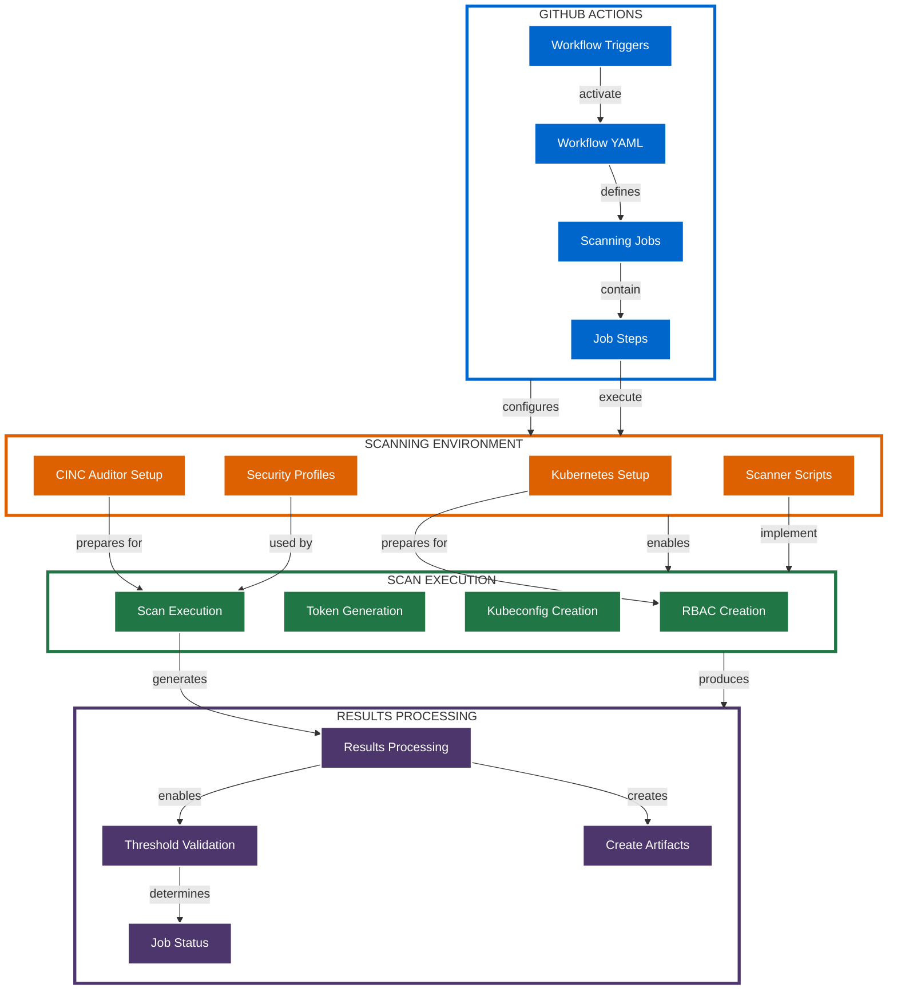
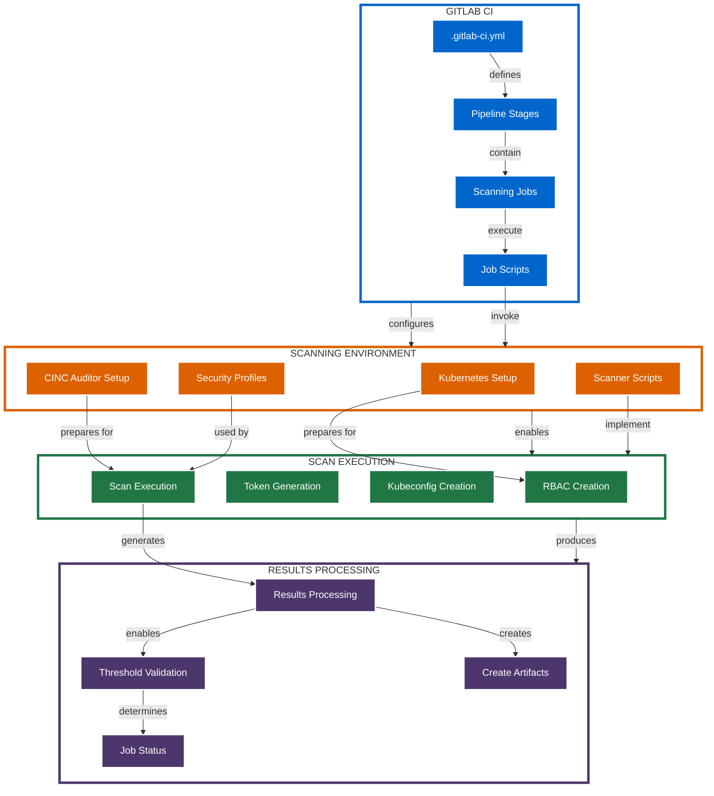
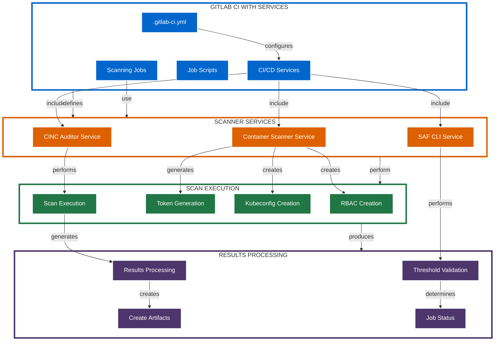

# CI/CD Integration Deployment Architecture

This document details the CI/CD integration deployment architecture for the Kubernetes CINC Secure Scanner.

## Architecture Overview

The CI/CD integration deployment architecture embeds container scanning into continuous integration and continuous deployment (CI/CD) pipelines. This approach is ideal for implementing security checks as part of the development workflow.

## Supported CI/CD Platforms

The scanner supports integration with several CI/CD platforms:

| Platform | Integration Method | Example |
|----------|-------------------|---------|
| GitHub Actions | Workflow YAML files | `github-workflow-examples/` |
| GitLab CI | Pipeline configuration | `gitlab-pipeline-examples/` |
| GitLab Services | Services integration | `gitlab-services-examples/` |
| Jenkins | Pipeline scripts | Custom integration |
| Any CI/CD | Direct script execution | Script-based approach |

## Key Components

### 1. Workflow Configuration

Configuration files that define the CI/CD workflow:

| Component | Purpose |
|-----------|---------|
| Workflow Definitions | Define scanning steps and conditions |
| Environment Configuration | Set up scanner environment |
| Trigger Definitions | Specify when scanning occurs |
| Result Handling | Define how results are processed |

### 2. Scanner Integration

Components that execute the scanning process:

| Component | Purpose |
|-----------|---------|
| Scanner Scripts | Execute scanning operations |
| CINC Profiles | Define security controls |
| Threshold Configuration | Define compliance thresholds |
| Report Formatting | Format and present results |

### 3. CI/CD Pipeline Steps

Typical scanning pipeline steps:

| Step | Purpose |
|------|---------|
| Environment Setup | Prepare Kubernetes environment |
| RBAC Creation | Create necessary RBAC resources |
| Scan Execution | Run scanner against containers |
| Results Processing | Process and validate results |
| Results Publication | Publish results as artifacts |
| Pass/Fail Determination | Determine pipeline success/failure |

## GitHub Actions Deployment Architecture



## GitLab CI Deployment Architecture



## GitLab CI Services Deployment Architecture



## Example CI/CD Configurations

### GitHub Actions Workflow Example

```yaml
name: Container Security Scanning

on:
  push:
    branches: [ main ]
  pull_request:
    branches: [ main ]

jobs:
  container-scan:
    runs-on: ubuntu-latest
    
    steps:
    - uses: actions/checkout@v2
    
    - name: Set up Kubernetes
      uses: helm/kind-action@v1.2.0
    
    - name: Deploy test container
      run: kubectl apply -f test-pod.yaml
    
    - name: Set up CINC Auditor
      run: |
        # Install CINC Auditor and dependencies
        curl -L https://omnitruck.cinc.sh/install.sh | sudo bash -s -- -P auditor
    
    - name: Scan container
      run: ./kubernetes-scripts/scan-container.sh default test-pod test-container examples/cinc-profiles/container-baseline
    
    - name: Upload results
      uses: actions/upload-artifact@v2
      with:
        name: scan-results
        path: results/
```

### GitLab CI Pipeline Example

```yaml
stages:
  - deploy
  - scan
  - report

variables:
  KUBE_CONTEXT: my-kubernetes-context
  TARGET_NAMESPACE: default
  TARGET_POD: web-app
  TARGET_CONTAINER: web-container
  PROFILE_PATH: examples/cinc-profiles/container-baseline
  THRESHOLD_FILE: examples/thresholds/moderate.yml

deploy-test-container:
  stage: deploy
  script:
    - kubectl --context $KUBE_CONTEXT apply -f test-pod.yaml

scan-container:
  stage: scan
  script:
    - ./kubernetes-scripts/scan-container.sh $TARGET_NAMESPACE $TARGET_POD $TARGET_CONTAINER $PROFILE_PATH $THRESHOLD_FILE
  artifacts:
    paths:
      - results/

report-results:
  stage: report
  script:
    - cat results/summary.json
    - |
      if [ $(jq '.failure_count' results/summary.json) -gt 0 ]; then
        exit 1
      fi
```

### GitLab CI with Services Example

```yaml
services:
  - name: registry.example.com/cinc-auditor:latest
    alias: cinc
  - name: registry.example.com/saf-cli:latest
    alias: saf

stages:
  - scan

container-scan:
  stage: scan
  script:
    - kubectl create namespace scanner-system
    - kubectl apply -f kubernetes/templates/rbac.yaml
    - kubectl apply -f kubernetes/templates/service-account.yaml
    - |
      cinc exec -t k8s-container://default/test-pod/test-container \
        --input examples/cinc-profiles/container-baseline \
        --reporter json:results.json
    - saf validate results.json -c $THRESHOLD_FILE
  artifacts:
    paths:
      - results.json
```

## Security Considerations

The CI/CD integration deployment implements these security measures:

1. **Pipeline Isolation**: Scanning runs in isolated CI/CD environments
2. **Secret Management**: Sensitive values stored as protected variables
3. **Least Privilege**: Minimal permissions for CI/CD jobs
4. **Ephemeral Resources**: All resources are temporary and cleaned up
5. **Result Protection**: Scan results stored as protected artifacts

## Deployment Scenarios

The CI/CD integration deployment is ideal for:

1. **Automated Testing**: Automatic scanning in CI/CD pipelines
2. **Pre-deployment Checks**: Security validation before deployment
3. **Pull Request Validation**: Scanning code changes in PRs
4. **Compliance Enforcement**: Enforcing security standards
5. **Continuous Security**: Regular security validation

## Integration Pattern Options

Several integration patterns are available:

### 1. Direct Script Execution

- Scripts executed directly in CI/CD jobs
- Simple integration with minimal dependencies
- Flexible but requires more configuration

### 2. Container-based Execution

- Scanner runs in containers
- Consistent environment across CI/CD systems
- Reduced dependency management

### 3. Service-based Integration

- Scanner provided as a service
- Clean separation of responsibilities
- Simplified job configuration

### 4. Hybrid Execution

- Combination of direct execution and services
- Different components used as needed
- Maximum flexibility for complex workflows

## Advanced Configuration

For detailed information on advanced CI/CD integration, see:

- [GitHub Actions Integration](../../integration/platforms/github-actions.md)
- [GitLab CI Integration](../../integration/platforms/gitlab-ci.md)
- [GitLab Services Integration](../../integration/platforms/gitlab-services.md)
