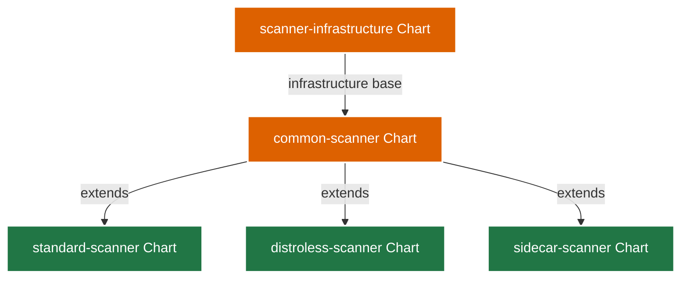
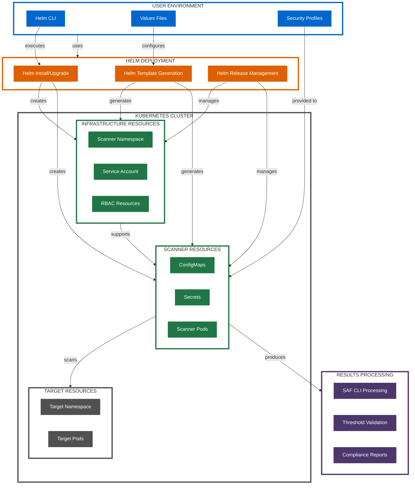
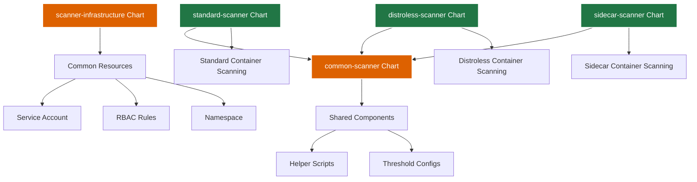

# Helm Chart Deployment Architecture

This document details the Helm chart deployment architecture for the Kubernetes CINC Secure Scanner.

## Architecture Overview

The Helm chart deployment architecture uses Helm charts to deploy and manage scanning resources in a Kubernetes cluster. This approach is ideal for production environments, providing a more structured and manageable deployment mechanism.

## Helm Chart Structure

The scanning system is organized into a collection of modular Helm charts:



## Key Components

### 1. Scanner Infrastructure Chart

The `scanner-infrastructure` chart creates the base infrastructure required for scanning:

| Component | Purpose |
|-----------|---------|
| Namespace | Dedicated namespace for scanner resources |
| Service Account | Identity for scanner operations |
| RBAC Resources | Access control for scanner |
| ConfigMap | Shared configuration for scanners |

### 2. Common Scanner Chart

The `common-scanner` chart provides shared functionality used by all scanner types:

| Component | Purpose |
|-----------|---------|
| Helper Scripts | Common scripts used by scanners |
| Threshold Configuration | Threshold validation settings |
| Value Definitions | Common value definitions |

### 3. Scanner Implementation Charts

Three specialized charts implement different scanning approaches:

| Chart | Purpose | Best For |
|-------|---------|----------|
| `standard-scanner` | For scanning standard containers | Containers with shell access |
| `distroless-scanner` | For scanning distroless containers | Minimal containers without shell |
| `sidecar-scanner` | For sidecar container approach | Mixed container environments |

## Deployment Architecture Diagram



## Deployment Workflow

The Helm chart deployment follows this general workflow:

1. **Setup Phase**:
   - User selects appropriate scanner chart
   - User configures values file with specific settings
   - User prepares security profiles

2. **Installation Phase**:
   - Helm installs infrastructure chart if not already present
   - Helm installs selected scanner chart
   - Helm manages dependencies between charts

3. **Execution Phase**:
   - Scanner pods are deployed according to configuration
   - Scanner executes against target containers
   - Results are collected and processed

4. **Reporting Phase**:
   - Results validated against thresholds
   - Reports generated according to configuration
   - Compliance status determined

## Configuration Options

Helm charts provide extensive configuration through values files:

### Infrastructure Configuration

```yaml
# Example scanner-infrastructure values
namespace:
  name: scanner-system
  create: true

serviceAccount:
  name: scanner-sa
  create: true

rbac:
  create: true
  rules:
    - apiGroups: [""]
      resources: ["pods", "pods/exec"]
      verbs: ["get", "list", "create"]

securityContext:
  runAsNonRoot: true
  runAsUser: 10001
```

### Scanner Configuration

```yaml
# Example standard-scanner values
target:
  namespace: default
  podSelector:
    matchLabels:
      app: web-service
  
scan:
  profile: container-baseline
  thresholds:
    critical: 0
    high: 2
    medium: 5
    low: 10
  
results:
  format: json
  reportDir: /reports
```

## Security Considerations

The Helm chart deployment implements these security measures:

1. **Security Contexts**: Non-root execution with minimal capabilities
2. **Resource Limits**: CPU and memory limits for scanner pods
3. **RBAC Isolation**: Namespace-specific RBAC with least privilege
4. **Secret Management**: Secure handling of sensitive values
5. **Ephemeral Resources**: Scanner pods are temporary and cleaned up after use

## Deployment Scenarios

The Helm chart deployment is ideal for:

1. **Production Environments**: Structured, repeatable deployment
2. **Multi-Cluster Environments**: Consistent deployment across clusters
3. **GitOps Workflows**: Integration with GitOps tools
4. **Regular Scanning**: Scheduled or triggered scanning
5. **Complex Environments**: When customization and flexibility are needed

## Chart Installation

### Basic Installation

```bash
# Install infrastructure chart
helm install scanner-infra ./helm-charts/scanner-infrastructure

# Install standard scanner
helm install standard-scanner ./helm-charts/standard-scanner \
  --set target.namespace=default \
  --set target.podName=web-pod \
  --set target.containerName=web-container
```

### Using Values Files

```bash
# Install with custom values
helm install standard-scanner ./helm-charts/standard-scanner \
  -f ./helm-charts/standard-scanner/examples/values-ci.yaml
```

### Complete Environment Installation

```bash
# Install all charts with script
./helm-charts/install-all.sh
```

## Integration with Other Systems

The Helm chart deployment can be integrated with:

1. **GitOps Systems**: ArgoCD, Flux for declarative deployment
2. **CI/CD Pipelines**: Automated deployment in CI/CD workflows
3. **Kubernetes Operators**: Custom operators for advanced automation
4. **Monitoring Systems**: Integration with monitoring for event-driven scanning

## Chart Dependencies and Relationships



## Advanced Configuration

For detailed information on advanced configuration options, see:

- [Helm Chart Customization](../../helm-charts/usage/customization.md)
- [Helm Chart Values Reference](../../helm-charts/usage/values.md)
- [Helm Chart Security](../../helm-charts/security/index.md)