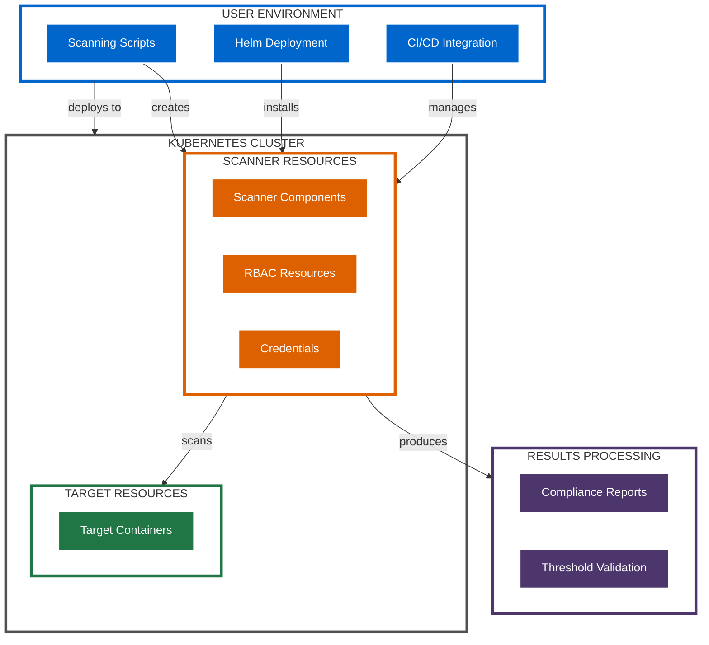

# Deployment Architectures

This section provides detailed information about the different deployment architectures supported by the Kubernetes CINC Secure Scanner.

!!! info "Directory Contents"
    For a complete listing of all files in this section, see the [Deployment Documentation Inventory](inventory.md).

## Deployment Options

The scanning system can be deployed using several different architectures:

1. **Script-based Deployment** - Using shell scripts for direct execution
2. **Helm Chart Deployment** - Using Helm charts for production environments
3. **CI/CD Integration** - Embedded in CI/CD pipelines

## Common Deployment Characteristics

While specific implementations differ, all deployment architectures share these characteristics:

1. **Security-First Approach**: All deployments implement least-privilege access controls
2. **Modular Design**: Components can be deployed independently as needed
3. **Configuration Flexibility**: Extensive configuration options for all deployment types
4. **Cleanup Mechanisms**: Automatic cleanup of temporary resources
5. **Threshold Validation**: Integration with the MITRE SAF CLI for compliance validation

## Deployment Documentation

For detailed information about specific deployment architectures, see these documents:

- [Script Deployment](script-deployment.md) - Using shell scripts for direct execution
- [Helm Deployment](helm-deployment.md) - Using Helm charts for production environments
- [CI/CD Deployment](ci-cd-deployment.md) - Integrating with CI/CD pipelines

## Deployment Architecture Diagram

## Next Steps

- Explore the [Component Architecture](../components/index.md) documentation
- Review the [Workflow Processes](../workflows/index.md) documentation
- See the [Integration Options](../integrations/index.md) documentation
