# Script-based Deployment Architecture

This document details the script-based deployment architecture for the Kubernetes CINC Secure Scanner.

## Architecture Overview

The script-based deployment architecture uses shell scripts to directly execute scanning operations against a Kubernetes cluster. This approach is ideal for testing, development, and environments where Helm is not available.

## Key Components

### 1. Shell Scripts

The core scripts that implement the scanning functionality:

| Script | Purpose | Usage |
|--------|---------|-------|
| `scan-container.sh` | Scan standard containers | `./scripts/scan-container.sh <namespace> <pod-name> <container-name> <profile-path> [threshold_file]` |
| `scan-distroless-container.sh` | Scan distroless containers | `./scripts/scan-distroless-container.sh <namespace> <pod-name> <container-name> <profile-path> [threshold_file]` |
| `scan-with-sidecar.sh` | Scan using sidecar approach | `./scripts/scan-with-sidecar.sh <namespace> <pod-name> <profile-path> [threshold_file]` |
| `setup-minikube.sh` | Set up test environment | `./scripts/setup-minikube.sh [--with-distroless]` |
| `generate-kubeconfig.sh` | Generate secure kubeconfig | `./scripts/generate-kubeconfig.sh <namespace> <service-account> <output-file>` |

### 2. RBAC Templates

Kubernetes YAML templates for creating RBAC resources:

| Template | Purpose |
|----------|---------|
| `kubernetes/templates/rbac.yaml` | Base RBAC rules for scanner |
| `kubernetes/templates/service-account.yaml` | Service account for scanner |
| `kubernetes/templates/namespace.yaml` | Namespace creation template |
| `kubernetes/templates/label-rbac.yaml` | Label-based RBAC for targeted scanning |

### 3. Test Resources

Resources for testing the scanner:

| Resource | Purpose |
|----------|---------|
| `test-pod.yaml` | Sample pod for testing scanner |
| `kubernetes/templates/test-pod.yaml` | Parametrized test pod template |

## Deployment Architecture

```mermaid
flowchart TD
    subgraph User["USER ENVIRONMENT"]
        scripts["Scanner Scripts"]
        profiles["Security Profiles"]
        thresholds["Threshold Configuration"]
    end
    
    subgraph Execution["SCRIPT EXECUTION"]
        rbac_creation["RBAC Resource Creation"]
        token_gen["Token Generation"]
        kubeconfig["Kubeconfig Creation"]
        scanner_exec["Scanner Execution"]
        results_process["Results Processing"]
        cleanup["Resource Cleanup"]
    end
    
    subgraph Kubernetes["KUBERNETES CLUSTER"]
        api["Kubernetes API"]
        sa["Service Account"]
        role["RBAC Role"]
        binding["RoleBinding"]
        containers["Target Containers"]
    end
    
    %% Component relationships
    User -->|invokes| Execution
    scripts -->|implements| Execution
    profiles -->|used by| scanner_exec
    thresholds -->|used by| results_process
    rbac_creation -->|creates| sa
    rbac_creation -->|creates| role
    rbac_creation -->|creates| binding
    token_gen -->|generates for| sa
    token_gen -->|produces for| kubeconfig
    kubeconfig -->|configures| scanner_exec
    scanner_exec -->|connects to| api
    scanner_exec -->|scans| containers
    scanner_exec -->|produces for| results_process
    results_process -->|returns to| User
    cleanup -->|removes| sa
    cleanup -->|removes| role
    cleanup -->|removes| binding
    
    %% WCAG-compliant styling
    style User fill:none,stroke:#0066CC,stroke-width:4px
    style Execution fill:none,stroke:#DD6100,stroke-width:4px
    style Kubernetes fill:none,stroke:#505050,stroke-width:4px
    
    %% Component styling
    style scripts fill:#0066CC,stroke:#FFFFFF,stroke-width:2px,color:#FFFFFF
    style profiles fill:#0066CC,stroke:#FFFFFF,stroke-width:2px,color:#FFFFFF
    style thresholds fill:#0066CC,stroke:#FFFFFF,stroke-width:2px,color:#FFFFFF
    style rbac_creation fill:#DD6100,stroke:#FFFFFF,stroke-width:2px,color:#FFFFFF
    style token_gen fill:#DD6100,stroke:#FFFFFF,stroke-width:2px,color:#FFFFFF
    style kubeconfig fill:#DD6100,stroke:#FFFFFF,stroke-width:2px,color:#FFFFFF
    style scanner_exec fill:#DD6100,stroke:#FFFFFF,stroke-width:2px,color:#FFFFFF
    style results_process fill:#DD6100,stroke:#FFFFFF,stroke-width:2px,color:#FFFFFF
    style cleanup fill:#DD6100,stroke:#FFFFFF,stroke-width:2px,color:#FFFFFF
    style api fill:#505050,stroke:#FFFFFF,stroke-width:2px,color:#FFFFFF
    style sa fill:#505050,stroke:#FFFFFF,stroke-width:2px,color:#FFFFFF
    style role fill:#505050,stroke:#FFFFFF,stroke-width:2px,color:#FFFFFF
    style binding fill:#505050,stroke:#FFFFFF,stroke-width:2px,color:#FFFFFF
    style containers fill:#505050,stroke:#FFFFFF,stroke-width:2px,color:#FFFFFF
```



## Workflow Process

The script-based deployment follows this general workflow:

1. **Setup**: 
   - User selects appropriate scanning script
   - User provides target container details
   - User provides security profile path
   - User optionally provides threshold configuration

2. **Execution**:
   - Script creates necessary RBAC resources
   - Script generates short-lived token
   - Script creates temporary kubeconfig
   - Script executes CINC Auditor with appropriate transport plugin
   - Script collects scan results

3. **Processing**:
   - Script processes results with SAF CLI
   - Script validates results against thresholds
   - Script produces formatted reports

4. **Cleanup**:
   - Script removes temporary kubeconfig
   - Script removes RBAC resources
   - Script ensures clean state

## Security Considerations

The script-based deployment implements these security measures:

1. **Temporary Resources**: All RBAC resources are created for the scan and then deleted
2. **Short-lived Tokens**: Authentication tokens have minimal lifespan
3. **Least Privilege**: RBAC permissions are limited to only what is necessary
4. **Secure Cleanup**: Reliable resource cleanup even in failure scenarios
5. **Configuration Validation**: Input validation to prevent misconfigurations

## Deployment Scenarios

The script-based deployment is ideal for:

1. **Development Environments**: Quick setup and testing
2. **CI/CD Pipelines**: Direct integration into pipeline steps
3. **Testing New Features**: Experimenting with scanning options
4. **Environments Without Helm**: When Helm is not available or allowed
5. **One-off Scans**: When regular scanning is not required

## Customization Options

Scripts can be customized in several ways:

1. **Profile Selection**: Any InSpec-compatible profile can be used
2. **Threshold Configuration**: Custom threshold files can be provided
3. **RBAC Templates**: RBAC templates can be modified for specific environments
4. **Timeout Settings**: Scan timeouts can be adjusted
5. **Output Formatting**: Result formatting can be customized

## Example Usage

### Basic Container Scanning

```bash
# Standard container scan
./scripts/scan-container.sh default nginx-pod nginx-container examples/cinc-profiles/container-baseline

# Distroless container scan
./scripts/scan-distroless-container.sh default distroless-pod distroless-container examples/cinc-profiles/container-baseline

# Sidecar approach scan
./scripts/scan-with-sidecar.sh default target-pod examples/cinc-profiles/container-baseline
```

### With Threshold Validation

```bash
# Standard container scan with threshold validation
./scripts/scan-container.sh default nginx-pod nginx-container examples/cinc-profiles/container-baseline examples/thresholds/moderate.yml
```

### Setting Up Test Environment

```bash
# Setup Minikube for testing
./scripts/setup-minikube.sh --with-distroless
```

## Integration with Other Systems

The script-based deployment can be integrated with:

1. **CI/CD Systems**: Scripts can be called directly from CI/CD jobs
2. **Monitoring Systems**: Scripts can be triggered by monitoring alerts
3. **Scheduled Jobs**: Scripts can be run as cron jobs for periodic scanning
4. **Custom Workflows**: Scripts can be incorporated into custom workflows