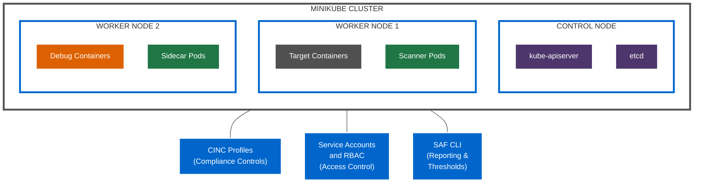
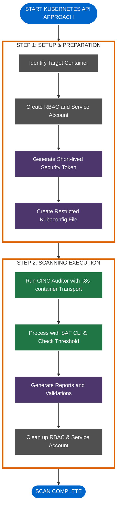
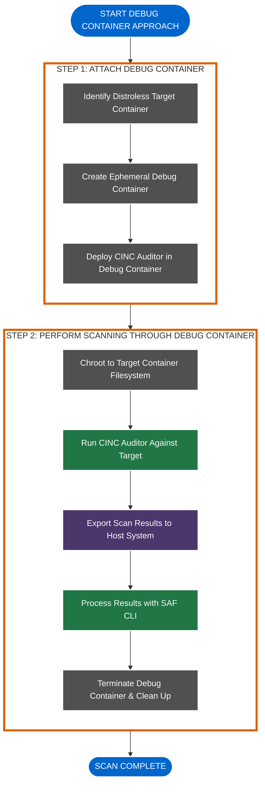
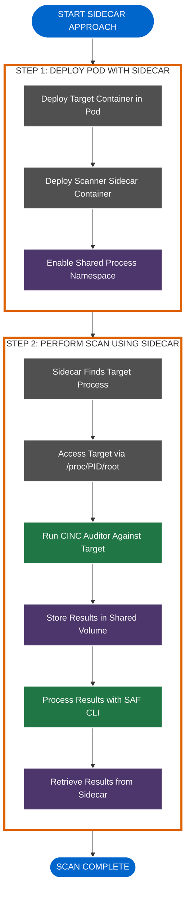
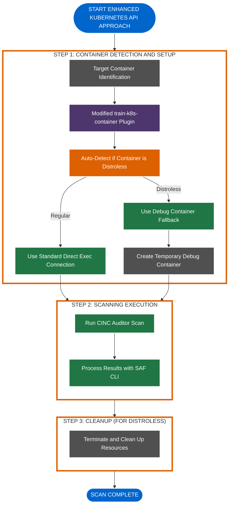
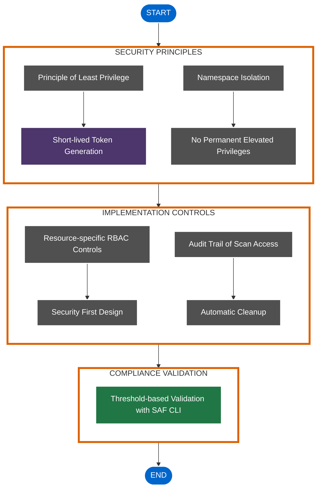

# Container Scanning Workflow Diagrams

This document provides WCAG-compliant Mermaid diagrams illustrating the key scanning workflows, CI/CD integrations, and architecture patterns in our container security platform. These diagrams follow our project's color standards and are designed to display properly in both light and dark modes.

## Minikube Architecture

## Kubernetes API Approach Workflow

## Debug Container Approach Workflow

## Sidecar Approach Workflow

## Enhanced Kubernetes API Approach Workflow

## GitLab CI Kubernetes API Approach with Services

```mermaid
flowchart TD
    start([GITLAB CI WITH SERVICES]) --> stage1
    
    subgraph stage1["STAGE 1: PIPELINE SETUP"]
        direction TB
        pipeline_start["GitLab CI Pipeline Begins"] --> start_service["Start CINC Auditor Scanner Service"]
        start_service --> deploy["Deploy Target Container"]
    end
    
    stage1 --> stage2
    
    subgraph stage2["STAGE 2: SECURITY SETUP"]
        direction TB
        create_rbac["Create RBAC & Service Account"] --> generate_token["Generate Short-lived Security Token"]
        generate_token --> create_kubeconfig["Create Restricted kubeconfig"]
    end
    
    stage2 --> stage3
    
    subgraph stage3["STAGE 3: SCANNING & REPORTING"]
        direction TB
        execute_scan["Execute Scan in Service Container"] --> process["Process Results with SAF CLI"]
        process --> copy_results["Copy Results & Generate Reports"]
        copy_results --> cleanup["Clean Up Resources"]
    end
    
    stage3 --> complete([COMPLETE])
    
    %% WCAG-compliant styling
    style start fill:#0066CC,stroke:#FFFFFF,stroke-width:2px,color:#FFFFFF
    style complete fill:#0066CC,stroke:#FFFFFF,stroke-width:2px,color:#FFFFFF
    
    %% Stage styling with WCAG-compliant colors - works in both light/dark
    style stage1 fill:none,stroke:#DD6100,stroke-width:4px
    style stage2 fill:none,stroke:#DD6100,stroke-width:4px
    style stage3 fill:none,stroke:#DD6100,stroke-width:4px
    
    %% Process styling with WCAG-compliant colors
    style pipeline_start fill:#505050,stroke:#FFFFFF,stroke-width:2px,color:#FFFFFF
    style start_service fill:#505050,stroke:#FFFFFF,stroke-width:2px,color:#FFFFFF
    style deploy fill:#505050,stroke:#FFFFFF,stroke-width:2px,color:#FFFFFF
    style create_rbac fill:#505050,stroke:#FFFFFF,stroke-width:2px,color:#FFFFFF
    style generate_token fill:#4C366B,stroke:#FFFFFF,stroke-width:2px,color:#FFFFFF
    style create_kubeconfig fill:#4C366B,stroke:#FFFFFF,stroke-width:2px,color:#FFFFFF
    style execute_scan fill:#217645,stroke:#FFFFFF,stroke-width:2px,color:#FFFFFF
    style process fill:#217645,stroke:#FFFFFF,stroke-width:2px,color:#FFFFFF
    style copy_results fill:#4C366B,stroke:#FFFFFF,stroke-width:2px,color:#FFFFFF
    style cleanup fill:#505050,stroke:#FFFFFF,stroke-width:2px,color:#FFFFFF
```

## GitLab CI Sidecar Approach

```mermaid
flowchart TD
    start([GITLAB CI SIDECAR APPROACH]) --> stage1
    
    subgraph stage1["STAGE 1: DEPLOYMENT"]
        direction TB
        pipeline_start["GitLab CI Pipeline Begins"] --> deploy["Deploy Pod with Target and Sidecar"]
        deploy --> shared_namespace["Enable Shared Process Namespace"]
    end
    
    stage1 --> stage2
    
    subgraph stage2["STAGE 2: SCANNING"]
        direction TB
        sidecar_start["Sidecar Scanner Starts"] --> scan["Scan Target via /proc Filesystem"]
        scan --> store_results["Store Results in Shared Volume"]
    end
    
    stage2 --> stage3
    
    subgraph stage3["STAGE 3: RESULTS PROCESSING"]
        direction TB
        retrieve["Retrieve Results from Sidecar"] --> process["Process Results and Generate Reports"]
        process --> upload["Upload Results & Clean Up Resources"]
    end
    
    stage3 --> complete([COMPLETE])
    
    %% WCAG-compliant styling
    style start fill:#0066CC,stroke:#FFFFFF,stroke-width:2px,color:#FFFFFF
    style complete fill:#0066CC,stroke:#FFFFFF,stroke-width:2px,color:#FFFFFF
    
    %% Stage styling with WCAG-compliant colors - works in both light/dark
    style stage1 fill:none,stroke:#DD6100,stroke-width:4px
    style stage2 fill:none,stroke:#DD6100,stroke-width:4px
    style stage3 fill:none,stroke:#DD6100,stroke-width:4px
    
    %% Process styling with WCAG-compliant colors
    style pipeline_start fill:#505050,stroke:#FFFFFF,stroke-width:2px,color:#FFFFFF
    style deploy fill:#505050,stroke:#FFFFFF,stroke-width:2px,color:#FFFFFF
    style shared_namespace fill:#4C366B,stroke:#FFFFFF,stroke-width:2px,color:#FFFFFF
    style sidecar_start fill:#505050,stroke:#FFFFFF,stroke-width:2px,color:#FFFFFF
    style scan fill:#217645,stroke:#FFFFFF,stroke-width:2px,color:#FFFFFF
    style store_results fill:#4C366B,stroke:#FFFFFF,stroke-width:2px,color:#FFFFFF
    style retrieve fill:#505050,stroke:#FFFFFF,stroke-width:2px,color:#FFFFFF
    style process fill:#217645,stroke:#FFFFFF,stroke-width:2px,color:#FFFFFF
    style upload fill:#4C366B,stroke:#FFFFFF,stroke-width:2px,color:#FFFFFF
```

## GitHub Actions Kubernetes API Approach

```mermaid
flowchart TD
    start([GITHUB ACTIONS KUBERNETES API APPROACH]) --> step1
    
    subgraph step1["STEP 1: ENVIRONMENT SETUP"]
        direction TB
        workflow_start["GitHub Actions Workflow Start"] --> setup_k8s["Setup Kubernetes Cluster"]
        setup_k8s --> install["Install CINC Auditor & Plugin"]
    end
    
    step1 --> step2
    
    subgraph step2["STEP 2: TARGET DEPLOYMENT"]
        direction TB
        deploy["Deploy Target Container"] --> create_rbac["Create RBAC & Service Account"]
        create_rbac --> generate_token["Generate Token & kubeconfig"]
    end
    
    step2 --> step3
    
    subgraph step3["STEP 3: SCAN & REPORT"]
        direction TB
        run_cinc["Run CINC Auditor Against Target"] --> process["Process Results with SAF CLI"]
        process --> generate_reports["Generate Reports & Clean Up"]
    end
    
    step3 --> complete([COMPLETE])
    
    %% WCAG-compliant styling
    style start fill:#0066CC,stroke:#FFFFFF,stroke-width:2px,color:#FFFFFF
    style complete fill:#0066CC,stroke:#FFFFFF,stroke-width:2px,color:#FFFFFF
    
    %% Step styling with WCAG-compliant colors - works in both light/dark
    style step1 fill:none,stroke:#DD6100,stroke-width:4px
    style step2 fill:none,stroke:#DD6100,stroke-width:4px
    style step3 fill:none,stroke:#DD6100,stroke-width:4px
    
    %% Process styling with WCAG-compliant colors
    style workflow_start fill:#505050,stroke:#FFFFFF,stroke-width:2px,color:#FFFFFF
    style setup_k8s fill:#505050,stroke:#FFFFFF,stroke-width:2px,color:#FFFFFF
    style install fill:#505050,stroke:#FFFFFF,stroke-width:2px,color:#FFFFFF
    style deploy fill:#505050,stroke:#FFFFFF,stroke-width:2px,color:#FFFFFF
    style create_rbac fill:#505050,stroke:#FFFFFF,stroke-width:2px,color:#FFFFFF
    style generate_token fill:#4C366B,stroke:#FFFFFF,stroke-width:2px,color:#FFFFFF
    style run_cinc fill:#217645,stroke:#FFFFFF,stroke-width:2px,color:#FFFFFF
    style process fill:#217645,stroke:#FFFFFF,stroke-width:2px,color:#FFFFFF
    style generate_reports fill:#4C366B,stroke:#FFFFFF,stroke-width:2px,color:#FFFFFF
```

## GitHub Actions Sidecar Approach

```mermaid
flowchart TD
    start([START GITHUB ACTIONS SIDECAR APPROACH]) --> step1
    
    subgraph step1["STEP 1: ENVIRONMENT SETUP"]
        direction TB
        workflow_start["GitHub Actions Workflow Start"] --> setup_k8s["Setup Kubernetes Cluster"]
        setup_k8s --> build_image["Build Scanner Container Image"]
    end
    
    step1 --> step2
    
    subgraph step2["STEP 2: DEPLOYMENT & SCANNING"]
        direction TB
        deploy["Deploy Pod with Target and Scanner"] --> shared_namespace["Configure Shared Process Namespace"]
        shared_namespace --> scanner_scan["Sidecar Scans Target Container"]
    end
    
    step2 --> step3
    
    subgraph step3["STEP 3: RESULTS PROCESSING"]
        direction TB
        wait["Wait for Completion"] --> retrieve["Retrieve Results"]
        retrieve --> process["Process Results & Generate Reports"]
        process --> upload["Upload Results & Clean Up"]
    end
    
    step3 --> complete([COMPLETE])
    
    %% WCAG-compliant styling
    style start fill:#0066CC,stroke:#FFFFFF,stroke-width:2px,color:#FFFFFF
    style complete fill:#0066CC,stroke:#FFFFFF,stroke-width:2px,color:#FFFFFF
    
    %% Step styling with WCAG-compliant colors - works in both light/dark
    style step1 fill:none,stroke:#DD6100,stroke-width:4px
    style step2 fill:none,stroke:#DD6100,stroke-width:4px
    style step3 fill:none,stroke:#DD6100,stroke-width:4px
    
    %% Process styling with WCAG-compliant colors
    style workflow_start fill:#505050,stroke:#FFFFFF,stroke-width:2px,color:#FFFFFF
    style setup_k8s fill:#505050,stroke:#FFFFFF,stroke-width:2px,color:#FFFFFF
    style build_image fill:#505050,stroke:#FFFFFF,stroke-width:2px,color:#FFFFFF
    style deploy fill:#505050,stroke:#FFFFFF,stroke-width:2px,color:#FFFFFF
    style shared_namespace fill:#4C366B,stroke:#FFFFFF,stroke-width:2px,color:#FFFFFF
    style scanner_scan fill:#217645,stroke:#FFFFFF,stroke-width:2px,color:#FFFFFF
    style wait fill:#505050,stroke:#FFFFFF,stroke-width:2px,color:#FFFFFF
    style retrieve fill:#505050,stroke:#FFFFFF,stroke-width:2px,color:#FFFFFF
    style process fill:#217645,stroke:#FFFFFF,stroke-width:2px,color:#FFFFFF
    style upload fill:#4C366B,stroke:#FFFFFF,stroke-width:2px,color:#FFFFFF
```

## End-to-End Security Architecture

