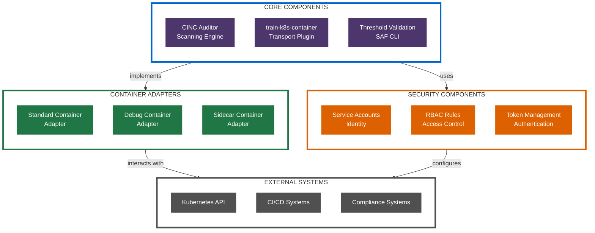
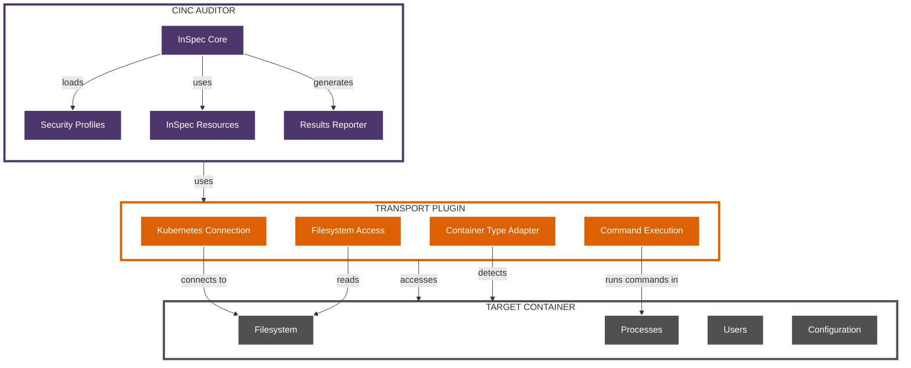
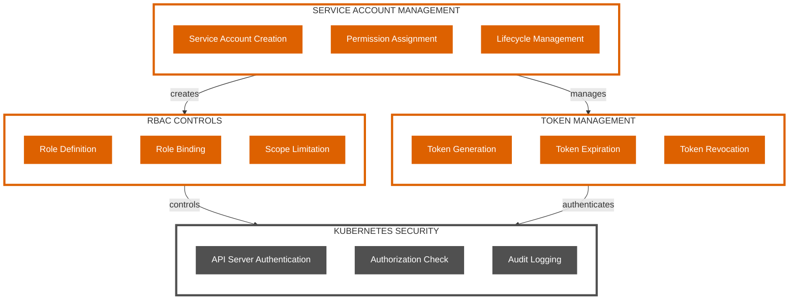
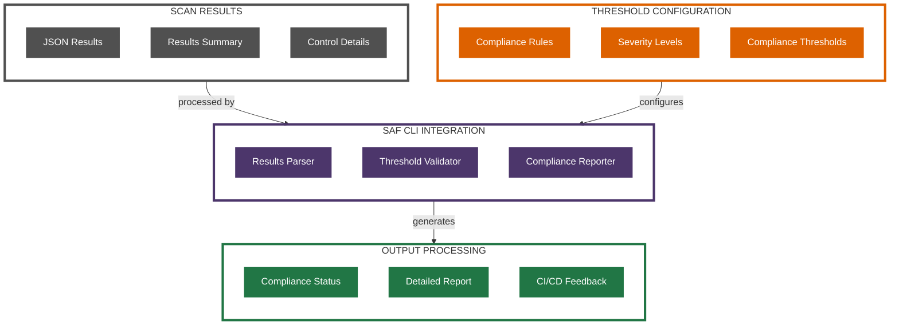

# Component Architecture Diagrams

This document provides visual representations of the architectural components that make up the Kubernetes CINC Secure Scanner.

## System Architecture Overview

The following diagram shows the high-level architecture of the scanning system:

## CINC Auditor Component Architecture

The following diagram shows the CINC Auditor component architecture:

## Security Component Architecture

The following diagram shows the security component architecture:

## Container Adapter Architecture

The following diagram shows the container adapter architecture:

```mermaid
flowchart TD
    subgraph Adapters["CONTAINER ADAPTERS"]
        direction TB
        detector["Container Type Detector"]
        selector["Adapter Selector"]
    end
    
    subgraph StandardAdapter["STANDARD ADAPTER"]
        direction TB
        std_exec["Direct Exec"]
        std_fs["Direct Filesystem Access"]
    end
    
    subgraph DebugAdapter["DEBUG CONTAINER ADAPTER"]
        direction TB
        debug_container["Debug Container Creation"]
        debug_chroot["Chroot to Target Filesystem"]
        debug_exec["Command Execution in Debug"]
    end
    
    subgraph SidecarAdapter["SIDECAR ADAPTER"]
        direction TB
        shared_process["Shared Process Namespace"]
        proc_fs["/proc Filesystem Access"]
        sidecar_exec["Command Execution in Sidecar"]
    end
    
    %% Component relationships
    Adapters -->|selects| StandardAdapter
    Adapters -->|selects| DebugAdapter
    Adapters -->|selects| SidecarAdapter
    
    %% WCAG-compliant styling
    style Adapters fill:none,stroke:#217645,stroke-width:4px
    style StandardAdapter fill:none,stroke:#217645,stroke-width:4px
    style DebugAdapter fill:none,stroke:#217645,stroke-width:4px
    style SidecarAdapter fill:none,stroke:#217645,stroke-width:4px
    
    %% Component styling
    style detector fill:#217645,stroke:#FFFFFF,stroke-width:2px,color:#FFFFFF
    style selector fill:#217645,stroke:#FFFFFF,stroke-width:2px,color:#FFFFFF
    style std_exec fill:#217645,stroke:#FFFFFF,stroke-width:2px,color:#FFFFFF
    style std_fs fill:#217645,stroke:#FFFFFF,stroke-width:2px,color:#FFFFFF
    style debug_container fill:#217645,stroke:#FFFFFF,stroke-width:2px,color:#FFFFFF
    style debug_chroot fill:#217645,stroke:#FFFFFF,stroke-width:2px,color:#FFFFFF
    style debug_exec fill:#217645,stroke:#FFFFFF,stroke-width:2px,color:#FFFFFF
    style shared_process fill:#217645,stroke:#FFFFFF,stroke-width:2px,color:#FFFFFF
    style proc_fs fill:#217645,stroke:#FFFFFF,stroke-width:2px,color:#FFFFFF
    style sidecar_exec fill:#217645,stroke:#FFFFFF,stroke-width:2px,color:#FFFFFF
```

## Threshold Validation Architecture

The following diagram shows the threshold validation architecture:

