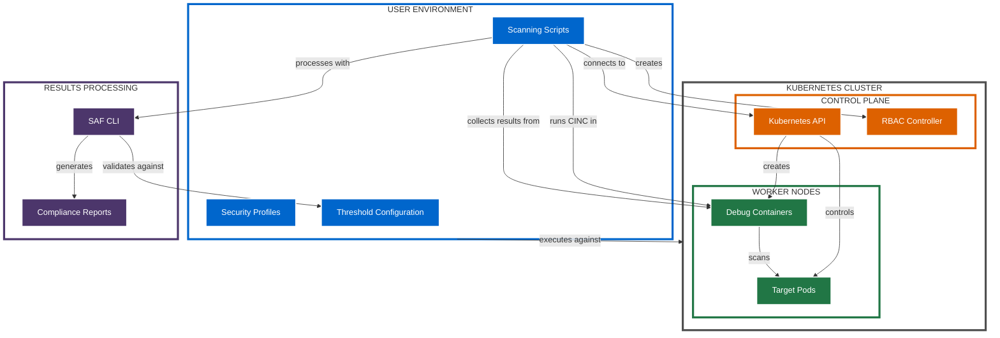
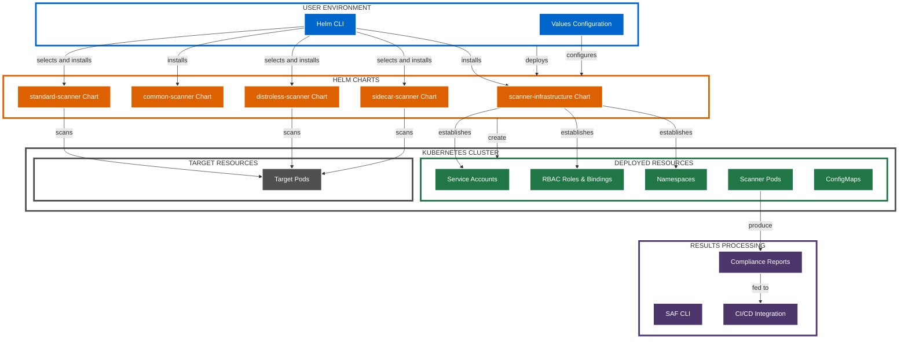
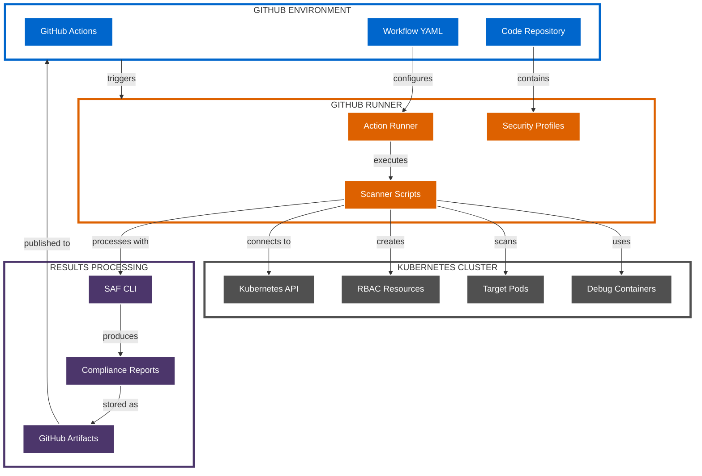
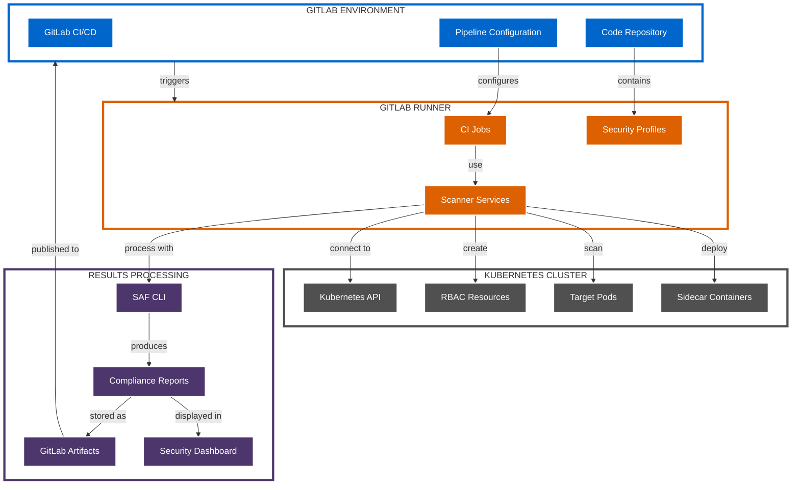
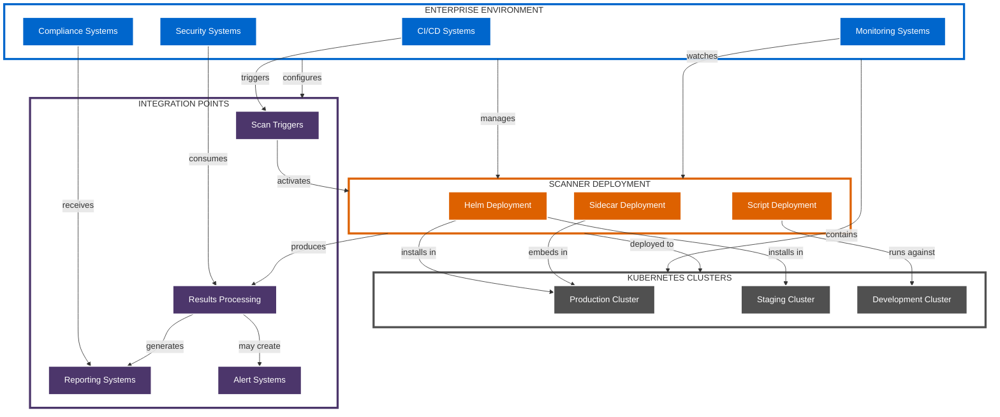

# Deployment Architecture Diagrams

This document provides visual representations of the different deployment architectures supported by the Kubernetes CINC Secure Scanner.

## Script-based Deployment Architecture

## Helm Chart Deployment Architecture

## GitHub Actions Deployment Architecture

## GitLab CI Deployment Architecture

## Enterprise Integration Architecture

