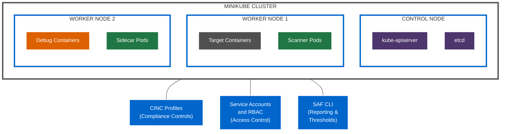

# Architecture Diagrams

This section provides WCAG-compliant Mermaid diagrams that visualize key aspects of the Kubernetes CINC Secure Scanner architecture.

!!! info "Directory Contents"
    For a complete listing of all files in this section, see the [Diagrams Documentation Inventory](inventory.md).

## Diagram Types

The architecture diagrams are organized into the following categories:

1. **Component Diagrams** - Visualizing system components and their relationships
2. **Workflow Diagrams** - Illustrating end-to-end workflow processes
3. **Deployment Diagrams** - Showing different deployment architectures

## Diagram Standards

All diagrams follow these standards:

- **WCAG Compliance**: Colors chosen for accessibility
- **Consistent Styling**: Uniform node and edge styles
- **Clarity**: Clear labels and relationships
- **Light/Dark Mode Support**: Visibility in both light and dark themes
- **Mermaid Syntax**: Using Mermaid for rendering in GitHub and MkDocs

## Sample Component Diagram

## Diagram Documentation

For detailed diagrams of specific aspects of the architecture, see these documents:

- [Component Diagrams](component-diagrams.md) - Visualization of system components
- [Workflow Diagrams](workflow-diagrams.md) - Visualization of workflow processes
- [Deployment Diagrams](deployment-diagrams.md) - Visualization of deployment architectures

## Next Steps

- Explore the [Component Architecture](../components/index.md) documentation
- Review the [Workflow Processes](../workflows/index.md) documentation
- See the [Deployment Options](../deployment/index.md) documentation
