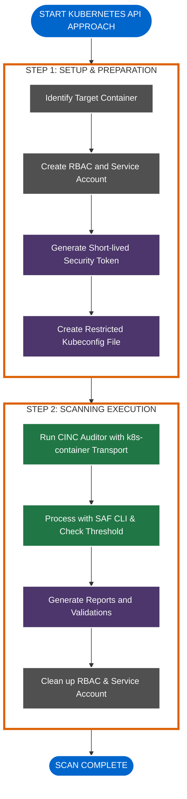
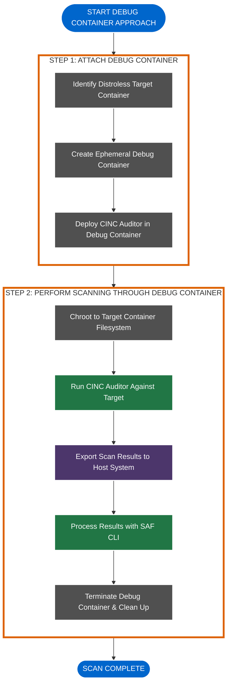
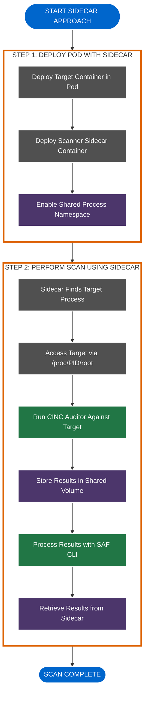
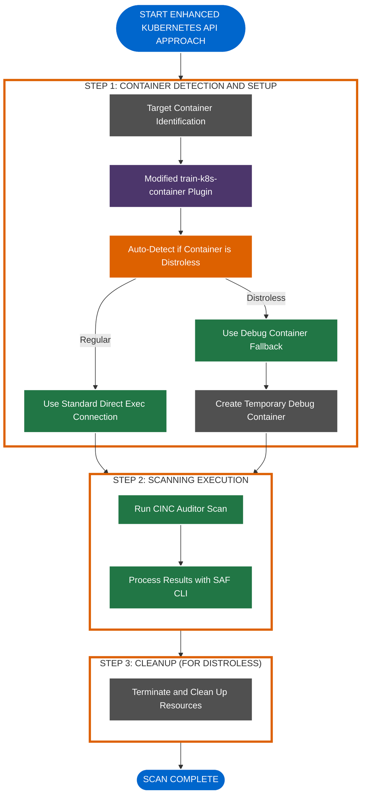
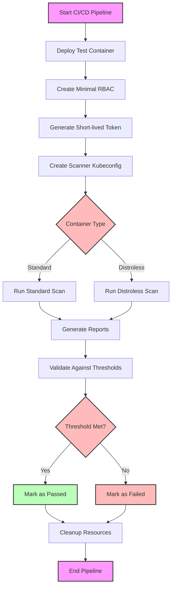
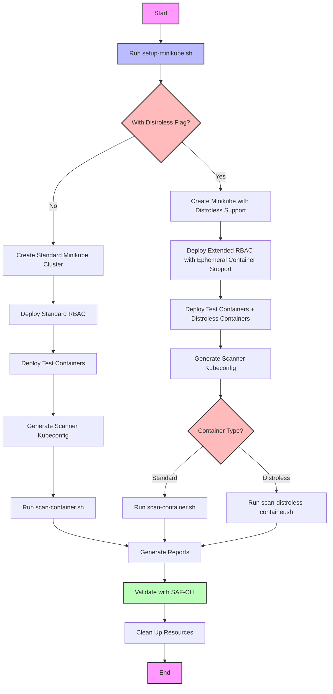
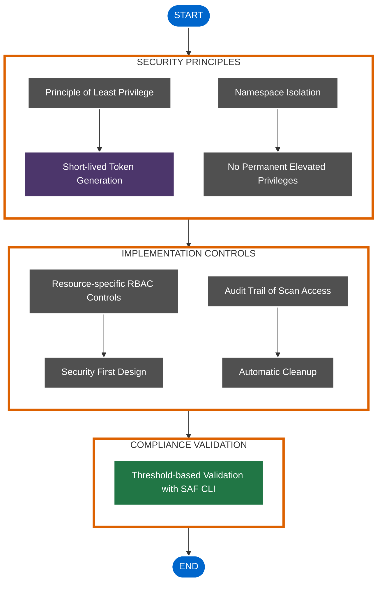

# Workflow Diagrams

This document provides visual representations of the workflow processes used by the Kubernetes CINC Secure Scanner.

## Standard Container Scanning Workflow

## Distroless Container Scanning Workflow

## Sidecar Container Scanning Workflow

## Enhanced Kubernetes API Workflow

## CI/CD Integration Workflow

## Minikube Setup and Scanning Workflow

## Security-Focused Workflow

