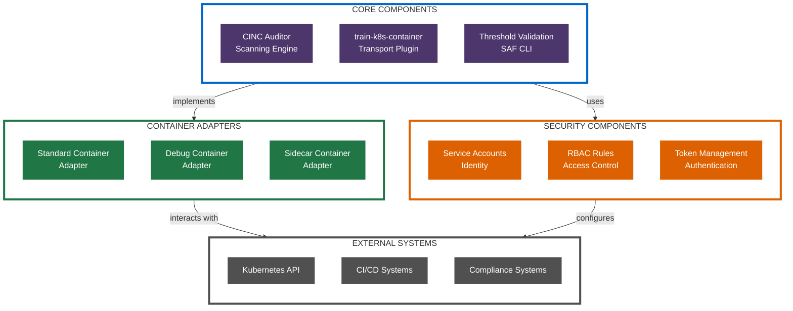

# Architecture & Workflows

This document provides an overview of the architecture, system components, and workflows for the Secure CINC Auditor Kubernetes Container Scanning platform.

!!! info "Directory Contents"
    For a complete listing of all files in this section, see the [Architecture Documentation Inventory](inventory.md).

## Architecture Overview

The architecture of the platform is designed with the following principles:

1. **Security-First Approach**: Implementing least-privilege access controls and temporary credentials
2. **Modularity**: Supporting multiple scanning approaches through a pluggable design
3. **Flexibility**: Accommodating different container types and Kubernetes environments
4. **Integration**: Seamless integration with CI/CD systems and compliance frameworks

## Architecture Documentation Structure

The architecture documentation is organized into the following sections:

- [Components](components/index.md): Core architectural components and their relationships
- [Workflows](workflows/index.md): End-to-end workflow processes for different scanning approaches
- [Diagrams](diagrams/index.md): Visual representations of the architecture using WCAG-compliant Mermaid diagrams
- [Deployment](deployment/index.md): Deployment architectures for different environments
- [Integrations](integrations/index.md): Integration architectures for CI/CD platforms

## System Architecture Diagram

## Core Functionality

The scanning platform provides several key capabilities:

1. **Container Scanning**: Security scanning of containers in Kubernetes environments
2. **Compliance Validation**: Validation against security benchmarks and compliance requirements
3. **Multiple Container Support**: Scanning of both standard and distroless containers
4. **CI/CD Integration**: Integration with CI/CD pipelines for automated security validation
5. **Threshold-based Validation**: Pass/fail determination based on configurable thresholds

## Next Steps

To explore the architecture in more detail, see these documents:

- [Core Components](components/core-components.md): Details on the main system components
- [Workflow Processes](workflows/index.md): End-to-end workflows for different scanning scenarios
- [Workflow Diagrams](diagrams/workflow-diagrams.md): Visual representations of system workflows
- [Deployment Options](deployment/index.md): Different deployment architectures
- [CI/CD Integrations](integrations/index.md): Integration with CI/CD platforms