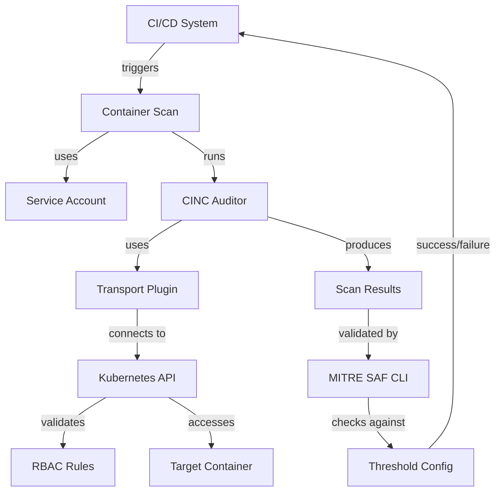

# Architecture & Workflows

This document provides an overview of the architecture, system components, and workflows for the Secure CINC Auditor Kubernetes Container Scanning platform.

!!! info "Directory Contents"
    For a complete listing of all files in this section, see the [Architecture Documentation Inventory](inventory.md).

## System Design

The architecture of the platform is designed with the following principles:

1. **Security-First Approach**: Implementing least-privilege access controls and temporary credentials
2. **Modularity**: Supporting multiple scanning approaches through a pluggable design
3. **Flexibility**: Accommodating different container types and Kubernetes environments
4. **Integration**: Seamless integration with CI/CD systems and compliance frameworks

## Core Components

The system consists of several key components that work together:

| Component | Purpose | Implementation |
|-----------|---------|----------------|
| **CINC Auditor** | Security scanning engine | InSpec-compatible open source scanner |
| **Transport Plugin** | Kubernetes communication | train-k8s-container plugin |
| **Service Accounts** | Identity for scanner | Kubernetes service account with limited lifespan |
| **RBAC Rules** | Access control | Kubernetes Roles and RoleBindings |
| **Container Adapters** | Container access | Specialized adapters for different container types |
| **Threshold Validation** | Compliance checks | MITRE SAF CLI integration |

## Workflow Documentation

For detailed information about specific workflows and processes, see these documents:

- [Workflow Processes](workflows.md) - End-to-end workflows for different scanning scenarios
- [Workflow Diagrams](diagrams.md) - Visual representations of system workflows using Mermaid diagrams

## Deployment Architecture

The platform supports multiple deployment architectures:

1. **Script-based Deployment**: Using shell scripts for direct execution and testing
2. **Helm Chart Deployment**: Modular Helm chart architecture for production environments
3. **CI/CD Integration**: Embedded in CI/CD pipelines through GitHub Actions and GitLab CI

> **Note**: The Helm Chart Architecture documentation has been moved to the [Helm Charts](../helm-charts/architecture.md) section, as it specifically pertains to the architecture of Helm charts.

## Workflow Overview

## Next Steps

- Review the [Technical Overview](../overview/index.md) for a detailed explanation of system components
- Explore the [Scanning Approaches](../approaches/index.md) to understand different container scanning methods
- See [Workflow Diagrams](diagrams.md) for detailed visual representations of the workflows