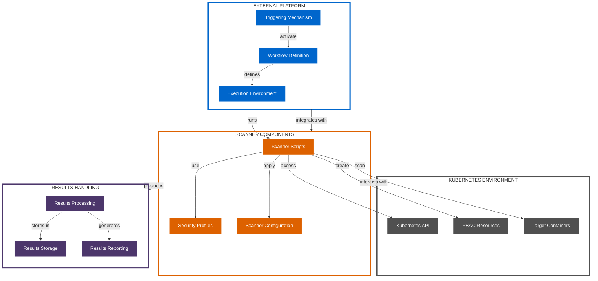
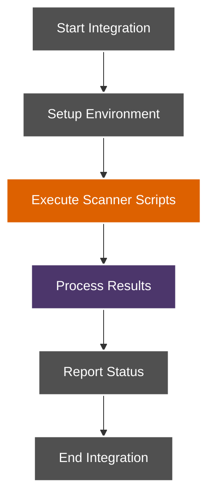
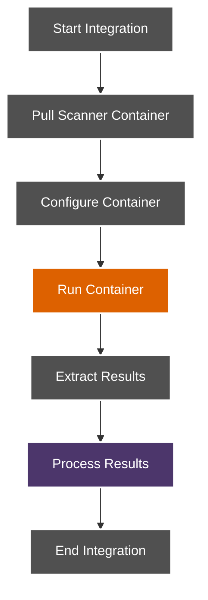
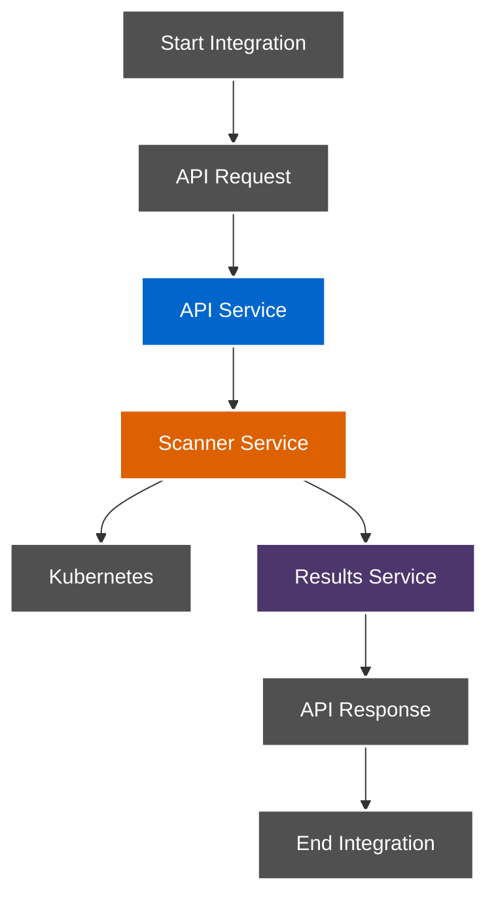
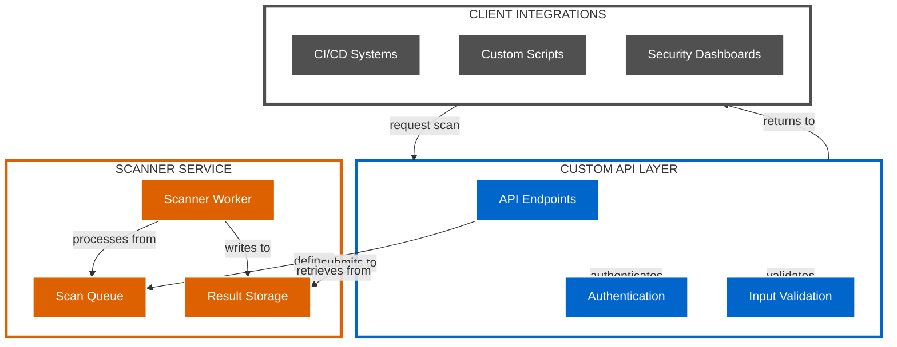
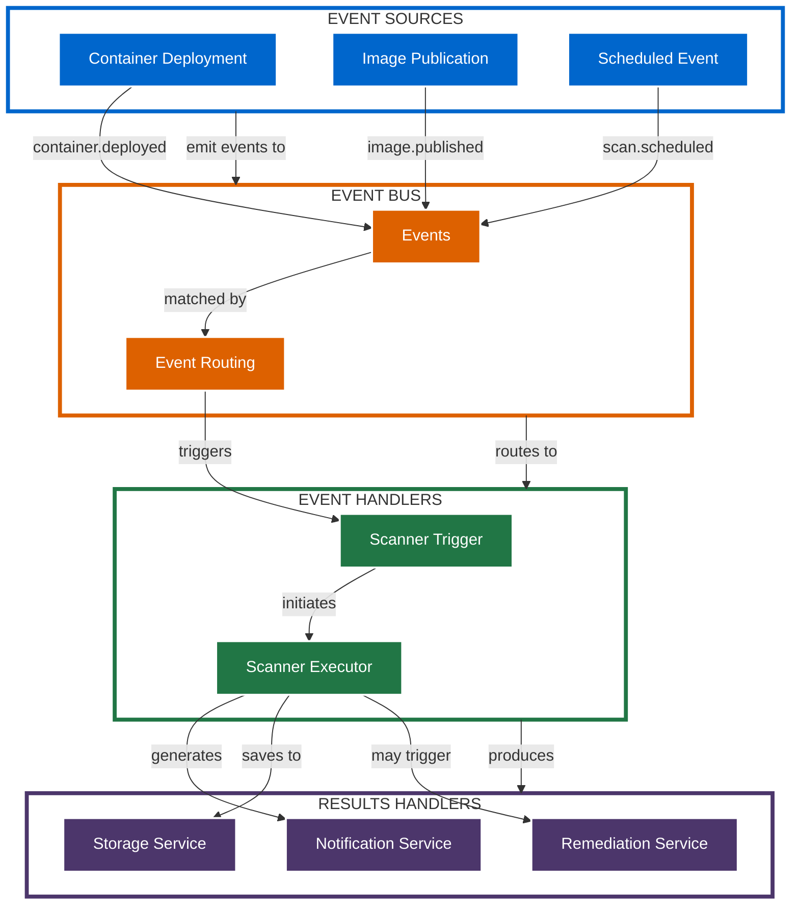

# Custom Integrations Architecture

This document details the architecture for integrating the Kubernetes CINC Secure Scanner with custom CI/CD platforms and external systems.

## Integration Overview

The custom integrations architecture provides guidance for integrating the scanning system with CI/CD platforms beyond GitHub Actions and GitLab CI, as well as with other external systems.

## Integration Architecture

The general architecture for custom integrations follows this pattern:



## Supported Integration Platforms

The scanning system can be integrated with various platforms:

| Platform | Integration Type | Key Components |
|----------|-----------------|----------------|
| Jenkins | Pipeline script | Jenkins Pipeline DSL, shared library |
| CircleCI | Config file | .circleci/config.yml, orbs |
| Bamboo | Build plan | Build tasks, deployment projects |
| TeamCity | Build configuration | Build steps, parameters |
| Azure DevOps | Pipeline file | azure-pipelines.yml, tasks |
| AWS CodePipeline | Pipeline definition | CodeBuild projects, buildspec.yml |
| Spinnaker | Pipeline definition | Stages, triggers, notifications |
| Custom scripts | Direct execution | Bash/Python scripts, cron jobs |

## Integration Patterns

### 1. Direct Script Execution

The simplest pattern involves direct execution of scanner scripts:



### 2. Container-based Integration

Using containers to package and run the scanner:



### 3. API-based Integration

Integrating through a custom API layer:



## Example Integrations

### Jenkins Pipeline Integration

```groovy
pipeline {
    agent {
        kubernetes {
            yaml """
apiVersion: v1
kind: Pod
spec:
  containers:
  - name: cinc
    image: registry.example.com/cinc-auditor:latest
    command:
    - cat
    tty: true
  - name: kubectl
    image: bitnami/kubectl:latest
    command:
    - cat
    tty: true
"""
        }
    }
    
    environment {
        PROFILE_PATH = 'examples/cinc-profiles/container-baseline'
        TARGET_NAMESPACE = 'default'
        TARGET_POD = 'web-app'
        TARGET_CONTAINER = 'web-container'
    }
    
    stages {
        stage('Setup') {
            steps {
                container('kubectl') {
                    sh 'kubectl apply -f test-pod.yaml'
                    sh 'kubectl wait --for=condition=Ready pod/$TARGET_POD --timeout=60s'
                }
            }
        }
        
        stage('Scan') {
            steps {
                container('cinc') {
                    sh """
                        cinc exec -t k8s-container://${TARGET_NAMESPACE}/${TARGET_POD}/${TARGET_CONTAINER} \
                            --input ${PROFILE_PATH} \
                            --reporter json:results.json
                    """
                }
            }
        }
        
        stage('Validate') {
            steps {
                container('cinc') {
                    sh """
                        if jq -e '.profiles[0].controls[] | select(.status == "failed")' results.json > /dev/null; then
                            echo "Security scan failed"
                            exit 1
                        else
                            echo "Security scan passed"
                        fi
                    """
                }
            }
        }
    }
    
    post {
        always {
            archiveArtifacts artifacts: 'results.json', allowEmptyArchive: true
        }
    }
}
```

### CircleCI Integration

```yaml
version: 2.1

jobs:
  scan:
    docker:
      - image: registry.example.com/scanner:latest
    steps:
      - checkout
      - setup_remote_docker
      - run:
          name: Setup Kubernetes
          command: |
            echo "${KUBECONFIG_CONTENT}" > kubeconfig.yaml
            export KUBECONFIG=kubeconfig.yaml
      - run:
          name: Deploy Target Container
          command: kubectl apply -f test-pod.yaml
      - run:
          name: Scan Container
          command: |
            ./scripts/scan-container.sh default test-pod test-container examples/cinc-profiles/container-baseline
      - run:
          name: Validate Results
          command: |
            if jq -e '.failure_count > 0' results/summary.json; then
              echo "Security scan failed"
              exit 1
            else
              echo "Security scan passed"
            fi
      - store_artifacts:
          path: results/
          destination: scan-results

workflows:
  security-scan:
    jobs:
      - scan
```

### AWS CodeBuild Integration

```yaml
version: 0.2

phases:
  install:
    runtime-versions:
      ruby: 2.7
    commands:
      - curl -LO "https://dl.k8s.io/release/v1.23.0/bin/linux/amd64/kubectl"
      - chmod +x kubectl && mv kubectl /usr/local/bin/
      - gem install cinc-auditor-bin saf
      
  pre_build:
    commands:
      - mkdir -p ~/.kube
      - echo "${KUBECONFIG_CONTENT}" > ~/.kube/config
      - chmod 600 ~/.kube/config
      - kubectl apply -f test-pod.yaml
      - kubectl wait --for=condition=Ready pod/test-pod --timeout=60s
      
  build:
    commands:
      - cinc exec -t k8s-container://default/test-pod/test-container --input examples/cinc-profiles/container-baseline --reporter json:results.json
      
  post_build:
    commands:
      - saf validate results.json -c examples/thresholds/moderate.yml --reporter cli
      - |
        if [ $(jq '.failure_count' results.json) -gt 0 ]; then
          echo "Security scan failed"
          exit 1
        else
          echo "Security scan passed"
        fi

artifacts:
  files:
    - results.json
    - validation.json
  name: scan-results
```

## Custom API Integration

For programmatic integration, a custom API layer can be implemented:



### API Endpoints

Example API endpoints for custom integration:

| Endpoint | Method | Purpose |
|----------|--------|---------|
| `/api/v1/scans` | POST | Create new scan |
| `/api/v1/scans/{id}` | GET | Get scan status |
| `/api/v1/scans/{id}/results` | GET | Get scan results |
| `/api/v1/profiles` | GET | List available profiles |
| `/api/v1/thresholds` | GET | List available thresholds |

### Example API Request

```json
{
  "target": {
    "namespace": "default",
    "pod": "web-app",
    "container": "web-container"
  },
  "scan": {
    "profile": "container-baseline",
    "threshold": "moderate"
  },
  "options": {
    "timeout": 300,
    "reportFormat": "json"
  },
  "callback": {
    "url": "https://ci-system.example.com/callbacks/scan-123",
    "authentication": {
      "type": "bearer",
      "token": "eyJhbGciOiJIUzI1NiIsInR5cCI6IkpXVCJ9..."
    }
  }
}
```

## Event-Driven Integration

For event-driven architectures, the scanner can be triggered by events:



## Security Considerations

When implementing custom integrations, consider these security aspects:

1. **Authentication**: Secure authentication mechanisms for API access
2. **Authorization**: Proper permission controls for scanning operations
3. **Credential Management**: Secure handling of Kubernetes credentials
4. **Network Security**: Secure communication between components
5. **Result Protection**: Protection of sensitive scan results

## Integration Best Practices

Follow these best practices for custom integrations:

1. **Modularity**: Keep integration components modular for flexibility
2. **Configuration**: Use configuration files for environment-specific settings
3. **Error Handling**: Implement robust error handling and reporting
4. **Scalability**: Design for scalability to handle multiple concurrent scans
5. **Monitoring**: Include monitoring and logging for visibility
6. **Documentation**: Maintain clear documentation for custom integrations
7. **Testing**: Thoroughly test integrations before production use
8. **Maintenance**: Plan for ongoing maintenance and updates

## Custom Integration Tools

Several tools and libraries can help with custom integrations:

| Tool | Purpose | Integration Use |
|------|---------|-----------------|
| REST APIs | Service communication | Build API integrations |
| Webhooks | Event notification | Trigger scans on events |
| Message Queues | Asynchronous processing | Queue scan requests |
| Docker | Containerization | Package scanner components |
| Kubernetes CRDs | Custom resources | Define scan specifications |
| OAuth/OIDC | Authentication | Secure API access |
| OpenAPI | API documentation | Document integration APIs |

## Additional Resources

For more information on custom integrations, see:

- [Enterprise Integration Analysis](../../overview/enterprise-integration-analysis.md)
- [Integration Overview](../../integration/overview.md)
- [Approach Mapping](../../integration/approach-mapping.md)