# GitHub Actions Integration Architecture

This document details the architecture for integrating the Kubernetes CINC Secure Scanner with GitHub Actions.

## Integration Overview

GitHub Actions integration enables container scanning to be performed as part of GitHub CI/CD workflows. This allows for security validation of containers during pull requests, deployments, or scheduled scans.

## Architectural Components

### 1. GitHub Workflow Configuration

The integration uses GitHub workflow YAML files to define the scanning process:

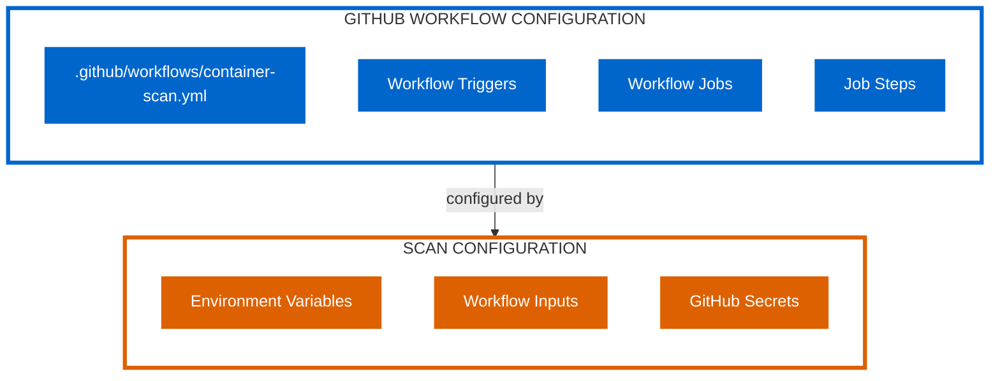

### 2. Integration Architecture

The overall architecture integrates GitHub Actions with the scanning system:

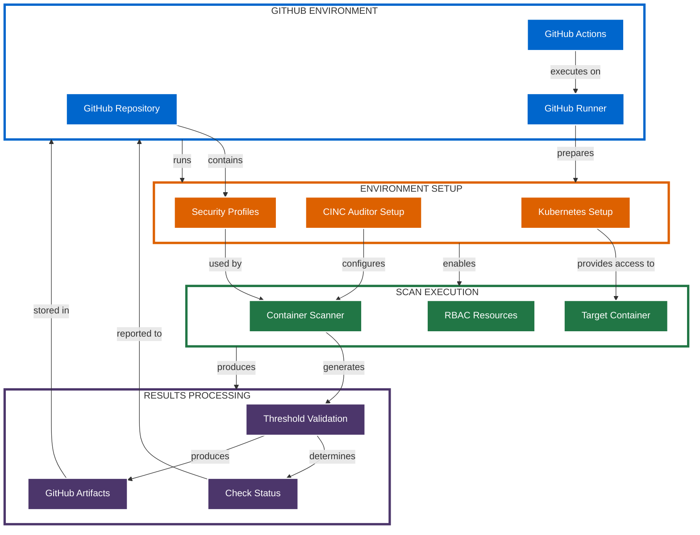

## Integration Workflow

The GitHub Actions integration follows this workflow process:

### 1. Workflow Triggering

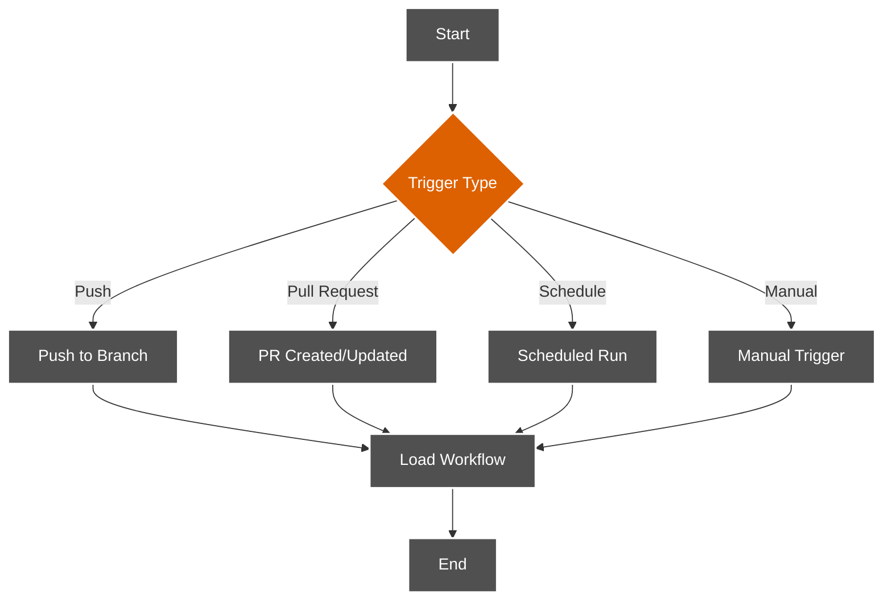

### 2. Environment Setup

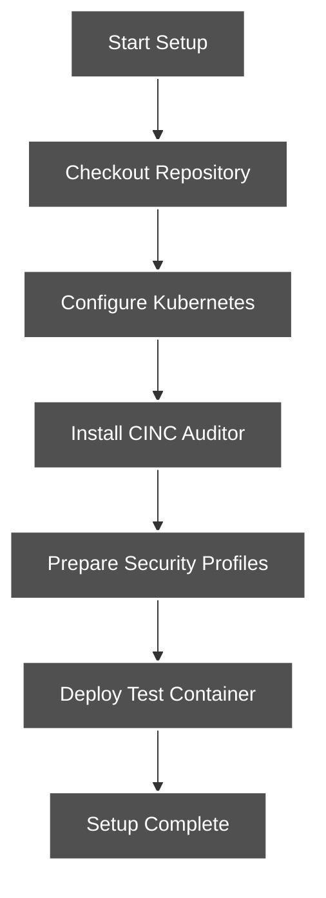

### 3. Scan Execution

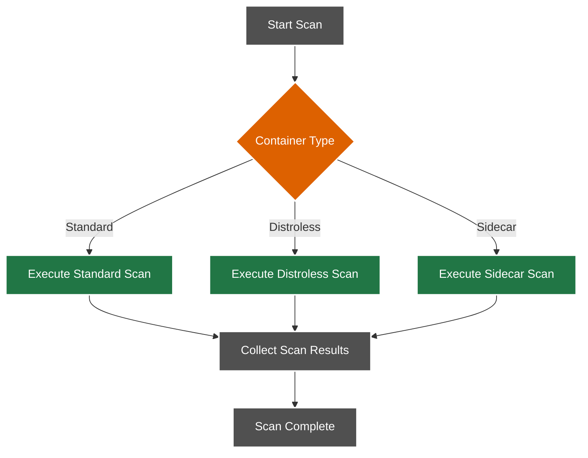

### 4. Results Processing

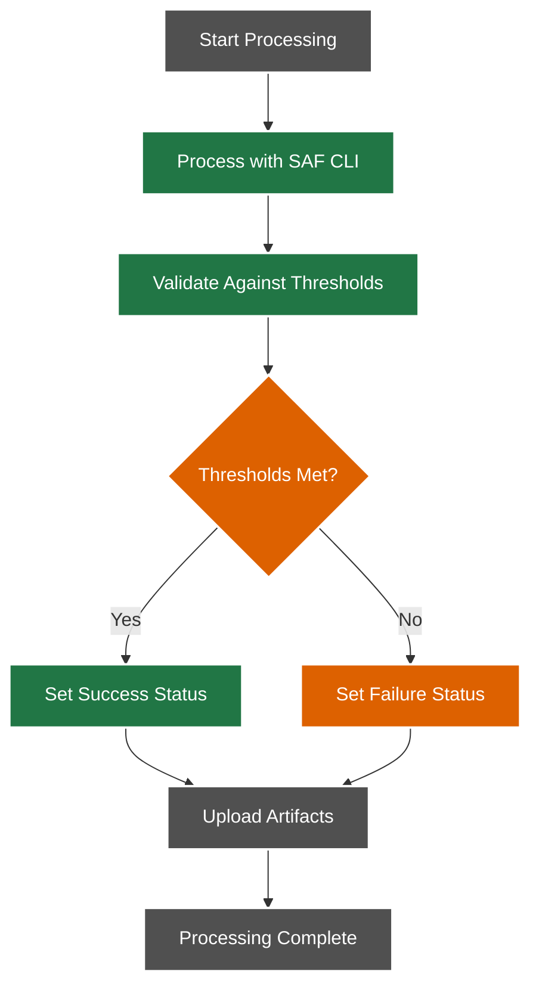

## Example GitHub Actions Workflow

```yaml
name: Kubernetes Container Security Scan

on:
  push:
    branches: [ main ]
  pull_request:
    branches: [ main ]
  schedule:
    - cron: '0 0 * * 0'  # Weekly on Sundays at midnight

jobs:
  container-scan:
    runs-on: ubuntu-latest
    
    steps:
    - name: Checkout Repository
      uses: actions/checkout@v2
    
    - name: Set up Kubernetes
      uses: helm/kind-action@v1.2.0
    
    - name: Set up CINC Auditor
      run: |
        curl -L https://omnitruck.cinc.sh/install.sh | sudo bash -s -- -P auditor
    
    - name: Deploy Test Container
      run: |
        kubectl apply -f test-pod.yaml
        kubectl wait --for=condition=Ready pod/test-pod --timeout=60s
    
    - name: Scan Standard Container
      run: |
        ./kubernetes-scripts/scan-container.sh default test-pod test-container examples/cinc-profiles/container-baseline
      
    - name: Process Results
      run: |
        if [ -f "results/summary.json" ]; then
          FAILURES=$(jq '.failure_count' results/summary.json)
          if [ "$FAILURES" -gt 0 ]; then
            echo "::error::Security scan failed with $FAILURES failures"
            exit 1
          else
            echo "::notice::Security scan passed"
          fi
        else
          echo "::error::Results file not found"
          exit 1
        fi
    
    - name: Upload Scan Results
      uses: actions/upload-artifact@v2
      with:
        name: security-scan-results
        path: results/
```

## GitHub-Specific Integration Features

### 1. Status Checks

GitHub Actions integration allows for status checks on pull requests:

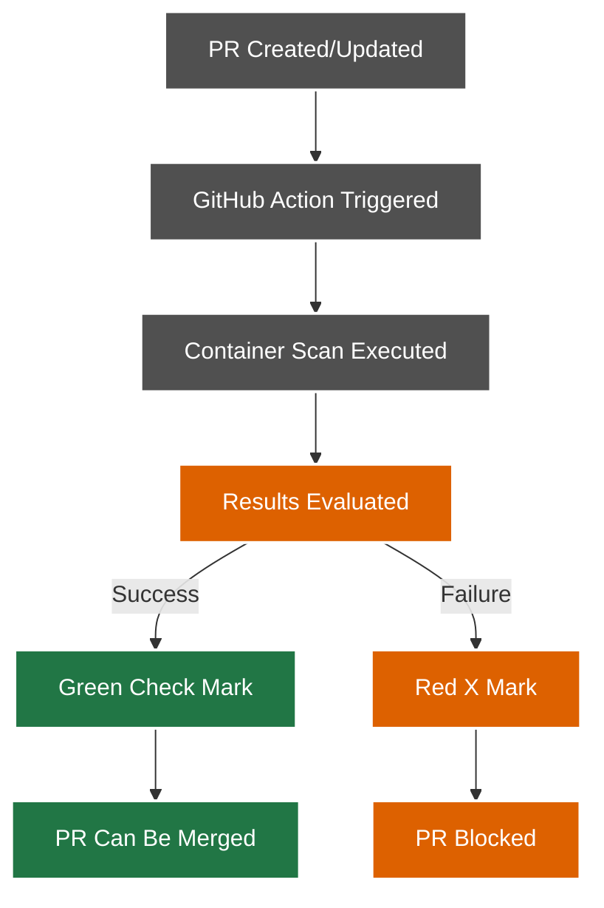

### 2. Workflow Matrices

Complex scanning configurations can utilize workflow matrices:

```yaml
jobs:
  scan-matrix:
    runs-on: ubuntu-latest
    strategy:
      matrix:
        container-type: [standard, distroless, sidecar]
        profile: [container-baseline, container-cis]
    
    steps:
    # Setup steps...
    
    - name: Scan Container
      run: |
        case "${{ matrix.container-type }}" in
          standard)
            ./kubernetes-scripts/scan-container.sh default test-pod test-container examples/cinc-profiles/${{ matrix.profile }}
            ;;
          distroless)
            ./kubernetes-scripts/scan-distroless-container.sh default distroless-pod distroless-container examples/cinc-profiles/${{ matrix.profile }}
            ;;
          sidecar)
            ./kubernetes-scripts/scan-with-sidecar.sh default target-pod examples/cinc-profiles/${{ matrix.profile }}
            ;;
        esac
```

### 3. GitHub Security Features

Integration with GitHub security features:

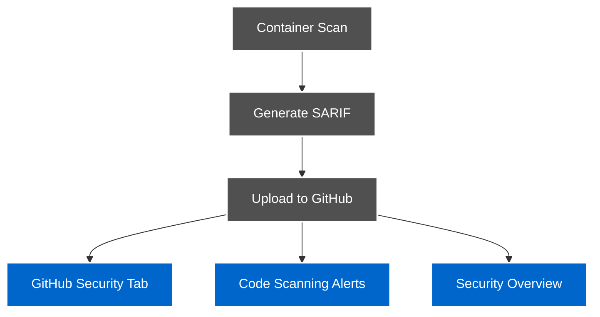

## Security Considerations

The GitHub Actions integration implements these security measures:

1. **Secret Management**: Kubernetes credentials stored as GitHub Secrets
2. **Runner Isolation**: Scans run in isolated GitHub Runners
3. **Temporary Resources**: All resources created during workflow are temporary
4. **Limited Scope**: Workflow has access only to what is necessary
5. **Artifact Protection**: Scan results stored as protected artifacts

## Integration Patterns

### 1. Standard Pattern

Direct execution of scanning scripts in GitHub Actions:

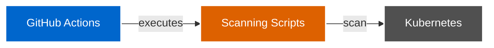

### 2. Container Pattern

Using containerized scanners in GitHub Actions:

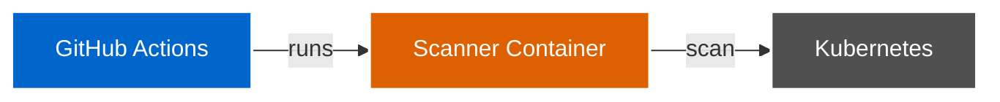

### 3. Reusable Workflow Pattern

Using reusable workflows for standardized scanning:

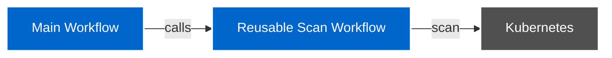

## Additional Resources

For more detailed GitHub Actions examples, see:

- [GitHub Workflow Examples](../../github-workflow-examples/index.md)
- [CI/CD Pipeline Example](../../github-workflow-examples/ci-cd-pipeline.yml)
- [Setup and Scan Example](../../github-workflow-examples/setup-and-scan.yml)
- [Sidecar Scanner Example](../../github-workflow-examples/sidecar-scanner.yml)
- [Dynamic RBAC Scanning Example](../../github-workflow-examples/dynamic-rbac-scanning.yml)
- [Existing Cluster Scanning Example](../../github-workflow-examples/existing-cluster-scanning.yml)
