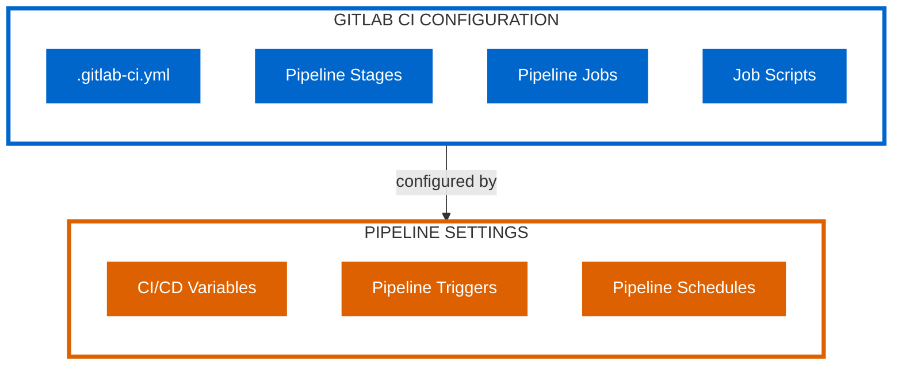
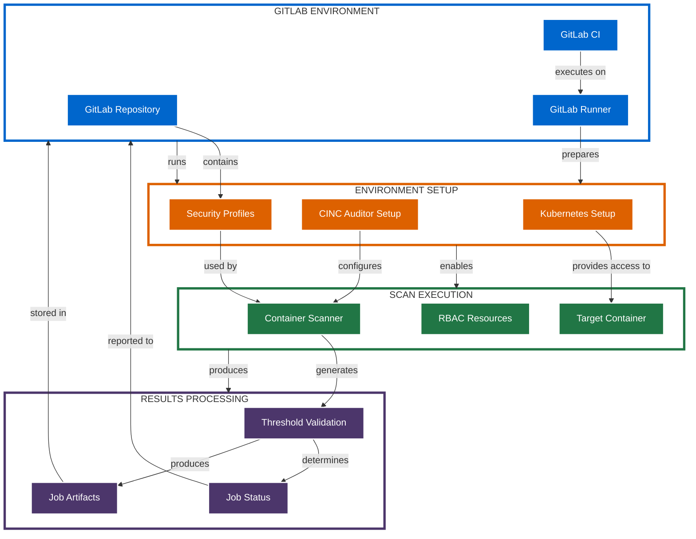
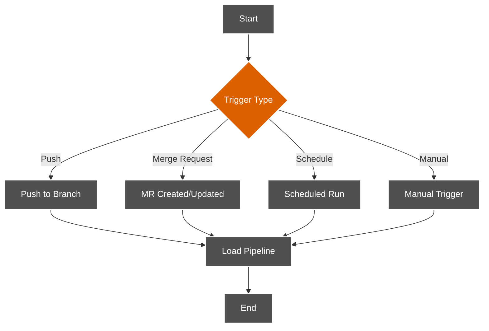
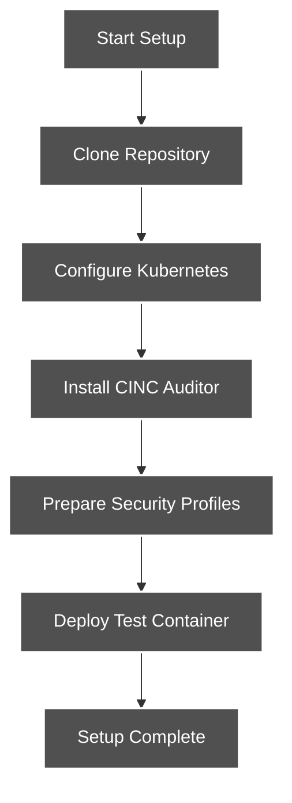
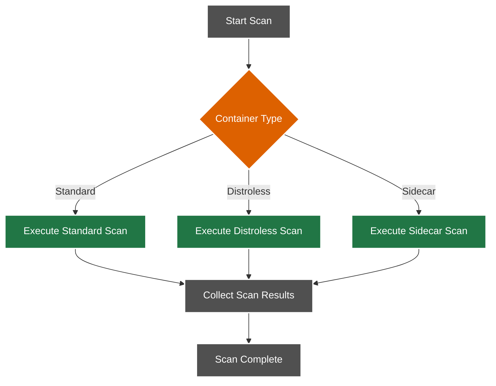
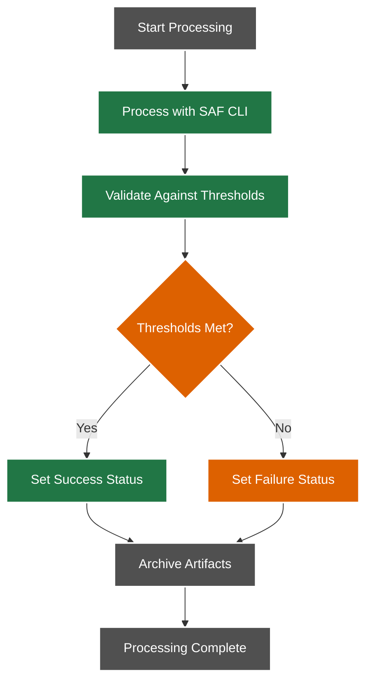
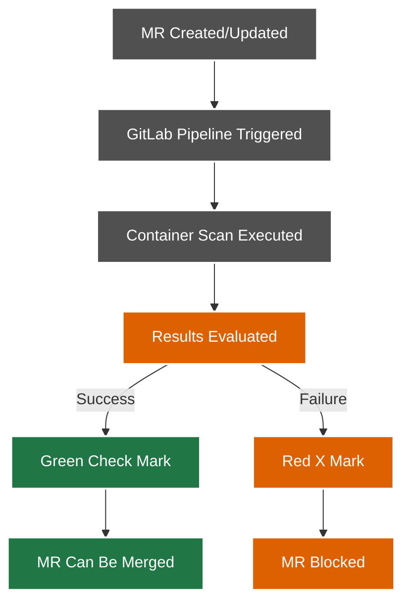
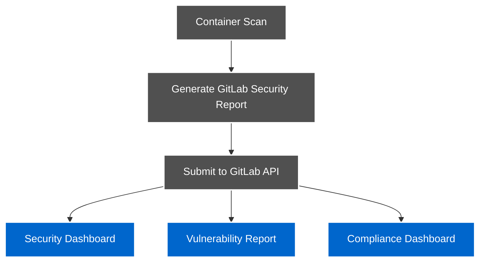
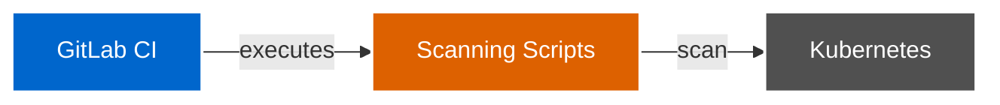
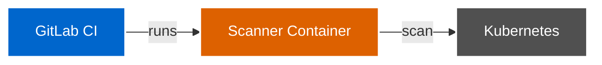

# GitLab CI Integration Architecture

This document details the architecture for integrating the Kubernetes CINC Secure Scanner with GitLab CI pipelines.

## Integration Overview

GitLab CI integration enables container scanning to be performed as part of GitLab CI/CD pipelines. This allows for security validation of containers during merge requests, deployments, or scheduled scans.

## Architectural Components

### 1. GitLab CI Configuration

The integration uses GitLab CI configuration files to define the scanning process:



### 2. Integration Architecture

The overall architecture integrates GitLab CI with the scanning system:



## Integration Workflow

The GitLab CI integration follows this workflow process:

### 1. Pipeline Triggering



### 2. Environment Setup



### 3. Scan Execution



### 4. Results Processing



## Example GitLab CI Configuration

```yaml
stages:
  - deploy
  - scan
  - validate

variables:
  KUBE_CONTEXT: my-kubernetes-context
  TARGET_NAMESPACE: default
  TARGET_POD: web-app
  TARGET_CONTAINER: web-container
  PROFILE_PATH: examples/cinc-profiles/container-baseline
  THRESHOLD_FILE: examples/thresholds/moderate.yml

.setup_cinc: &setup_cinc
  - curl -L https://omnitruck.cinc.sh/install.sh | bash -s -- -P auditor
  - cinc-auditor --version

deploy-test-container:
  stage: deploy
  script:
    - kubectl --context $KUBE_CONTEXT apply -f test-pod.yaml
    - kubectl --context $KUBE_CONTEXT wait --for=condition=Ready pod/$TARGET_POD --timeout=60s

scan-container:
  stage: scan
  before_script:
    - *setup_cinc
  script:
    - ./scripts/scan-container.sh $TARGET_NAMESPACE $TARGET_POD $TARGET_CONTAINER $PROFILE_PATH
  artifacts:
    paths:
      - results/
    expire_in: 1 week

validate-results:
  stage: validate
  script:
    - if [ ! -f "results/summary.json" ]; then echo "Results file missing"; exit 1; fi
    - FAILURES=$(jq '.failure_count' results/summary.json)
    - if [ "$FAILURES" -gt 0 ]; then
        echo "Security scan failed with $FAILURES failures";
        exit 1;
      else
        echo "Security scan passed";
      fi
  dependencies:
    - scan-container
```

## GitLab-Specific Integration Features

### 1. Merge Request Status

GitLab CI integration provides status checks on merge requests:



### 2. Pipeline Matrix

Using GitLab's parallel matrix feature for complex scanning:

```yaml
scan-matrix:
  stage: scan
  parallel:
    matrix:
      - CONTAINER_TYPE: [standard, distroless, sidecar]
        PROFILE: [container-baseline, container-cis]
  script:
    - |
      case "$CONTAINER_TYPE" in
        standard)
          ./scripts/scan-container.sh default test-pod test-container examples/cinc-profiles/$PROFILE
          ;;
        distroless)
          ./scripts/scan-distroless-container.sh default distroless-pod distroless-container examples/cinc-profiles/$PROFILE
          ;;
        sidecar)
          ./scripts/scan-with-sidecar.sh default target-pod examples/cinc-profiles/$PROFILE
          ;;
      esac
```

### 3. GitLab Security Dashboard

Integration with GitLab security features:



## Security Considerations

The GitLab CI integration implements these security measures:

1. **Secret Management**: Kubernetes credentials stored as GitLab CI/CD Variables
2. **Runner Isolation**: Scans run in isolated GitLab Runners
3. **Temporary Resources**: All resources created during pipeline are temporary
4. **Limited Scope**: Pipeline has access only to what is necessary
5. **Artifact Protection**: Scan results stored as protected artifacts

## Integration Patterns

### 1. Standard Pattern

Direct execution of scanning scripts in GitLab CI:



### 2. Docker Executor Pattern

Using GitLab's Docker executor for containerized scanning:



### 3. Include Pattern

Using GitLab's include feature for reusable scanning configurations:


## Additional Resources

For more detailed GitLab CI examples, see:

- [GitLab Pipeline Examples](../../gitlab-pipeline-examples/index.md)
- [GitLab CI Example](../../gitlab-pipeline-examples/gitlab-ci.yml)
- [GitLab CI with Services Example](../../gitlab-pipeline-examples/gitlab-ci-with-services.yml)
- [GitLab CI Sidecar Example](../../gitlab-pipeline-examples/gitlab-ci-sidecar.yml)
- [Dynamic RBAC Scanning Example](../../gitlab-pipeline-examples/dynamic-rbac-scanning.yml)
- [Existing Cluster Scanning Example](../../gitlab-pipeline-examples/existing-cluster-scanning.yml)