# GitLab Services Integration Architecture

This document details the architecture for integrating the Kubernetes CINC Secure Scanner with GitLab CI using the services approach.

## Integration Overview

The GitLab Services integration uses GitLab's services feature to run the scanning components as separate services alongside the main CI/CD pipeline. This provides better isolation and reusability compared to the standard GitLab CI approach.

## Architectural Components

### 1. GitLab Services

The integration defines several services to support scanning:

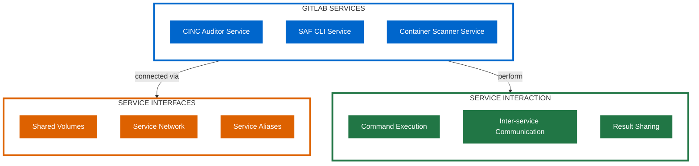

### 2. Integration Architecture

The overall architecture integrates GitLab services with the scanning system:

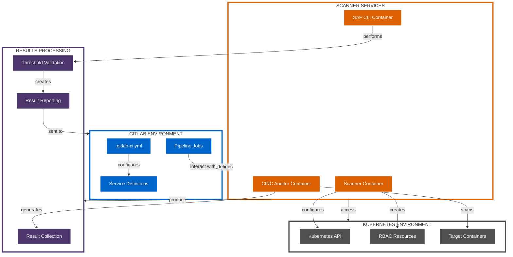

## Service Components

### 1. CINC Auditor Service

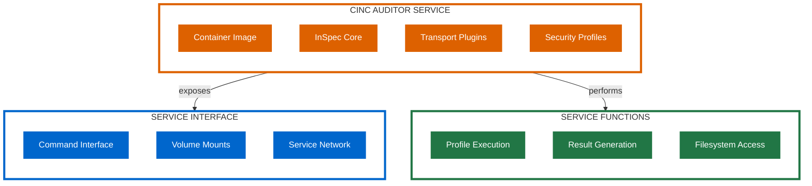

### 2. SAF CLI Service

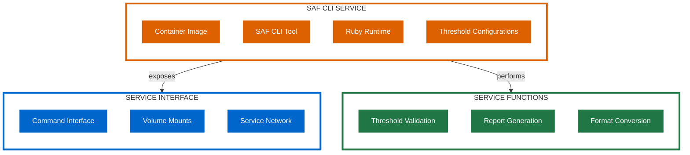

### 3. Scanner Service

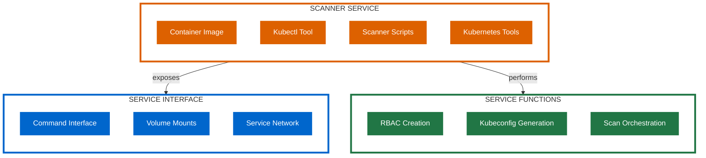

## Integration Workflow

The GitLab Services integration follows this workflow process:

### 1. Service Initialization

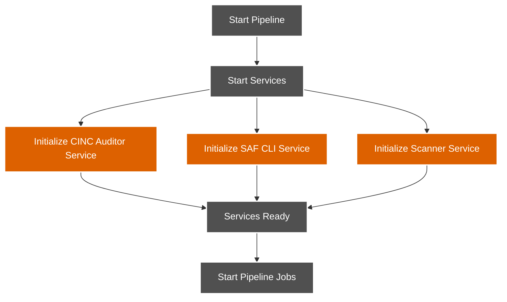

### 2. Scan Execution

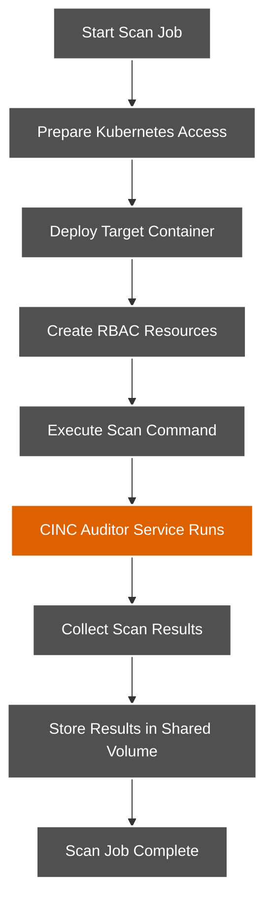

### 3. Results Processing

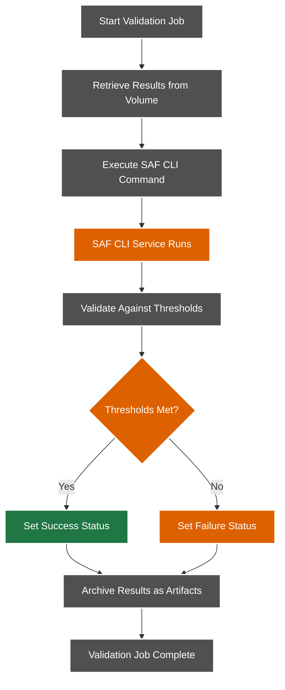

## Example GitLab CI with Services Configuration

```yaml
services:
  - name: registry.example.com/cinc-auditor:latest
    alias: cinc
  - name: registry.example.com/saf-cli:latest
    alias: saf
  - name: registry.example.com/kubernetes-scanner:latest
    alias: scanner

variables:
  KUBE_CONFIG: ${CI_PROJECT_DIR}/.kube/config
  RESULTS_DIR: ${CI_PROJECT_DIR}/results
  PROFILE_PATH: /profiles/container-baseline
  THRESHOLD_FILE: /thresholds/moderate.yml

stages:
  - setup
  - scan
  - validate

prepare-environment:
  stage: setup
  script:
    - mkdir -p ${CI_PROJECT_DIR}/.kube
    - echo "${KUBECONFIG_CONTENT}" > ${KUBE_CONFIG}
    - chmod 600 ${KUBE_CONFIG}
    - mkdir -p ${RESULTS_DIR}
    - scanner setup-environment

scan-container:
  stage: scan
  script:
    - scanner deploy-test-container
    - |
      cinc exec -t k8s-container://default/test-pod/test-container \
        --input ${PROFILE_PATH} \
        --reporter json:${RESULTS_DIR}/results.json
  artifacts:
    paths:
      - ${RESULTS_DIR}/

validate-results:
  stage: validate
  script:
    - |
      saf validate ${RESULTS_DIR}/results.json \
        -c ${THRESHOLD_FILE} \
        --reporter json:${RESULTS_DIR}/validation.json
    - |
      if grep -q '"status":"failed"' ${RESULTS_DIR}/validation.json; then
        echo "Security validation failed"
        exit 1
      else
        echo "Security validation passed"
      fi
  dependencies:
    - scan-container
```

## Service Communication Architecture

The services communicate with each other and with the GitLab jobs through several mechanisms:

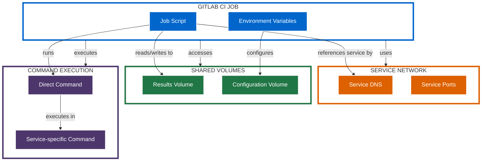

## Security Considerations

The GitLab Services integration implements these security measures:

1. **Service Isolation**: Each component runs in an isolated container
2. **Reduced Attack Surface**: Services only expose necessary interfaces
3. **Shared Volume Security**: Volumes have appropriate permissions
4. **Service Network Isolation**: Services only communicate with each other
5. **Command Validation**: Input validation for service commands

## Integration Patterns

### 1. Direct Service Execution

Running commands directly in the service containers:


### 2. Service Orchestration

Using the scanner service to orchestrate operations:

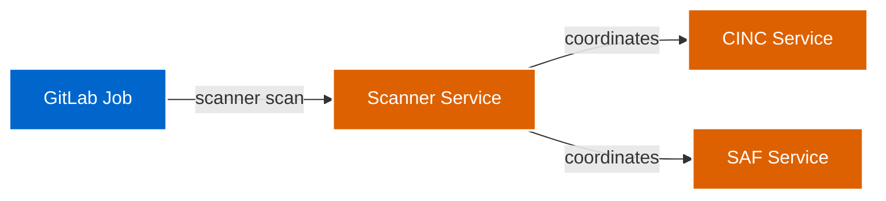

### 3. Shared Volume Communication

Services communicate through shared volumes:

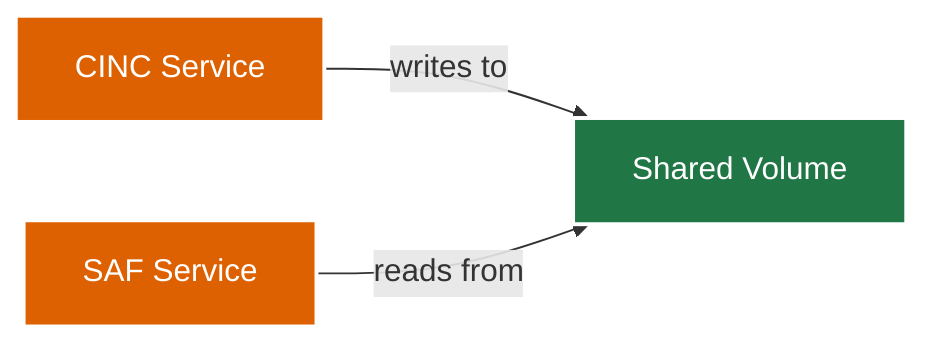

## Service Configuration

### CINC Auditor Service

```dockerfile
FROM ruby:2.7-alpine

RUN apk add --no-cache build-base libxml2-dev libxslt-dev
RUN gem install cinc-auditor-bin -v 4.38.9

WORKDIR /workspace

ENTRYPOINT ["cinc-auditor"]
CMD ["--help"]
```

### SAF CLI Service

```dockerfile
FROM ruby:2.7-alpine

RUN apk add --no-cache build-base git
RUN gem install saf -v 1.1.0

WORKDIR /workspace

ENTRYPOINT ["saf"]
CMD ["--help"]
```

### Scanner Service

```dockerfile
FROM alpine:3.14

RUN apk add --no-cache curl bash jq

# Install kubectl
RUN curl -LO "https://dl.k8s.io/release/v1.23.0/bin/linux/amd64/kubectl" && \
    chmod +x kubectl && \
    mv kubectl /usr/local/bin/

COPY scripts/ /usr/local/bin/

WORKDIR /workspace

ENTRYPOINT ["/bin/bash"]
CMD ["--help"]
```

## Additional Resources

For more detailed GitLab Services examples, see:

- [GitLab Services Examples](../../gitlab-services-examples/index.md)
- [GitLab CI with Services Example](../../gitlab-pipeline-examples/gitlab-ci-with-services.yml)
- [GitLab CI Sidecar with Services Example](../../gitlab-pipeline-examples/gitlab-ci-sidecar-with-services.yml)
