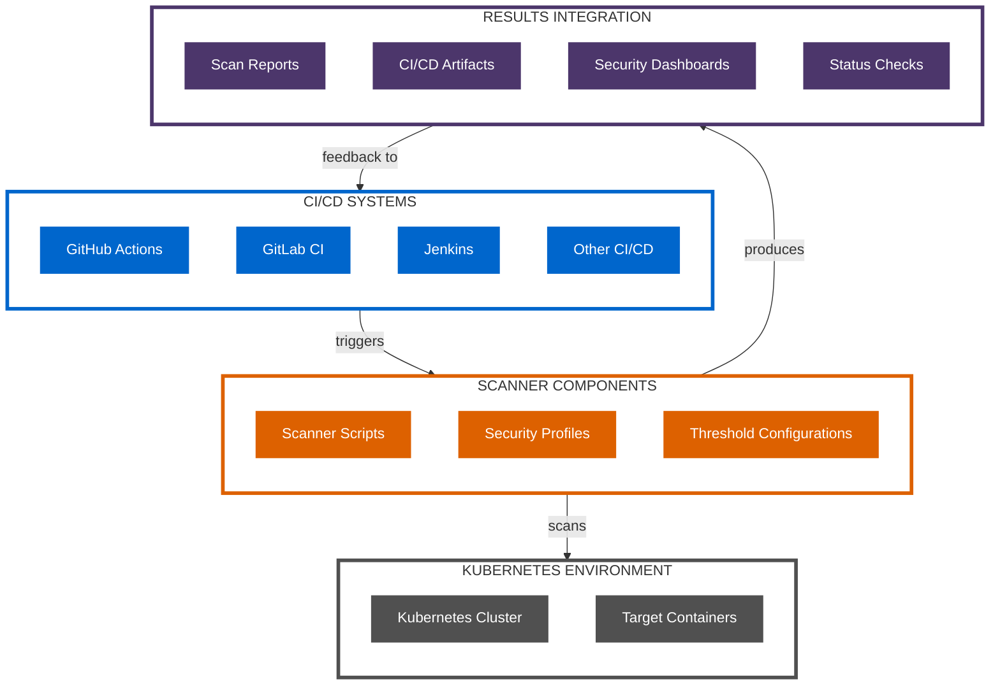

# CI/CD Integration Architecture

This section provides detailed information about the CI/CD integration architecture for the Kubernetes CINC Secure Scanner.

!!! info "Directory Contents"
    For a complete listing of all files in this section, see the [Integrations Documentation Inventory](inventory.md).

## Integration Overview

The scanning system is designed to integrate seamlessly with various CI/CD platforms and external systems:

1. **GitHub Actions Integration** - For GitHub-based workflows
2. **GitLab CI Integration** - For GitLab-based pipelines
3. **GitLab Services Integration** - For GitLab with service containers
4. **Custom Integration** - For other CI/CD platforms

## Integration Architecture Patterns

While specific implementations differ, all integrations follow these general patterns:

1. **Environment Setup**: Configure the scanning environment
2. **Security Configuration**: Establish secure access to the Kubernetes cluster
3. **Scanning Execution**: Execute the appropriate scanner
4. **Results Processing**: Process and validate scan results
5. **Pipeline Integration**: Integrate results into the CI/CD workflow

## Integration Documentation

For detailed information about specific integrations, see these documents:

- [GitHub Actions Integration](github-actions.md) - Integration with GitHub Actions
- [GitLab CI Integration](gitlab-ci.md) - Integration with GitLab CI pipelines
- [GitLab Services Integration](gitlab-services.md) - Integration with GitLab Services
- [Custom Integrations](custom-integrations.md) - Integration with other platforms

## Integration Diagram

## Next Steps

- Explore the [Component Architecture](../components/index.md) documentation
- Review the [Workflow Processes](../workflows/index.md) documentation
- See the [Deployment Options](../deployment/index.md) documentation