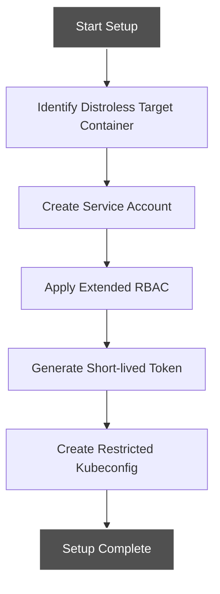
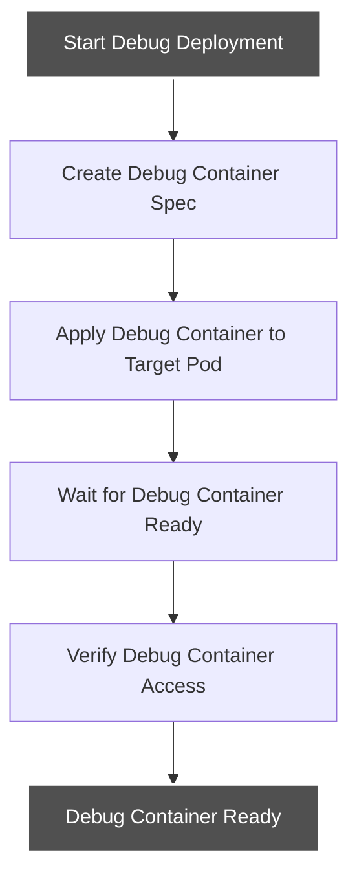
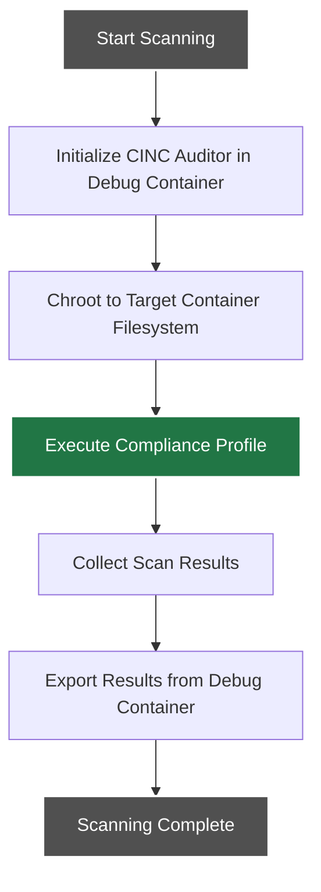
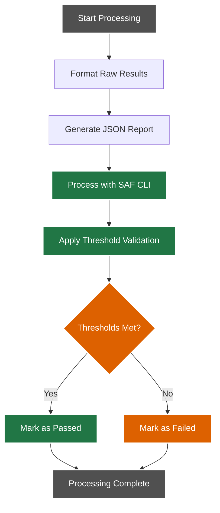
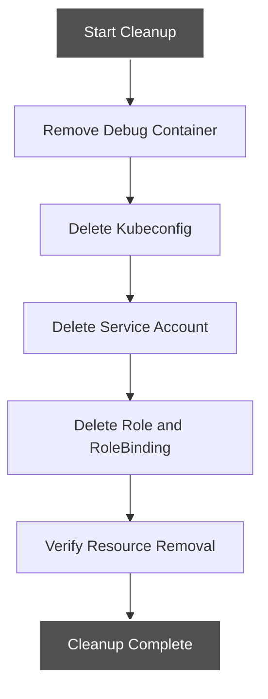

# Distroless Container Workflow

This document details the workflow for scanning distroless containers, which are minimal containers without a shell or common utilities.

## Workflow Overview

The distroless container workflow uses a debug container approach to access containers that lack a shell or common utilities. It employs ephemeral debug containers with chroot to scan the target container's filesystem.

## Detailed Workflow Steps

### 1. Setup Phase



#### Setup Tasks:

1. **Identify Target Container**:
   - Namespace, pod name, and container name are identified
   - Container status verified to ensure it's running
   - Container verified as distroless or minimal

2. **Create Service Account**:
   - Temporary service account created in target namespace
   - Account is marked for cleanup after scan completion

3. **Apply Extended RBAC**:
   - Role created with permissions for:
     - `pods/exec` permission for target pod
     - `pods/ephemeralcontainers` permission for debug container
     - `pods` GET permission for target pod
   - RoleBinding created to link service account to role

4. **Generate Token**:
   - Short-lived token generated for service account
   - Token expiration set to minimal required time

5. **Create Kubeconfig**:
   - Restricted kubeconfig file created with token
   - File permissions set to restrict access

### 2. Debug Container Deployment Phase



#### Debug Container Tasks:

1. **Create Debug Container**:
   - Debug container specification created with:
     - CINC Auditor image
     - Target process namespace sharing
     - Required security context

2. **Apply Debug Container**:
   - Debug container added to target pod
   - Container configured to access target filesystem

3. **Wait for Readiness**:
   - Debug container availability checked
   - Connection tested

### 3. Scanning Phase



#### Scanning Tasks:

1. **Initialize CINC Auditor**:
   - CINC Auditor (InSpec) initialized in debug container
   - Scanner configured with appropriate profile

2. **Chroot to Target**:
   - Target container filesystem accessed via:
     - Process filesystem (`/proc/<pid>/root`)
     - Or bind-mounted directory

3. **Execute Profile**:
   - Compliance profile run against target filesystem
   - Profile execution constrained to target context

4. **Collect Results**:
   - Scan results collected in structured JSON format
   - Results stored in debug container

5. **Export Results**:
   - Results exported from debug container
   - Results saved for processing

### 4. Results Processing Phase



#### Processing Tasks:

1. **Format Results**:
   - Raw scan results formatted for readability
   - Results organized by control

2. **Generate Reports**:
   - JSON report generated with full scan details
   - Additional report formats created as needed

3. **Process with SAF CLI**:
   - MITRE SAF CLI processes scan results
   - Results evaluated against compliance standards

4. **Threshold Validation**:
   - Results compared to configured thresholds
   - Pass/fail status determined

### 5. Cleanup Phase



#### Cleanup Tasks:

1. **Remove Debug Container**:
   - Debug container removed from target pod
   - Removal verified

2. **Delete Kubeconfig**:
   - Temporary kubeconfig file securely deleted
   - File permissions verified during deletion

3. **Delete Kubernetes Resources**:
   - Service account removed
   - Role and RoleBinding removed
   - Any other temporary resources removed

4. **Verify Cleanup**:
   - Resource deletion confirmed
   - No leftover resources remain

## Implementation Details

The distroless container workflow is implemented in the `scan-distroless-container.sh` script with the following parameters:

```bash
./scripts/scan-distroless-container.sh <namespace> <pod-name> <container-name> <profile-path> [threshold_file]
```

### Required Parameters:

- `namespace`: Kubernetes namespace containing the target container
- `pod-name`: Name of the pod containing the target container
- `container-name`: Name of the target container
- `profile-path`: Path to the InSpec profile to run

### Optional Parameters:

- `threshold_file`: Path to threshold configuration file for validation

## Kubernetes Version Requirements

This workflow requires:

- Kubernetes v1.16+ for ephemeral container support
- Feature gate `EphemeralContainers=true` enabled in the cluster

## Error Handling

The workflow includes specialized error handling for distroless containers:

1. **Feature Detection**: Checks for ephemeral container support
2. **Alternative Fallbacks**: Can use other methods if ephemeral containers unavailable
3. **Filesystem Access**: Validates access to target filesystem
4. **Resource Cleanup**: Ensures debug containers are removed even after failures

## Integration with CI/CD

For CI/CD integration, the workflow can be adapted to run as part of:

- GitHub Actions workflows with special ephemeral container permissions
- GitLab CI pipelines with extended RBAC
- Other CI/CD systems with appropriate configuration

See [CI/CD Integration for Distroless Containers](../../integration/distroless-integration.md) for specific integration examples.