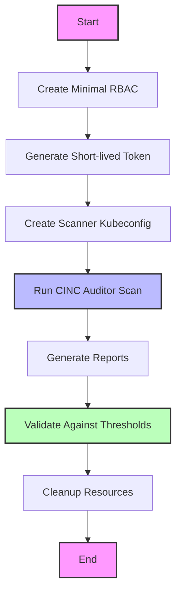

# Architecture Workflow Processes

This section provides detailed information about the workflow processes for the Kubernetes CINC Secure Scanner.

!!! info "Directory Contents"
    For a complete listing of all files in this section, see the [Workflows Documentation Inventory](inventory.md).

## Workflow Overview

The scanner supports several workflow processes to accommodate different container types and scanning requirements:

1. **Standard Container Workflow** - For containers with a shell and common utilities
2. **Distroless Container Workflow** - For minimal containers without a shell
3. **Sidecar Container Workflow** - Using a sidecar container with shared process namespace
4. **Security-Focused Workflows** - Workflows with enhanced security controls

## Common Workflow Steps

While the specific implementations differ, all workflows follow these general steps:

1. **Setup Phase**: Create necessary Kubernetes resources and security controls
2. **Access Phase**: Establish secure access to the target container
3. **Scanning Phase**: Execute CINC Auditor against the target
4. **Reporting Phase**: Process and validate scan results
5. **Cleanup Phase**: Remove temporary resources and credentials

## Workflow Documentation

For detailed information about specific workflows, see these documents:

- [Standard Container Workflow](standard-container.md) - For standard containers with a shell
- [Distroless Container Workflow](distroless-container.md) - For minimal containers without a shell
- [Sidecar Container Workflow](sidecar-container.md) - Using a sidecar container approach
- [Security Workflows](security-workflows.md) - Security-focused scanning workflows

## Standard Workflow Diagram

## Next Steps

- Explore [Component Architecture](../components/index.md) to understand the system components
- See [Diagram Visualizations](../diagrams/index.md) for detailed workflow diagrams
- Review [Deployment Options](../deployment/index.md) for different deployment architectures