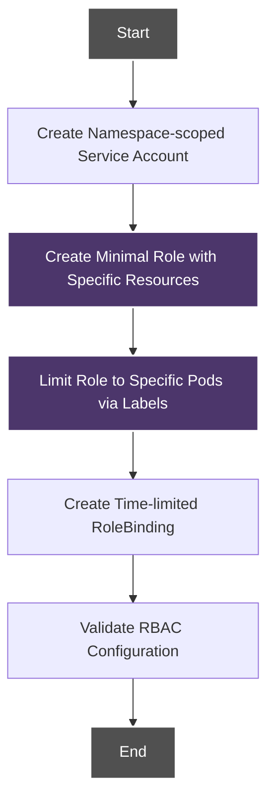
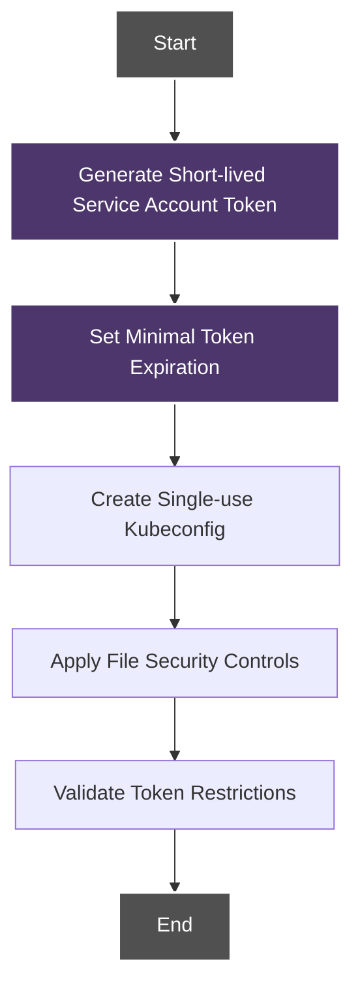
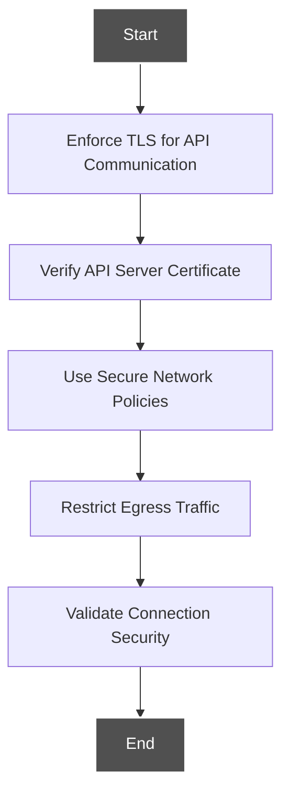
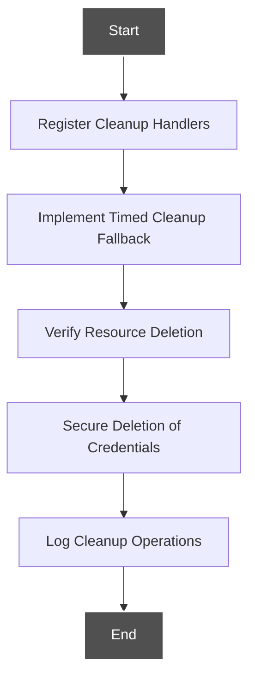
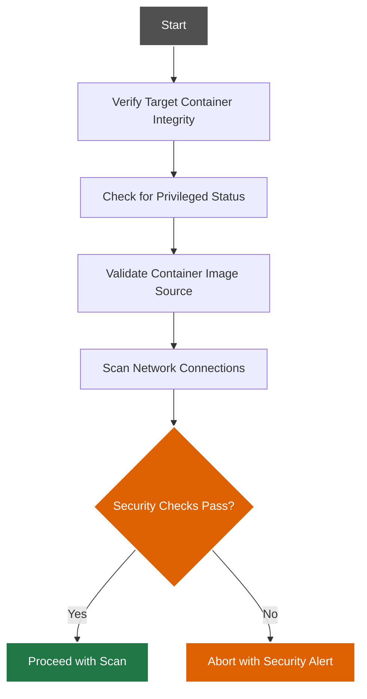
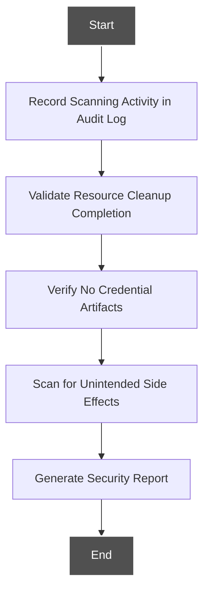
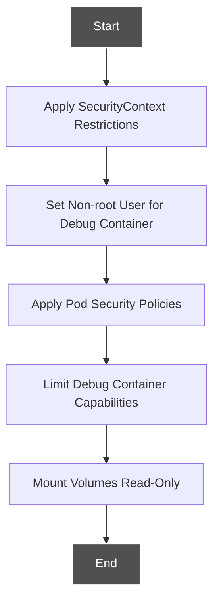
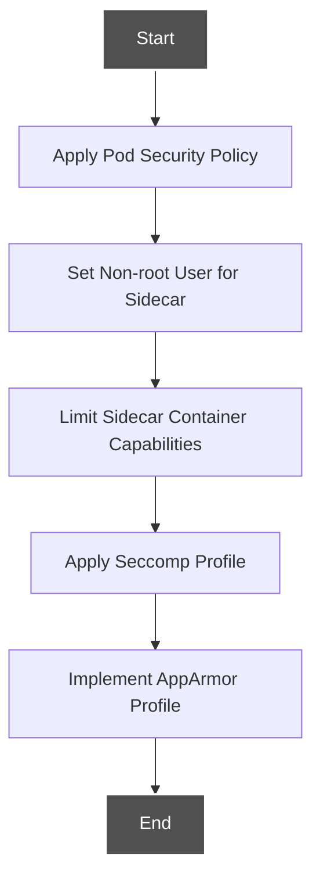

# Security-Focused Workflows

This document details the security-focused workflows that emphasize enhanced security controls for container scanning.

## Security Workflow Overview

The security-focused workflows build upon the standard, distroless, and sidecar approaches with additional security controls to meet stringent security requirements.

## Enhanced Security Controls

Security-focused workflows implement the following enhanced controls:

### 1. Least Privilege RBAC



#### Controls:

1. **Target-Specific Permissions**:
   - Role limited to specific pod by name or label
   - Exact resource permissions defined
   - No wildcard permissions

2. **Time-Limited Access**:
   - RoleBinding created with time-limited validity
   - Automatic expiration of permissions

### 2. Ephemeral Credentials



#### Controls:

1. **Token Security**:
   - Token generated with minimal lifespan
   - Token intended for single use only
   - No persistent token storage

2. **Credential Protection**:
   - Kubeconfig stored with restricted permissions
   - Kubeconfig created in memory when possible
   - Kubeconfig deleted immediately after use

### 3. Secure Network Communication



#### Controls:

1. **Transport Security**:
   - TLS enforced for all API communication
   - Certificate validation required
   - No insecure connections allowed

2. **Network Isolation**:
   - Network policies restrict scanner traffic
   - Egress limited to required endpoints
   - Communication isolation between namespaces

### 4. Automated Resource Cleanup



#### Controls:

1. **Reliable Cleanup**:
   - Multiple cleanup mechanisms (trap handlers)
   - Fallback cleanup processes
   - Verification of resource removal

2. **Secure Deletion**:
   - Secure credential wiping
   - Complete removal of all temporary resources
   - Cleanup logs for audit trail

## Security-Enhanced Standard Container Workflow

The security-enhanced standard container workflow adds these additional steps to the [standard container workflow](standard-container.md):

### 1. Pre-Scan Security Verification



### 2. Enhanced RBAC with Label Targeting

```bash
# Example of label-targeted RBAC for enhanced security
cat <<EOF | kubectl apply -f -
apiVersion: rbac.authorization.k8s.io/v1
kind: Role
metadata:
  name: scanner-role
  namespace: ${NAMESPACE}
spec:
  rules:
  - apiGroups: [""]
    resources: ["pods"]
    verbs: ["get"]
    resourceNames: ["${POD_NAME}"]
  - apiGroups: [""]
    resources: ["pods/exec"]
    verbs: ["create"]
    resourceNames: ["${POD_NAME}"]
EOF
```

### 3. Post-Scan Security Audit



## Security-Enhanced Distroless Container Workflow

The security-enhanced distroless container workflow adds these additional steps to the [distroless container workflow](distroless-container.md):

### 1. Enhanced Debug Container Controls



### 2. Debug Container Isolation

```yaml
# Example of security-enhanced debug container configuration
securityContext:
  runAsNonRoot: true
  runAsUser: 10001
  capabilities:
    drop:
    - ALL
    add:
    - CHOWN
    - DAC_OVERRIDE
  allowPrivilegeEscalation: false
  readOnlyRootFilesystem: true
```

## Security-Enhanced Sidecar Workflow

The security-enhanced sidecar workflow adds these additional steps to the [sidecar container workflow](sidecar-container.md):

### 1. Secure Sidecar Configuration



### 2. Secure Pod Manifest

```yaml
# Example of security-enhanced sidecar pod configuration
securityContext:
  runAsNonRoot: true
  runAsUser: 10001
  seccompProfile:
    type: RuntimeDefault
```

## Implementation Guidelines

To implement security-focused workflows:

1. **Baseline Identification**:
   - Identify baseline security requirements
   - Choose appropriate scanning approach based on security needs

2. **RBAC Enhancement**:
   - Use label-based targeting for specific pods
   - Implement time-limited RoleBindings
   - Apply namespace isolation

3. **Credential Hardening**:
   - Generate shortest-lived tokens possible
   - Implement secure credential handling
   - Use in-memory credential storage when available

4. **Network Security**:
   - Apply network policies for scanner isolation
   - Restrict egress traffic
   - Enforce TLS for all communication

5. **Automated Security Processes**:
   - Implement pre-scan security verification
   - Configure post-scan security auditing
   - Enable automated cleanup with verification

## Security-Enhanced Script Example

The security-enhanced scripts are available in the `/scripts/security-enhanced/` directory:

- `secure-scan-container.sh` - Enhanced standard container scanning
- `secure-scan-distroless-container.sh` - Enhanced distroless container scanning
- `secure-scan-with-sidecar.sh` - Enhanced sidecar container scanning

These scripts implement all the security controls described in this document.