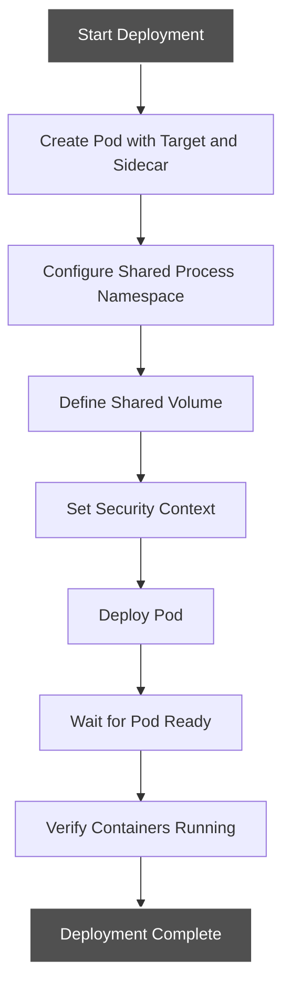
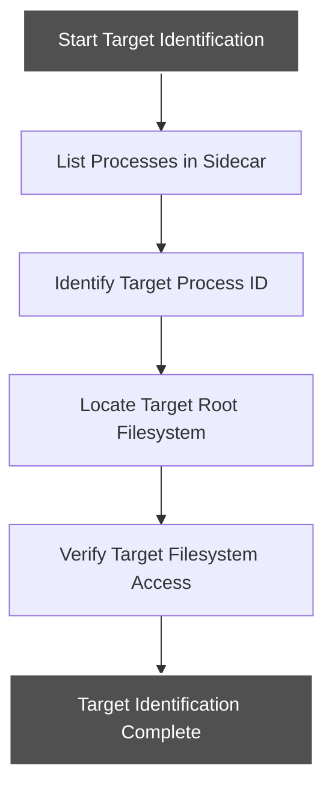
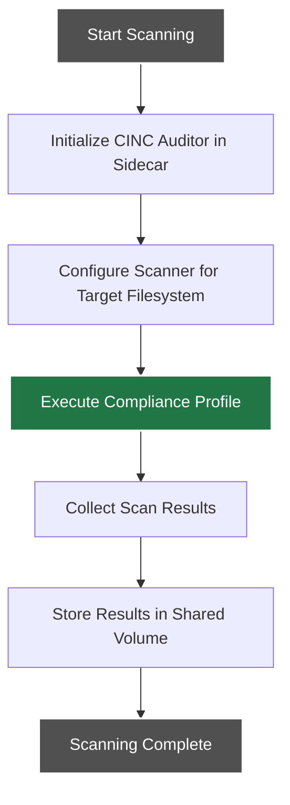
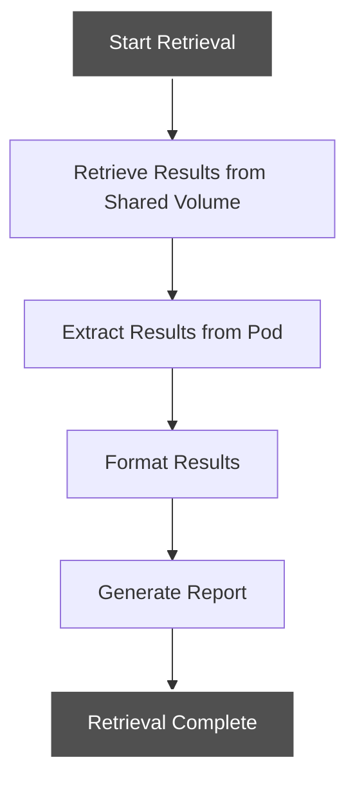
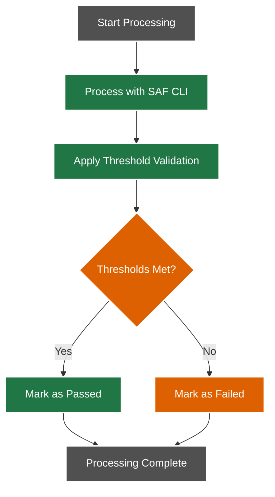
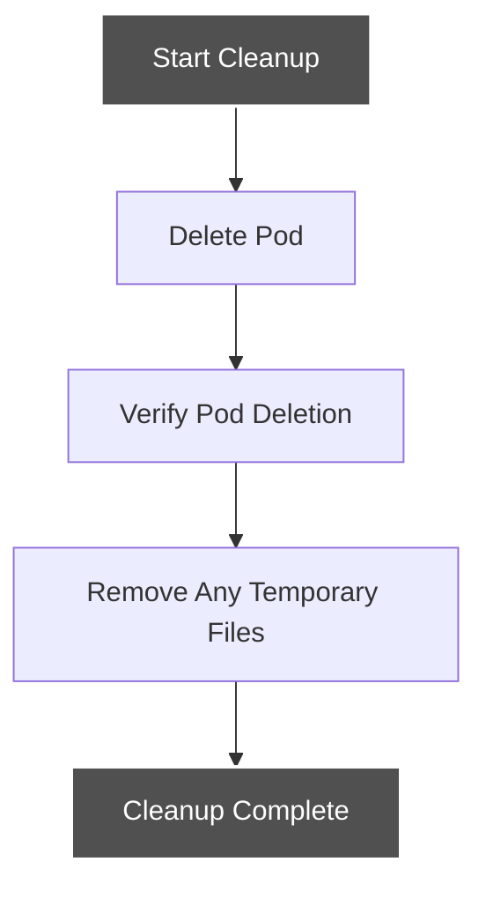

# Sidecar Container Workflow

This document details the sidecar container workflow, which uses a sidecar container with shared process namespace to scan both standard and distroless containers.

## Workflow Overview

The sidecar container workflow deploys a CINC Auditor sidecar container within the same pod as the target container, using a shared process namespace to access the target container's filesystem and processes.

## Detailed Workflow Steps

### 1. Deployment Phase



#### Deployment Tasks:

1. **Create Pod Specification**:
   - Pod spec includes target container and scanner sidecar
   - `shareProcessNamespace: true` enabled in pod spec
   - Shared volume defined for results storage

2. **Configure Scanner Sidecar**:
   - Sidecar container configured with:
     - CINC Auditor image
     - Access to shared volume
     - Appropriate security context

3. **Deploy Pod**:
   - Pod deployed to specified namespace
   - Pod status monitored until ready

### 2. Target Identification Phase



#### Identification Tasks:

1. **Process Identification**:
   - Sidecar lists all processes in shared namespace
   - Target container processes identified
   - Main process ID (PID) determined

2. **Filesystem Location**:
   - Target filesystem located via `/proc/<pid>/root`
   - Filesystem access verified

### 3. Scanning Phase



#### Scanning Tasks:

1. **Initialize CINC Auditor**:
   - CINC Auditor started in sidecar container
   - Scanner configured with appropriate profile

2. **Configure Target Access**:
   - Scanner configured to use target filesystem path
   - Access to target processes enabled

3. **Execute Profile**:
   - Compliance profile run against target filesystem
   - Commands executed in target context

4. **Store Results**:
   - Scan results stored in JSON format
   - Results saved to shared volume

### 4. Results Retrieval Phase



#### Retrieval Tasks:

1. **Access Shared Volume**:
   - Results accessed from shared volume
   - Results copied from pod to local storage

2. **Format and Extract**:
   - Raw results formatted for readability
   - Results prepared for processing

### 5. Results Processing Phase



#### Processing Tasks:

1. **Process with SAF CLI**:
   - MITRE SAF CLI processes scan results
   - Results evaluated against compliance standards

2. **Threshold Validation**:
   - Results compared to configured thresholds
   - Pass/fail status determined

### 6. Cleanup Phase



#### Cleanup Tasks:

1. **Delete Pod**:
   - Pod containing target and sidecar deleted
   - Deletion verified

2. **Remove Temporary Files**:
   - Any temporary files removed
   - Clean state ensured

## Implementation Details

The sidecar container workflow is implemented in the `scan-with-sidecar.sh` script with the following parameters:

```bash
./scripts/scan-with-sidecar.sh <namespace> <pod-name> <profile-path> [threshold_file]
```

### Required Parameters:

- `namespace`: Kubernetes namespace for deploying the pod
- `pod-name`: Name to give the pod with sidecar
- `profile-path`: Path to the InSpec profile to run

### Optional Parameters:

- `threshold_file`: Path to threshold configuration file for validation

## Usage Scenarios

The sidecar approach is particularly useful for:

1. **CI/CD Integration**: When scanning container images during CI/CD
2. **Mixed Container Types**: Environments with both standard and distroless containers
3. **Access Restrictions**: Environments where direct pod exec is restricted
4. **Consistent Approach**: When a unified approach for all container types is preferred

## Advantages

The sidecar approach offers several advantages:

1. **Universal Compatibility**: Works with both standard and distroless containers
2. **Simplified RBAC**: Doesn't require special ephemeral container permissions
3. **Process Visibility**: Full visibility into target processes
4. **Deployment Flexibility**: Can be deployed as part of the application pod or separately

## Limitations

Some limitations to consider:

1. **Pod Recreation**: Requires creating a new pod or modifying existing pod spec
2. **Privilege Requirements**: Requires shared process namespace capability
3. **Resource Usage**: Additional resource consumption for sidecar container

## Integration with CI/CD

For CI/CD integration, the workflow can be adapted to run as part of:

- GitHub Actions using a dedicated scanning job
- GitLab CI using services containers
- Other CI/CD systems with appropriate Kubernetes access

See [Sidecar CI/CD Integration](../../integration/sidecar-integration.md) for specific integration examples.