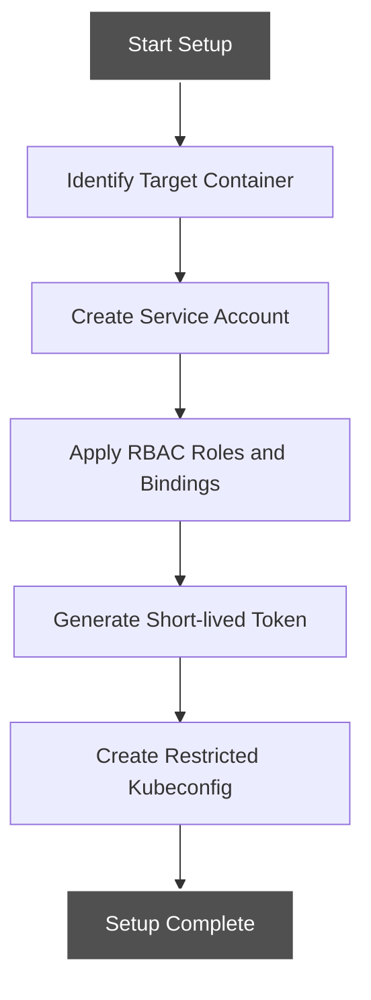
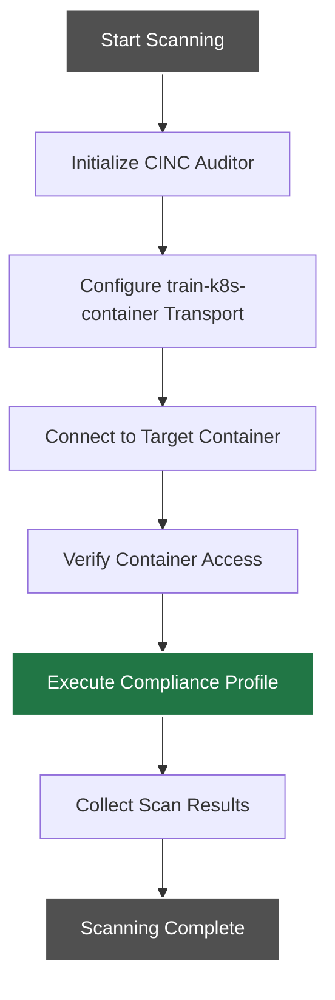
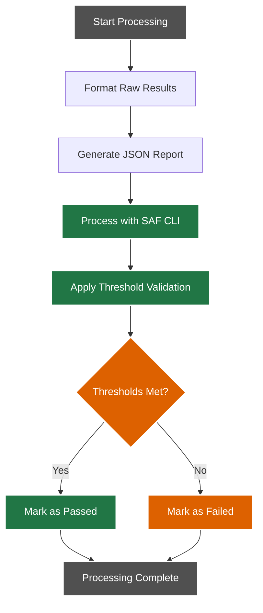
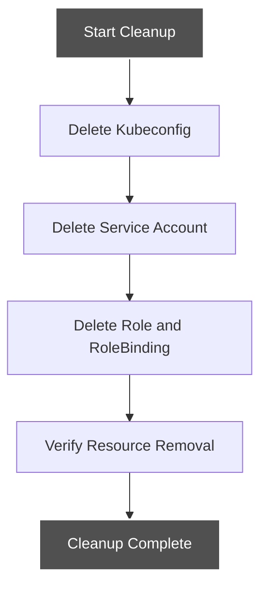

# Standard Container Workflow

This document details the standard container scanning workflow, which is the primary method for scanning containers with a shell and common utilities.

## Workflow Overview

The standard container workflow uses the Kubernetes API approach with the train-k8s-container transport plugin to directly access the target container.

## Detailed Workflow Steps

### 1. Setup Phase



#### Setup Tasks

1. **Identify Target Container**:
   - Namespace, pod name, and container name are identified
   - Container status is verified to ensure it's running

2. **Create Service Account**:
   - Temporary service account created in target namespace
   - Account is marked for cleanup after scan completion

3. **Apply RBAC**:
   - Role created with minimal permissions:
     - `pods/exec` permission for target container
     - `pods` GET permission for target pod
   - RoleBinding created to link service account to role

4. **Generate Token**:
   - Short-lived token generated for service account
   - Token expiration set to minimal required time

5. **Create Kubeconfig**:
   - Restricted kubeconfig file created with token
   - File permissions set to restrict access

### 2. Scanning Phase



#### Scanning Tasks

1. **Initialize CINC Auditor**:
   - CINC Auditor (InSpec) initialized with appropriate profile
   - Scanner configuration loaded

2. **Configure Transport**:
   - train-k8s-container transport configured with:
     - Target namespace
     - Pod name
     - Container name
     - Kubeconfig file path

3. **Connect to Container**:
   - Transport plugin establishes connection to container
   - Connection validated with simple command

4. **Execute Profile**:
   - Compliance profile run against target container
   - Commands executed within container context
   - Filesystem examined as needed

5. **Collect Results**:
   - Scan results collected in structured JSON format
   - Results stored for processing

### 3. Results Processing Phase



#### Processing Tasks

1. **Format Results**:
   - Raw scan results formatted for readability
   - Results organized by control

2. **Generate Reports**:
   - JSON report generated with full scan details
   - Additional report formats created as needed

3. **Process with SAF CLI**:
   - MITRE SAF CLI processes scan results
   - Results evaluated against compliance standards

4. **Threshold Validation**:
   - Results compared to configured thresholds
   - Pass/fail status determined

### 4. Cleanup Phase



#### Cleanup Tasks

1. **Delete Kubeconfig**:
   - Temporary kubeconfig file securely deleted
   - File permissions verified during deletion

2. **Delete Kubernetes Resources**:
   - Service account removed
   - Role and RoleBinding removed
   - Any other temporary resources removed

3. **Verify Cleanup**:
   - Resource deletion confirmed
   - No leftover resources remain

## Implementation Details

The standard container workflow is implemented in the `scan-container.sh` script with the following parameters:

```bash
./kubernetes-scripts/scan-container.sh <namespace> <pod-name> <container-name> <profile-path> [threshold_file]
```

### Required Parameters

- `namespace`: Kubernetes namespace containing the target container
- `pod-name`: Name of the pod containing the target container
- `container-name`: Name of the target container
- `profile-path`: Path to the InSpec profile to run

### Optional Parameters

- `threshold_file`: Path to threshold configuration file for validation

## Error Handling

The workflow includes robust error handling:

1. **Connection Failures**: Detected and reported with clear error messages
2. **Permission Issues**: Identified with troubleshooting guidance
3. **Container Availability**: Checked before attempting scan
4. **Resource Cleanup**: Attempted even after scan failures

## Integration with CI/CD

For CI/CD integration, the workflow can be adapted to run as part of:

- GitHub Actions workflows
- GitLab CI pipelines
- Other CI/CD systems

See [CI/CD Integration](../../integration/index.md) for specific integration examples.
