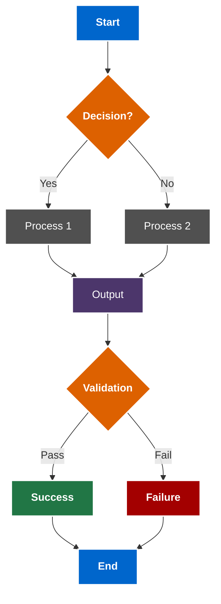

# Diagram Color Guide

This guide provides standards for creating accessible, WCAG-compliant diagrams that work well in both light and dark modes.

## WCAG Compliance for Diagrams

All diagrams should follow the Web Content Accessibility Guidelines (WCAG) 2.1 Level AA standards:

1. **Text Contrast Ratio**: Text should have a contrast ratio of at least 4.5:1 against its background
2. **Important Graphics**: Graphical elements conveying information should have a contrast ratio of at least 3:1
3. **Color Independence**: Information should not be conveyed by color alone; always use shapes, patterns, or labels alongside color

## Recommended Color Palette

The following color palette has been tested for WCAG compliance and works well in both light and dark modes:

### Primary Colors

| Purpose | Color | Hex Code | Light Mode BG | Dark Mode BG |
|---------|-------|----------|---------------|--------------|
| Primary | Blue | #0066CC | 5.9:1 | 6.3:1 with white text |
| Secondary | Purple | #4C366B | 7.8:1 | 8.3:1 with white text |
| Success | Green | #217645 | 5.6:1 | 5.9:1 with white text |
| Warning | Orange | #DD6100 | 5.4:1 | 5.8:1 with white text |
| Danger | Red | #A30000 | 8.5:1 | 9.1:1 with white text |
| Neutral | Gray | #505050 | 7.0:1 | 7.5:1 with white text |

### Node Type Colors

For consistency across all diagrams, use the following color assignments:

- **Start/End Nodes**: Blue (#0066CC)
- **Process Nodes**: Gray (#505050) or Green (#217645)
- **Decision Nodes**: Orange (#DD6100)
- **Input/Output Nodes**: Purple (#4C366B)
- **Success States**: Green (#217645)
- **Failure States**: Red (#A30000)

## Mermaid Diagram Example

Here's an example of a WCAG-compliant Mermaid diagram using the recommended palette:



## Implementation in Mermaid

When creating Mermaid diagrams, use the following style properties:

```
style NodeID fill:#HexColor,stroke:#FFFFFF,stroke-width:2px,color:#FFFFFF
```

For light mode compatibility, white text (#FFFFFF) works well with all the recommended background colors.

### Proper Subgraph Containment

When using subgraphs in Mermaid diagrams, follow these guidelines to ensure proper containment and wrapping:

1. **Always add `direction TB` inside subgraphs**: This ensures proper containment of elements within the subgraph
   
   ```mermaid
   flowchart TD
     subgraph MySubgraph["My Subgraph Title"]
       direction TB
       A --> B
       B --> C
     end
   ```

2. **Avoid using `classDef space` and `class` definitions** in your diagrams, as these can interfere with proper rendering and containment. Instead, rely on the default sizing and standard styling.

3. **Consistent styling for subgraphs**:
   ```
   style subgraphID fill:none,stroke:#DD6100,stroke-width:4px
   ```
   
4. **Remove explicit text color and font-weight from subgraph labels** to allow for automatic theme handling:
   - Do NOT use: `style subgraphID fill:none,stroke:#DD6100,stroke-width:4px,color:#FFFFFF,font-weight:bold`
   - Instead use: `style subgraphID fill:none,stroke:#DD6100,stroke-width:4px`

These guidelines help ensure that subgraphs display correctly in both light and dark modes, with proper containment and wrapping of their elements.

## Dark Mode Considerations

Our CSS and JavaScript configuration ensures that diagrams display properly in dark mode by:

1. Increasing border contrast in dark mode
2. Adjusting line thickness for better visibility
3. Increasing font weight in dark mode for better readability
4. Maintaining sufficient contrast for all elements

## Testing Accessibility

To verify your diagram meets accessibility standards:

1. Check color contrast using the [WebAIM Contrast Checker](https://webaim.org/resources/contrastchecker/)
2. Test in both light and dark modes
3. Verify readability for users with color vision deficiencies using a tool like [Color Oracle](https://colororacle.org/)

## Diagram Creation Process

1. Design your diagram structure first
2. Apply the standard color scheme based on node types
3. Add clear, concise labels
4. Include appropriate styling for all nodes
5. Test in both light and dark mode
6. Validate contrast ratios

## Common Pitfalls to Avoid

- **Pastel Colors**: Avoid pale colors that lack sufficient contrast
- **Red/Green Combinations**: Avoid using red and green adjacently, which can be problematic for colorblind users
- **Too Many Colors**: Limit diagrams to 5-6 distinct colors for clarity
- **Small Text**: Ensure text is large enough and has sufficient weight
- **Thin Lines**: Use stroke-width of at least 2px for visibility

By following these guidelines, your diagrams will be accessible to all users and display correctly in both light and dark mode themes.