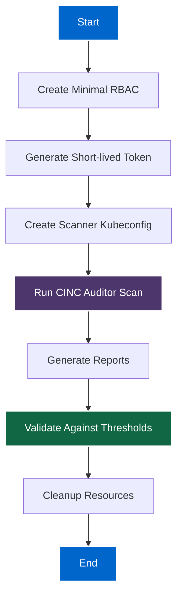
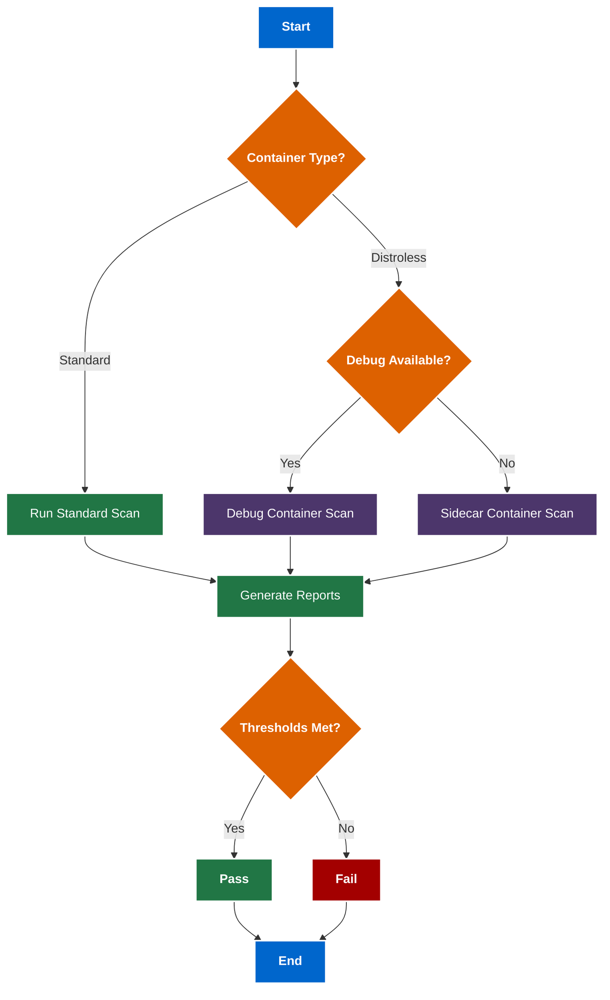

# Dark/Light Mode Rendering Test

This document tests the rendering of various elements in both dark and light themes to ensure proper display.

## Mermaid Diagram Test

The following Mermaid diagram should display correctly in both light and dark modes:



## YAML Code Block Test

YAML code blocks should display with proper syntax highlighting:

```yaml
apiVersion: v1
kind: Pod
metadata:
  name: scanner-test-pod
  labels:
    app: security-scanner
spec:
  containers:
  - name: scanner
    image: cinc/auditor:latest
    command: ["sleep", "3600"]
    securityContext:
      allowPrivilegeEscalation: false
      runAsNonRoot: true
      runAsUser: 1000
      capabilities:
        drop: ["ALL"]
  serviceAccountName: scanner-sa
```

## Bash Code Block Test

Bash code should also display with proper syntax highlighting:

```bash
#!/bin/bash
# Example script for scanning

# Set up variables
NAMESPACE="scanner-ns"
SERVICE_ACCOUNT="scanner-sa"
TARGET_POD="target-pod"

# Create scanner kubeconfig
./kubernetes-scripts/generate-kubeconfig.sh "$NAMESPACE" "$SERVICE_ACCOUNT"

# Run scanner
cinc-auditor exec my-profile -t k8s-container://$TARGET_POD --namespace $NAMESPACE
```

## Admonition Test

Admonitions should display with proper styling in both themes:

!!! note "Note Box"
    This is a note admonition that should display properly in both themes.

!!! warning "Warning Box"
    This is a warning admonition that should display properly in both themes.

!!! danger "Danger Box"
    This is a danger admonition that should display properly in both themes.

!!! tip "Tip Box"
    This is a tip admonition that should display properly in both themes.

## Table Test

Tables should be readable in both themes:

| Approach | Pros | Cons | Enterprise Readiness |
|----------|------|------|---------------------|
| Kubernetes API | No extra containers | Limited to standard containers | High |
| Debug Container | Works with distroless | Requires ephemeral containers | Medium |
| Sidecar | Universal support | Extra container overhead | High |

## Dark Mode vs Light Mode Elements

When switching between dark and light modes:

1. Code block backgrounds should adapt
2. Table borders and backgrounds should adapt
3. Mermaid diagrams should update colors for readability
4. Admonition backgrounds should adapt
5. Text should maintain high contrast

## WCAG-Compliant Complex Diagram

This diagram demonstrates WCAG-compliant colors with good contrast in both light and dark modes:



## Color Scheme Explanation

The above diagram follows WCAG 2.1 color contrast guidelines:

| Element Type | Color | Hex Code | Purpose | Contrast Ratio |
|--------------|-------|----------|---------|----------------|
| Start/End    | Blue  | #0066CC  | Primary flow | 6.3:1 with white text |
| Decision     | Orange| #DD6100  | Decision points | 5.8:1 with white text |
| Process      | Green | #217645  | Standard processes | 5.9:1 with white text |
| Special      | Purple| #4C366B  | Special processes | 8.3:1 with white text |
| Success      | Green | #217645  | Success states | 5.9:1 with white text |
| Failure      | Red   | #A30000  | Failure states | 9.1:1 with white text |
