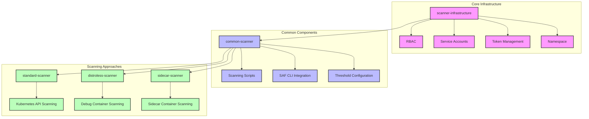
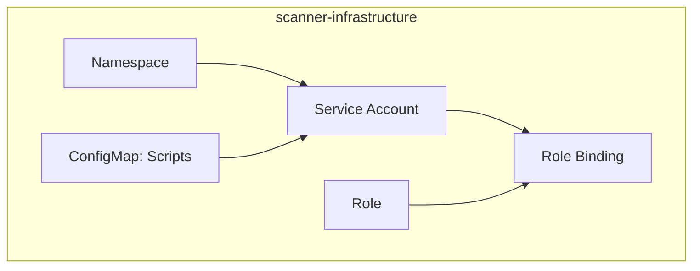
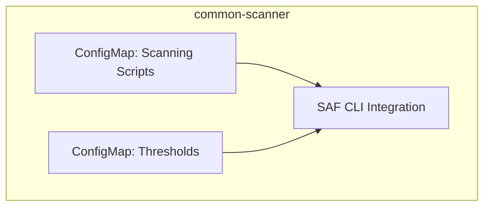
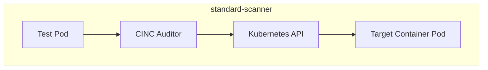
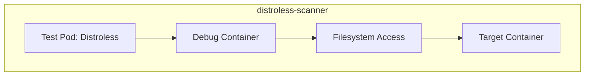
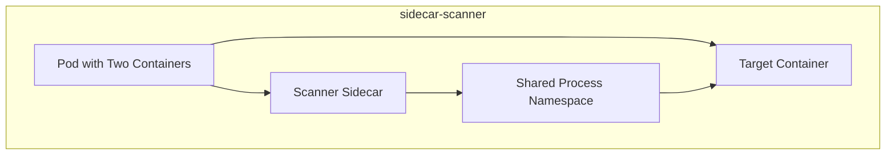
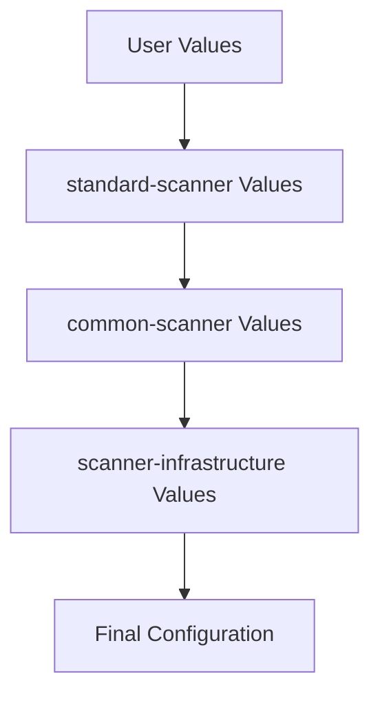
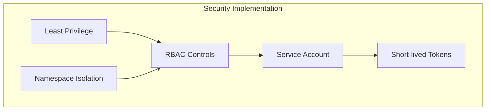
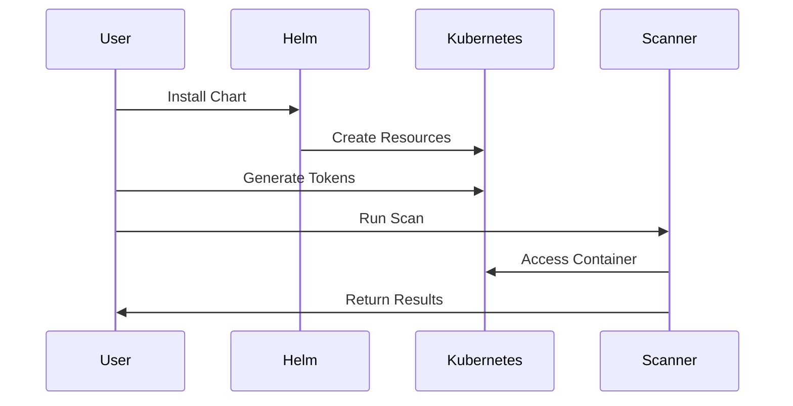
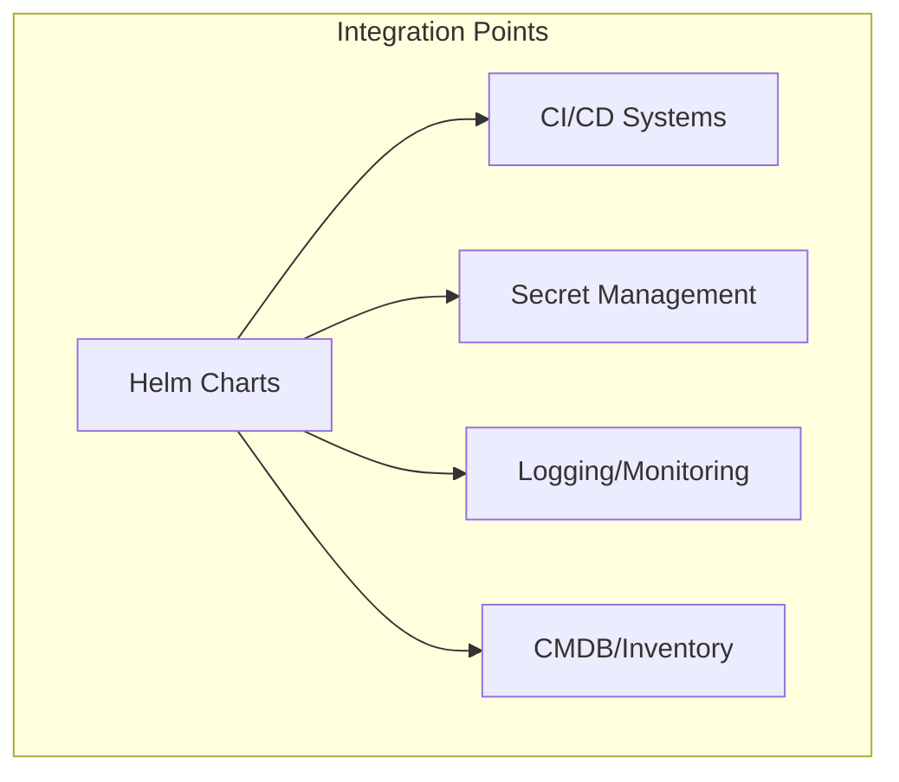

# Helm Chart Architecture

This document provides a detailed overview of the architecture, relationships, and design principles of our Helm charts for Kubernetes container scanning.

## Chart Relationship Diagram

## Layered Architecture

Our Helm charts follow a layered architecture pattern with three distinct layers:

1. **Core Infrastructure Layer** (scanner-infrastructure)
   - Foundation for all scanning operations
   - RBAC and security model implementation
   - Service account and access control
   - Namespace management

2. **Common Components Layer** (common-scanner)
   - Reusable scanning utilities and scripts
   - SAF CLI integration for compliance validation
   - Threshold configuration for pass/fail criteria
   - Results processing and reporting

3. **Scanning Approaches Layer** (approach-specific charts)
   - Specialized components for each scanning approach
   - Test pods for demonstration and validation
   - Approach-specific configurations
   - Usage examples

## Component Details

### scanner-infrastructure

The scanner-infrastructure chart creates the foundational security components:

Key components:
- **Namespace**: Isolated environment for scanning operations
- **Service Account**: Identity for scanning operations
- **Role**: Defines permissions needed for scanning
- **RoleBinding**: Associates role with service account
- **ConfigMap: Scripts**: Helper scripts for token generation

### common-scanner

The common-scanner chart provides shared components for scanning operations:

Key components:
- **ConfigMap: Scanning Scripts**: CINC Auditor execution scripts
- **ConfigMap: Thresholds**: Compliance threshold configuration
- **SAF CLI Integration**: MITRE SAF CLI integration for results processing

### standard-scanner (Kubernetes API Approach)

The standard-scanner chart implements the Kubernetes API Approach:

Key components:
- **Test Pod**: Demo pod for validation
- **CINC Auditor**: Execution via train-k8s-container transport
- **Kubernetes API**: Direct interaction with target containers

### distroless-scanner (Debug Container Approach)

The distroless-scanner chart implements the Debug Container Approach:

Key components:
- **Test Pod: Distroless**: Demo distroless container
- **Debug Container**: Ephemeral container for scanning
- **Filesystem Access**: Access to target container's filesystem

### sidecar-scanner (Sidecar Container Approach)

The sidecar-scanner chart implements the Sidecar Container Approach:

Key components:
- **Pod with Two Containers**: Combined target and scanner
- **Target Container**: Application container to scan
- **Scanner Sidecar**: Container with CINC Auditor
- **Shared Process Namespace**: Access between containers

## Value Flow

Values flow through the chart hierarchy, allowing configuration at multiple levels:

This allows:
- Global values set at top level
- Approach-specific overrides
- Component-specific settings
- Local environment customization

## Security Model

The security model is implemented across all chart layers:

Key security features:
- **Least Privilege**: Minimal permissions required
- **RBAC Controls**: Fine-grained access control
- **Service Account**: Dedicated identity for scanning
- **Short-lived Tokens**: Time-limited access
- **Namespace Isolation**: Segmentation by namespace

## Deployment Flow

The typical deployment flow involves these steps:

1. User installs Helm chart
2. Helm creates Kubernetes resources
3. User generates short-lived tokens
4. User runs scanning operation
5. Scanner accesses container via K8s API
6. Results returned to user

## Integration Points

Our charts provide integration points with external systems:

Key integration points:
- **CI/CD Systems**: Pipeline integration
- **Secret Management**: External secrets for tokens
- **Logging/Monitoring**: Result tracking and alerting
- **CMDB/Inventory**: Asset tracking and management

## Chart Dependencies

Formal Helm chart dependencies are defined in Chart.yaml files:

| Chart | Dependencies |
|-------|-------------|
| scanner-infrastructure | None |
| common-scanner | scanner-infrastructure |
| standard-scanner | common-scanner |
| distroless-scanner | common-scanner |
| sidecar-scanner | common-scanner |

These dependencies ensure proper installation order and value inheritance.