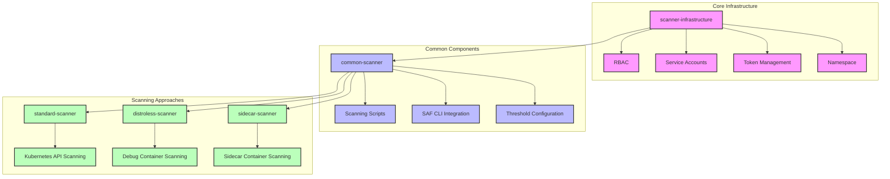
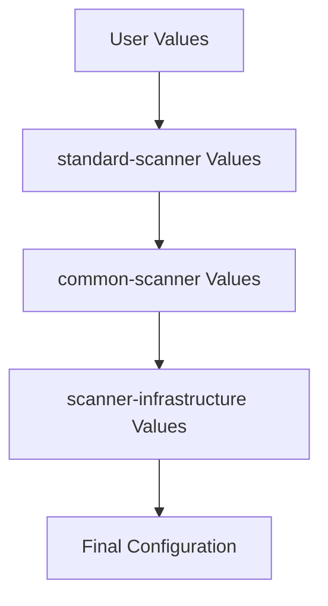
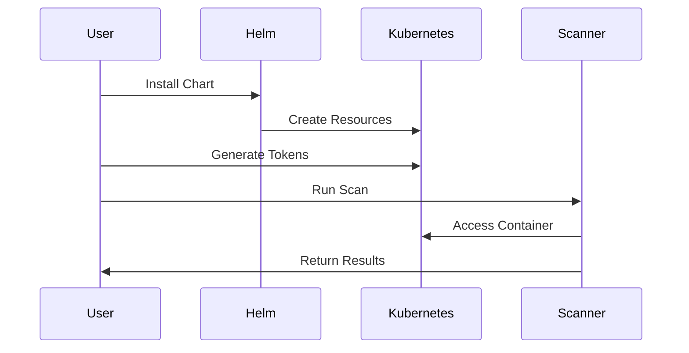
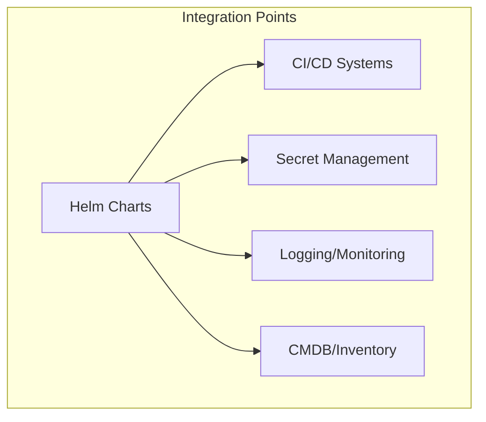

# Helm Chart Architecture

!!! info "Directory Context"
    This document is part of the [Overview Directory](index.md). See the [Overview Directory Inventory](inventory.md) for related resources.

## Chart Relationship Diagram

## Layered Architecture

Our Helm charts follow a layered architecture pattern with three distinct layers:

1. **Core Infrastructure Layer** (scanner-infrastructure)
   - Foundation for all scanning operations
   - RBAC and security model implementation
   - Service account and access control
   - Namespace management

2. **Common Components Layer** (common-scanner)
   - Reusable scanning utilities and scripts
   - SAF CLI integration for compliance validation
   - Threshold configuration for pass/fail criteria
   - Results processing and reporting

3. **Scanning Approaches Layer** (approach-specific charts)
   - Specialized components for each scanning approach
   - Test pods for demonstration and validation
   - Approach-specific configurations
   - Usage examples

## Value Flow

Values flow through the chart hierarchy, allowing configuration at multiple levels:

This allows:
- Global values set at top level
- Approach-specific overrides
- Component-specific settings
- Local environment customization

## Deployment Flow

The typical deployment flow involves these steps:

1. User installs Helm chart
2. Helm creates Kubernetes resources
3. User generates short-lived tokens
4. User runs scanning operation
5. Scanner accesses container via K8s API
6. Results returned to user

## Integration Points

Our charts provide integration points with external systems:

Key integration points:
- **CI/CD Systems**: Pipeline integration
- **Secret Management**: External secrets for tokens
- **Logging/Monitoring**: Result tracking and alerting
- **CMDB/Inventory**: Asset tracking and management

## Chart Dependencies

Formal Helm chart dependencies are defined in Chart.yaml files:

| Chart | Dependencies |
|-------|-------------|
| scanner-infrastructure | None |
| common-scanner | scanner-infrastructure |
| standard-scanner | common-scanner |
| distroless-scanner | common-scanner |
| sidecar-scanner | common-scanner |

These dependencies ensure proper installation order and value inheritance.