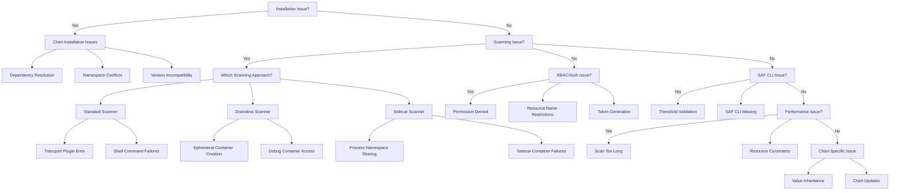

# Helm Chart Troubleshooting Guide

## Overview

This guide provides solutions for common issues encountered when using the Secure Kubernetes Container Scanning Helm charts. It covers installation problems, scanning errors, RBAC issues, and performance troubleshooting.

## Installation Issues

### Chart Dependency Resolution Failures

**Problem:** Dependencies not resolved during installation.

```
Error: found in Chart.yaml, but missing in charts/ directory: common-scanner, scanner-infrastructure
```

**Solution:**

```bash
# Update dependencies before installing
helm dependency update ./helm-charts/standard-scanner

# Alternative: build dependencies explicitly
cd ./helm-charts
helm dependency build standard-scanner
helm install standard-scanner ./standard-scanner
```

### Namespace Conflicts

**Problem:** Chart tries to create a namespace that already exists.

```
Error: rendered manifests contain a resource that already exists. Unable to continue with install: namespace "inspec-test" exists
```

**Solution:**

```bash
# Disable namespace creation
helm install standard-scanner ./helm-charts/standard-scanner \
  --set common-scanner.scanner-infrastructure.createNamespace=false \
  --set common-scanner.scanner-infrastructure.targetNamespace=inspec-test
```

### Chart Version Incompatibility

**Problem:** Helm version doesn't support the chart schema version.

**Solution:**

```bash
# Check Helm version
helm version

# Upgrade Helm if needed
curl https://raw.githubusercontent.com/helm/helm/main/scripts/get-helm-3 | bash
```

## RBAC and Authentication Issues

### Permission Denied Errors

**Problem:** Scanner can't access target containers.

```
Error: PERMISSION_DENIED: pods "target-pod" is forbidden: User "system:serviceaccount:inspec-test:inspec-scanner" cannot exec into pods in the namespace "inspec-test"
```

**Solution:**

1. Verify RBAC configuration:

```bash
# Check service account
kubectl get serviceaccount inspec-scanner -n inspec-test

# Check role and permissions
kubectl get role inspec-container-role -n inspec-test -o yaml

# Check role binding
kubectl get rolebinding inspec-container-rolebinding -n inspec-test -o yaml
```

2. Ensure proper role configuration:

```bash
# Update chart with explicit permissions
helm upgrade scanner-infrastructure ./helm-charts/scanner-infrastructure \
  --set targetNamespace=inspec-test \
  --set rbac.rules.core.enabled=true \
  --set rbac.rules.ephemeralContainers.enabled=true  # If needed
```

### Resource Name Restriction Issues

**Problem:** When using resource name restrictions, scanner can't access pods.

**Solution:**

```bash
# Disable resource name restrictions temporarily for debugging
helm upgrade scanner-infrastructure ./helm-charts/scanner-infrastructure \
  --set targetNamespace=inspec-test \
  --set rbac.useResourceNames=false

# Or set the correct pod names in restrictions
helm upgrade scanner-infrastructure ./helm-charts/scanner-infrastructure \
  --set targetNamespace=inspec-test \
  --set rbac.useResourceNames=true \
  --set rbac.resourceNames[0]=target-pod-1 \
  --set rbac.resourceNames[1]=target-pod-2
```

### Token Generation Issues

**Problem:** Can't generate valid tokens for scanner.

**Solution:**

```bash
# Check service account secrets
kubectl get serviceaccount inspec-scanner -n inspec-test -o yaml

# Recreate service account if needed
kubectl delete serviceaccount inspec-scanner -n inspec-test
helm upgrade scanner-infrastructure ./helm-charts/scanner-infrastructure \
  --set targetNamespace=inspec-test

# Manual token generation
SERVICE_ACCOUNT=inspec-scanner
NAMESPACE=inspec-test
SECRET_NAME=$(kubectl get serviceaccount ${SERVICE_ACCOUNT} -n ${NAMESPACE} -o jsonpath='{.secrets[0].name}')
TOKEN=$(kubectl get secret ${SECRET_NAME} -n ${NAMESPACE} -o jsonpath='{.data.token}' | base64 --decode)
echo $TOKEN
```

## Scanning Issues

### Standard Scanner (Kubernetes API Approach) Issues

#### Transport Plugin Errors

**Problem:** CINC Auditor can't connect to target container.

```
Error connecting to 'k8s-container://inspec-test/target-pod/container': unable to execute command on pod...
```

**Solution:**

```bash
# Check if container has shell
kubectl exec -n inspec-test target-pod -c container -- /bin/sh -c "echo test"

# Verify CINC Auditor plugin installation
cinc-auditor plugin list

# Install plugin if missing
cinc-auditor plugin install inspec-k8s-container

# Update transport plugin version
cinc-auditor plugin update inspec-k8s-container
```

#### Shell Command Failures

**Problem:** CINC Auditor can't execute commands in target container.

**Solution:**

```bash
# Check container shell
kubectl exec -n inspec-test target-pod -c container -- ls -la /bin/sh

# If using Alpine, ensure sh is available
kubectl exec -n inspec-test target-pod -c container -- apk add --no-cache bash

# Update profile to use available commands
# Edit profile to use `/bin/sh` instead of `/bin/bash`
```

### Distroless Scanner (Debug Container Approach) Issues

#### Ephemeral Container Creation Failures

**Problem:** Debug container can't be created.

```
Error: ephemeral containers are disabled for this cluster
```

**Solution:**

```bash
# Check Kubernetes version
kubectl version

# Enable ephemeral containers in API server (requires admin access)
# For k8s < 1.23, update kube-apiserver with feature gate:
--feature-gates=EphemeralContainers=true

# For newer versions, ephemeral containers should be enabled by default
# Verify API version support
kubectl api-resources | grep ephemeralcontainers
```

#### Debug Container Access Issues

**Problem:** Debug container can't access target container filesystem.

**Solution:**

```bash
# Manually test ephemeral container access
kubectl debug -it -n inspec-test target-pod --image=alpine:latest --target=container -- sh

# Inside debug container, check process list and filesystem access
ps aux
ls -la /proc/1/root/

# If access issues persist, check security policies
kubectl get psp  # PodSecurityPolicies in older clusters
kubectl get podsecuritypolicy  # In newer clusters
```

### Sidecar Scanner Issues

#### Process Namespace Sharing Failures

**Problem:** Sidecar can't access target container processes.

**Solution:**

```bash
# Verify pod has shareProcessNamespace enabled
kubectl get pod sidecar-target -n inspec-test -o yaml | grep shareProcessNamespace

# Recreate pod with proper configuration
helm upgrade sidecar-scanner ./helm-charts/sidecar-scanner \
  --set common-scanner.scanner-infrastructure.targetNamespace=inspec-test \
  --set testPod.shareProcessNamespace=true
```

#### Sidecar Container Failures

**Problem:** Scanner container crashes or can't run profiles.

**Solution:**

```bash
# Check scanner container logs
kubectl logs -n inspec-test sidecar-target -c scanner

# Shell into scanner container for debugging
kubectl exec -it -n inspec-test sidecar-target -c scanner -- sh

# Try manual profile execution
inspec exec /profiles/container-baseline -t proc://1/root --logger debug
```

## SAF CLI Integration Issues

### Threshold Validation Failures

**Problem:** SAF CLI can't validate against threshold file.

```
Error: Failed to validate results against threshold: Invalid threshold file format
```

**Solution:**

```bash
# Check threshold file format
cat threshold.yml

# Ensure threshold file has correct structure:
compliance:
  min: 70
failed:
  critical:
    max: 0
  high:
    max: 2

# Validate threshold file with SAF CLI
saf validate-threshold --threshold threshold.yml

# Update chart with correct threshold configuration
helm upgrade common-scanner ./helm-charts/common-scanner \
  --set scanner-infrastructure.targetNamespace=inspec-test \
  --set safCli.thresholdConfig.compliance.min=70 \
  --set safCli.thresholdConfig.failed.critical.max=0 \
  --set safCli.thresholdConfig.failed.high.max=2
```

### SAF CLI Missing or Incompatible

**Problem:** SAF CLI not available or incompatible version.

**Solution:**

```bash
# Check if SAF CLI is installed
saf --version

# Install SAF CLI if missing
pip install saf-cli

# Update to compatible version
pip install saf-cli==1.2.3

# Alternatively, disable SAF CLI integration temporarily
helm upgrade common-scanner ./helm-charts/common-scanner \
  --set scanner-infrastructure.targetNamespace=inspec-test \
  --set safCli.enabled=false
```

## Performance Issues

### Scan Taking Too Long

**Problem:** Container scans taking too long to complete.

**Solution:**

```bash
# Profile optimization
# Use smaller, focused profiles instead of large ones

# For standard scanner, add timeout
cinc-auditor exec ./profiles/container-baseline -t k8s-container://inspec-test/target-pod/container --timeout 300

# For distroless scanner, adjust debug container timeout
helm upgrade distroless-scanner ./helm-charts/distroless-scanner \
  --set common-scanner.scanner-infrastructure.targetNamespace=inspec-test \
  --set debugContainer.timeout=300

# For sidecar scanner, adjust resource limits
helm upgrade sidecar-scanner ./helm-charts/sidecar-scanner \
  --set common-scanner.scanner-infrastructure.targetNamespace=inspec-test \
  --set scanner.resources.limits.cpu=500m \
  --set scanner.resources.limits.memory=512Mi
```

### Resource Constraints

**Problem:** Scanner or target pods experiencing resource issues.

**Solution:**

```bash
# Check resource usage
kubectl top pods -n inspec-test

# Adjust resource limits and requests
helm upgrade sidecar-scanner ./helm-charts/sidecar-scanner \
  --set common-scanner.scanner-infrastructure.targetNamespace=inspec-test \
  --set scanner.resources.requests.cpu=100m \
  --set scanner.resources.requests.memory=256Mi \
  --set scanner.resources.limits.cpu=500m \
  --set scanner.resources.limits.memory=512Mi
```

## Helm Chart Specific Issues

### Chart Value Inheritance Issues

**Problem:** Values not being passed correctly through chart dependencies.

**Solution:**

```bash
# Check how values are passed through dependencies
helm template standard-scanner ./helm-charts/standard-scanner \
  --set common-scanner.scanner-infrastructure.targetNamespace=inspec-test \
  --debug

# Use explicit values file instead
cat > values.yaml << EOF
common-scanner:
  scanner-infrastructure:
    targetNamespace: inspec-test
    rbac:
      useResourceNames: true
EOF

helm install standard-scanner ./helm-charts/standard-scanner -f values.yaml
```

### Chart Update Issues

**Problem:** Helm upgrade not applying changes as expected.

**Solution:**

```bash
# Verify changes before upgrade
helm diff upgrade standard-scanner ./helm-charts/standard-scanner \
  --set common-scanner.scanner-infrastructure.targetNamespace=inspec-test

# Force resource updates if needed
helm upgrade standard-scanner ./helm-charts/standard-scanner \
  --set common-scanner.scanner-infrastructure.targetNamespace=inspec-test \
  --force

# Worst case, uninstall and reinstall
helm uninstall standard-scanner
helm install standard-scanner ./helm-charts/standard-scanner \
  --set common-scanner.scanner-infrastructure.targetNamespace=inspec-test
```

## Diagram: Troubleshooting Flowchart



## Diagnostic Scripts

### Scanner Setup Diagnostics

Use this script to diagnose scanner setup issues:

```bash
#!/bin/bash
# scanner-diagnostics.sh
NAMESPACE="inspec-test"
SERVICE_ACCOUNT="inspec-scanner"

echo "Scanner Diagnostics"
echo "==================="

# Check namespace
echo "\nChecking namespace..."
kubectl get ns $NAMESPACE || echo "Namespace $NAMESPACE does not exist!"

# Check service account
echo "\nChecking service account..."
kubectl get serviceaccount $SERVICE_ACCOUNT -n $NAMESPACE -o yaml || echo "Service account $SERVICE_ACCOUNT does not exist!"

# Check role and role binding
echo "\nChecking RBAC configuration..."
ROLE_NAME=$(kubectl get rolebinding -n $NAMESPACE -o json | jq -r '.items[] | select(.subjects[] | select(.kind=="ServiceAccount" and .name=="'$SERVICE_ACCOUNT'")) | .roleRef.name')
echo "Role name: $ROLE_NAME"
kubectl get role $ROLE_NAME -n $NAMESPACE -o yaml || echo "Role $ROLE_NAME does not exist!"

# Check token secrets
echo "\nChecking token secrets..."
SECRETS=$(kubectl get serviceaccount $SERVICE_ACCOUNT -n $NAMESPACE -o json | jq -r '.secrets[].name')
for SECRET in $SECRETS; do
  echo "Secret: $SECRET"
  kubectl get secret $SECRET -n $NAMESPACE -o yaml | grep -v "token:" || echo "Secret $SECRET does not exist!"
done

echo "\nDiagnostics complete!"
```

### Scanning Diagnostics

Use this script to diagnose scanning issues:

```bash
#!/bin/bash
# scan-diagnostics.sh
NAMESPACE="inspec-test"
POD_NAME="target-pod"
CONTAINER_NAME="container"

echo "Scanning Diagnostics"
echo "==================="

# Check pod
echo "\nChecking target pod..."
kubectl get pod $POD_NAME -n $NAMESPACE || { echo "Pod $POD_NAME does not exist!"; exit 1; }

# Check container
echo "\nChecking container status..."
STATUS=$(kubectl get pod $POD_NAME -n $NAMESPACE -o json | jq -r '.status.containerStatuses[] | select(.name=="'$CONTAINER_NAME'") | .ready')
echo "Container ready status: $STATUS"

# Check shell access
echo "\nChecking shell access..."
kubectl exec -n $NAMESPACE $POD_NAME -c $CONTAINER_NAME -- /bin/sh -c "echo 'Shell access working'" || echo "No shell access to container!"

# Check process list for sidecar approach
echo "\nChecking process namespace sharing (for sidecar approach)..."
SHARE_NS=$(kubectl get pod $POD_NAME -n $NAMESPACE -o json | jq -r '.spec.shareProcessNamespace')
echo "Process namespace sharing: $SHARE_NS"

# Check CINC Auditor installation for manual troubleshooting
echo "\nChecking CINC Auditor installation..."
which cinc-auditor || echo "CINC Auditor not found in PATH!"
cinc-auditor plugin list 2>/dev/null || echo "Error listing CINC Auditor plugins!"

echo "\nDiagnostics complete!"
```

## Getting Help

If you encounter issues not covered in this guide:

1. **Check Logs**: Always start by checking pod logs

```bash
kubectl logs -n inspec-test target-pod -c container
kubectl logs -n inspec-test target-pod -c scanner  # For sidecar approach
```

2. **Increase Logging Verbosity**: Enable debug logging

```bash
# For CINC Auditor
CINC_LOGGER=debug KUBECONFIG=./kubeconfig.yaml cinc-auditor exec ./profiles/container-baseline -t k8s-container://inspec-test/target-pod/container

# For scanning scripts
DEBUG=true ./scripts/scan-container.sh inspec-test target-pod container ./profiles/container-baseline
```

3. **Report Issues**: If you believe you've found a bug in the charts, please report it with:
   - Chart version
   - Kubernetes version
   - Error messages
   - Steps to reproduce
   - Any modifications made to default values