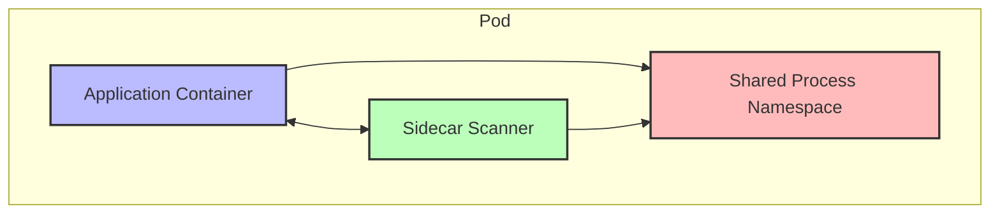
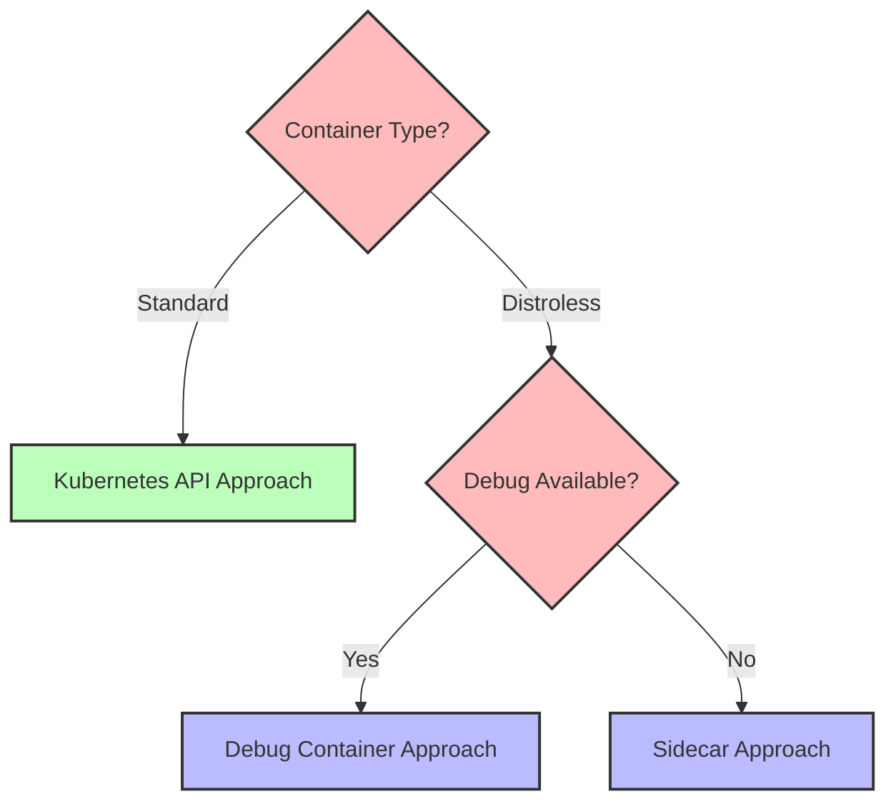
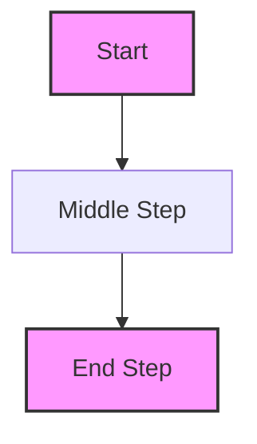

# ASCII to Mermaid Diagram Conversion

This document demonstrates the conversion of ASCII diagrams to Mermaid diagrams for better visualization in the documentation.

## Example 1: Basic Workflow

### Original ASCII Diagram

```
+--------+     +---------------+     +----------------+
| Start  |---->| Create RBAC   |---->| Generate Token |
+--------+     +---------------+     +----------------+
                                           |
                                           v
+--------+     +---------------+     +----------------+
|  End   |<----| Run Results   |<----| Execute Scan   |
+--------+     +---------------+     +----------------+
```

### Converted Mermaid Diagram


## Example 2: Container Relationships

### Original ASCII Diagram

```
+------------------------------------------+
| Pod                                      |
|  +-------------+     +---------------+   |
|  | Application |<--->| Sidecar       |   |
|  | Container   |     | Scanner       |   |
|  +-------------+     +---------------+   |
|         |                  |             |
|         v                  v             |
|  +-----------------------------------+   |
|  | Shared Process Namespace          |   |
|  +-----------------------------------+   |
+------------------------------------------+
```

### Converted Mermaid Diagram



## Example 3: Approach Decision Tree

### Original ASCII Diagram

```
                 +------------------+
                 | Container Type?  |
                 +------------------+
                         |
          +--------------+---------------+
          |                              |
          v                              v
+------------------+            +------------------+
| Standard         |            | Distroless       |
+------------------+            +------------------+
          |                              |
          v                              v
+------------------+            +------------------+
| Kubernetes API   |            | Debug Available? |
| Approach         |            +------------------+
+------------------+                     |
                             +-----------+----------+
                             |                      |
                             v                      v
                    +------------------+   +------------------+
                    | Debug Container  |   | Sidecar         |
                    | Approach         |   | Approach        |
                    +------------------+   +------------------+
```

### Converted Mermaid Diagram



## Conversion Benefits

Converting ASCII diagrams to Mermaid offers several advantages:

1. **Improved readability** - Mermaid diagrams are more visually appealing and easier to read
2. **Theme compatibility** - Mermaid diagrams adapt to light/dark themes automatically
3. **Maintainability** - Mermaid syntax is more structured and easier to modify
4. **Interactive features** - Diagrams can be made interactive with clickable elements
5. **Consistency** - Unified diagram style across the documentation

## Conversion Process

When converting ASCII to Mermaid:

1. Identify the core elements and relationships in the ASCII diagram
2. Choose the appropriate Mermaid diagram type (flowchart, sequence, etc.)
3. Map each ASCII element to its Mermaid counterpart
4. Add styling to improve visual clarity
5. Test the diagram in both light and dark modes

## Example Syntax Comparison

### ASCII Syntax (difficult to maintain)

```
+--------+     +---------------+
| Start  |---->| Middle Step   |
+--------+     +---------------+
                      |
                      v
               +---------------+
               | End Step      |
               +---------------+
```

### Mermaid Syntax (structured and maintainable)

```
flowchart TD
    A[Start] --> B[Middle Step]
    B --> C[End Step]
    
    style A fill:#f9f,stroke:#333,stroke-width:2px
    style C fill:#f9f,stroke:#333,stroke-width:2px
```

Which renders as:

