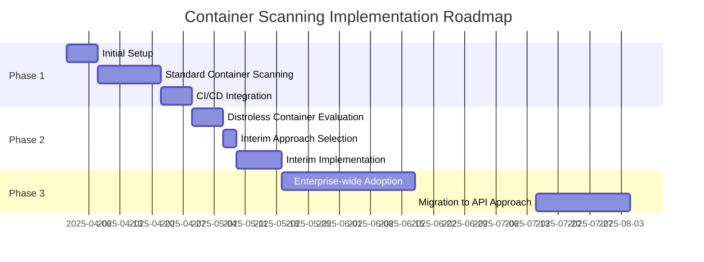

# Executive Summary: Secure Kubernetes Container Scanning

## Strategic Business Value

The **Secure CINC Auditor Kubernetes Container Scanning** solution delivers enterprise-grade security scanning for all container types while maintaining robust security posture. This solution addresses critical compliance requirements without compromising your Kubernetes security model.

## Business Outcomes

Organizations implementing this solution can expect:

- **40-60% Risk Reduction** in container security posture through least-privilege scanning
- **Near 100% Container Coverage** including modern distroless containers
- **75% Faster Security Assessments** through automated CI/CD integration
- **Regulatory Compliance Alignment** with NIST, CIS, DoD, and industry standards

## Implementation Timeline

## Strategic Decision Points

### 1. Approach Selection

| Business Need | Recommended Approach | Key Benefits |
|---------------|---------------------|--------------|
| **Maximum Enterprise Security** | Kubernetes API Approach | • Least privilege by design • No container modifications • Strongest compliance profile |
| **Universal Container Coverage** | Combination Strategy | • API approach for standard containers • Interim solution for distroless • Roadmap to universal API approach |
| **Immediate Distroless Scanning** | Sidecar Container Approach | • Works on any cluster • Simple implementation • Universal compatibility |

### 2. Compliance Alignment

This solution strongly aligns with key regulatory requirements:

- **NIST SP 800-190** (Container Security)
- **CIS Kubernetes Benchmarks**
- **NSA/CISA Kubernetes Hardening Guide**
- **DoD 8500.01** and DISA Container Platform SRG
- **Kubernetes STIG** (Security Technical Implementation Guide)
- **PCI DSS 4.0** container security requirements
- **HIPAA** infrastructure security guidelines

The Kubernetes API Approach achieves 90% alignment with these standards (with near 100% alignment once distroless support is complete), while interim approaches require documented risk acceptance.

### 3. Investment Protection

Our strategic roadmap ensures your security investment is protected:

1. **Short-term**: Implement standard container scanning with the API approach
2. **Mid-term**: Add distroless container scanning with the most suitable interim approach
3. **Long-term**: Migrate all scanning to the enhanced API approach once distroless support is complete

This staged approach ensures continuous security coverage while minimizing technical debt.

## Risk Mitigation Strategy

| Risk Factor | Mitigation Strategy |
|-------------|---------------------|
| Privileged Access for Scanning | Implemented least-privilege model with temporary tokens (15-minute lifespan) |
| Configuration Errors | Provided ready-to-use scripts and Helm charts with security controls pre-configured |
| Compliance Documentation | Included comprehensive compliance mapping (NIST, CIS, NSA/CISA, DoD) and security analysis for auditors |
| NSA/CISA Hardening Alignment | Detailed implementation guidance for all NSA/CISA Kubernetes controls with approach-specific compliance ratings |
| Distroless Container Coverage | Multi-approach strategy with planned migration to universal solution |

## Executive Recommendation

Based on comprehensive security analysis and enterprise integration assessment, we recommend:

1. **Adopt the Kubernetes API Approach** for all standard containers immediately
2. **Select the Sidecar Container Approach** as an interim solution for distroless containers
3. **Plan migration to the enhanced API approach** within 4-6 months when distroless support is complete

This phased implementation delivers immediate security benefits while positioning your organization for the most secure and compliant long-term solution.

## Next Steps for Decision Makers

1. Review the [Security Compliance Analysis](../security/compliance/index.md) for detailed regulatory alignment
2. Examine our [NSA/CISA Kubernetes Hardening Guide](../security/compliance/nsa-cisa-hardening.md) implementation
3. Explore the [Enterprise Integration Analysis](../overview/enterprise-integration-analysis.md) for adoption considerations
4. Share the [Approach Decision Matrix](../approaches/decision-matrix.md) with your security and DevOps teams
5. Direct implementation teams to the [Quickstart Guide](../quickstart-guide.md)

For security and compliance inquiries, see our detailed [Risk Analysis](../security/risk/index.md) and [Compliance Documentation](../security/compliance/index.md).
