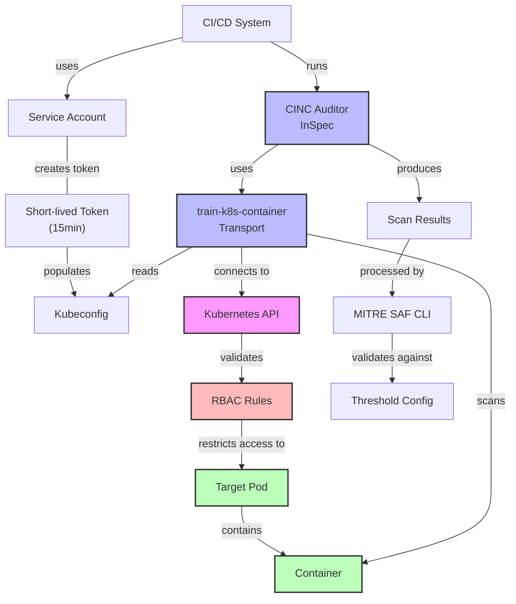
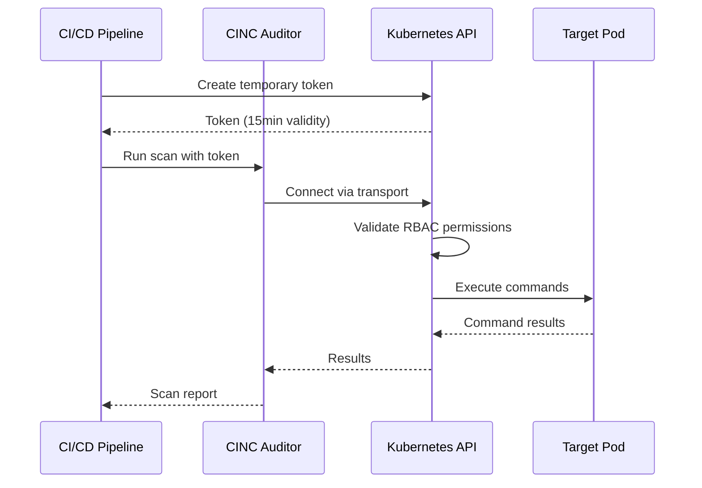
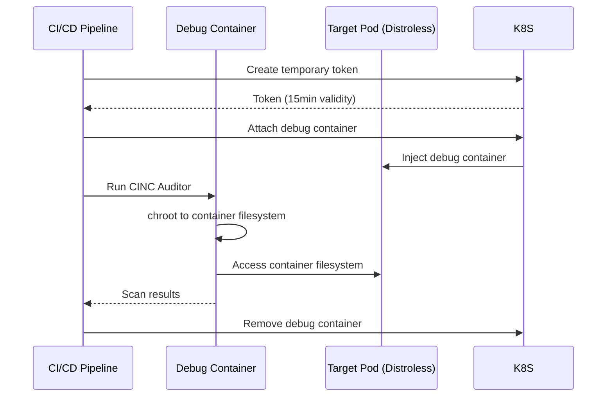
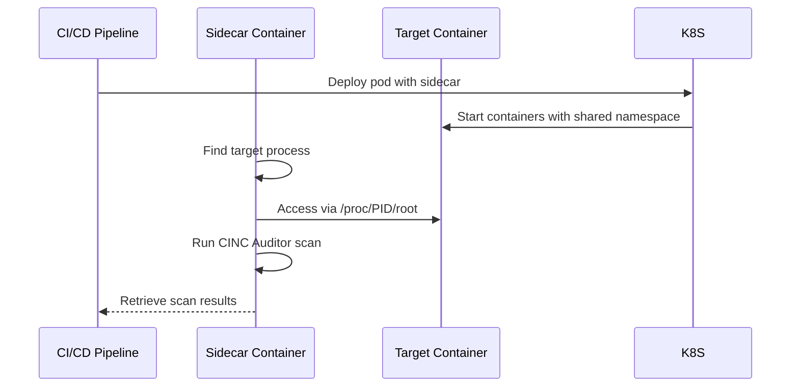
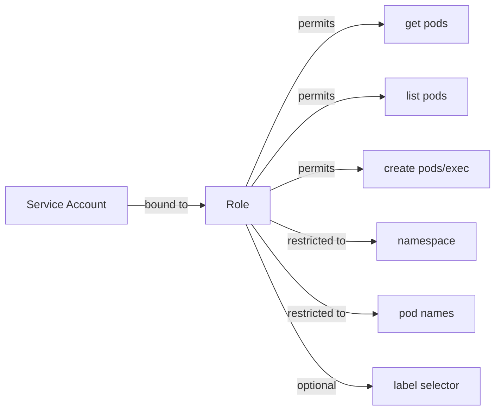
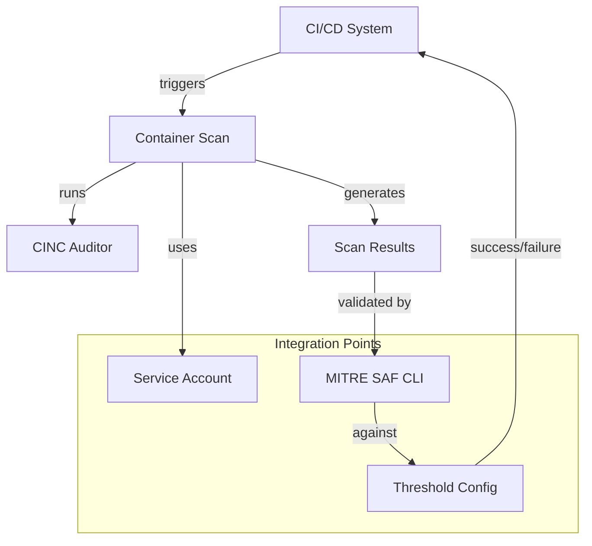

# Technical Architecture Overview

This document provides a solution architect's view of the Secure CINC Auditor Kubernetes Container Scanning platform, covering system components, interactions, and technical implementation details.

!!! info "Directory Contents"
    For a complete listing of all files in this section, see the [Overview Documentation Inventory](inventory.md).

## System Architecture



## Core Components

| Component | Purpose | Implementation |
|-----------|---------|----------------|
| **CINC Auditor** | Security & compliance scanning engine | InSpec-compatible open source scanner |
| **train-k8s-container** | Kubernetes transport plugin | Custom Ruby transport for InSpec |
| **Service Accounts** | Identity for scanner | Kubernetes service account with limited lifespan |
| **RBAC Configuration** | Access control | Kubernetes Roles and RoleBindings |
| **Token Generator** | Temporary credentials | kubectl create token with 15min expiry |
| **Kubeconfig** | API access configuration | Generated config with embedded token |
| **Threshold Configuration** | Compliance validation | YAML-based pass/fail criteria |
| **MITRE SAF CLI** | Results processing | JSON processor with report generation |

## Implementation Approaches

The platform implements three technical approaches for container scanning:

### 1. Kubernetes API Approach (Standard + Future Distroless)



Technical characteristics:

- Uses standard Kubernetes API (exec into pod)
- Leverages train-k8s-container transport
- Most secure and scalable enterprise approach
- Clean from a compliance perspective
- Future enhancement will add distroless support

### 2. Debug Container Approach (Interim for Distroless)



Technical characteristics:

- Uses ephemeral debug containers (K8s 1.16+)
- Requires specific Kubernetes feature flags
- Uses chroot for filesystem access
- Interim solution for distroless containers

### 3. Sidecar Container Approach (Universal Compatibility)



Technical characteristics:

- Uses shared process namespace in pod
- Works with any Kubernetes version
- Must deploy alongside target container
- Requires pod modification
- Universal compatibility approach

## Component Relationships

### RBAC Model



The RBAC model provides minimal permissions:

- `get pods` - View specific pods
- `list pods` - List available pods
- `create pods/exec` - Execute commands in pod
- Restrictions are applied at namespace, pod, and/or label level

### Scanning Workflow Integration Points



## Deployment Options

| Approach | Implementation | Best For |
|----------|----------------|----------|
| **Shell Scripts** | Standalone bash scripts | Quick setup, testing, custom workflows |
| **Helm Charts** | Modular chart architecture | Production environments, GitOps workflows |
| **GitLab CI** | CI/CD pipeline configuration | Automated scanning in GitLab |
| **GitLab Services** | Container service configuration | Advanced GitLab pipeline integration |
| **GitHub Actions** | Workflow YAML files | Automated scanning in GitHub |

## Directory Structure

```
/
├── docs/                    # Documentation
├── scripts/                 # Automation scripts
│   ├── generate-kubeconfig.sh  # Generate restricted kubeconfig
│   ├── scan-container.sh    # End-to-end container scanning
│   ├── scan-distroless-container.sh # Scanning distroless containers
│   └── scan-with-sidecar.sh # Scanning with sidecar container approach
├── kubernetes/              # Kubernetes manifests
│   └── templates/           # Template YAML files
├── helm-charts/             # Modular Helm charts for deployment
│   ├── scanner-infrastructure/ # Core RBAC, service accounts
│   ├── common-scanner/      # Common scanning components 
│   ├── standard-scanner/    # Standard container scanning
│   ├── distroless-scanner/  # Distroless container scanning
│   └── sidecar-scanner/     # Sidecar approach for container scanning
├── github-workflow-examples/ # GitHub Actions workflow examples
├── gitlab-pipeline-examples/ # GitLab CI examples
└── examples/                # Example resources and profiles
```

## Technical Decisions & Strategic Direction

### Core Technical Decisions

1. **Security-First Design**: Using least-privilege RBAC model with temporary credentials
2. **Pluggable Architecture**: Modular design supporting multiple scanning approaches
3. **Transport Plugin**: Using train-k8s-container transport for Kubernetes API-based scanning
4. **Threshold Validation**: Implementing MITRE SAF CLI integration for compliance validation
5. **Distroless Strategy**: Multi-approach implementation with migration path to unified API approach

### Strategic Technical Direction

The project's strategic technical roadmap:

1. **Near-term**: Continued support for all three approaches with best-practice implementations
2. **Mid-term**: Enhance train-k8s-container plugin to support distroless containers
3. **Long-term**: Converge on the Kubernetes API approach as the universal solution for all container types

For detailed scanning workflows, see [Workflow Diagrams](../architecture/diagrams/index.md).
