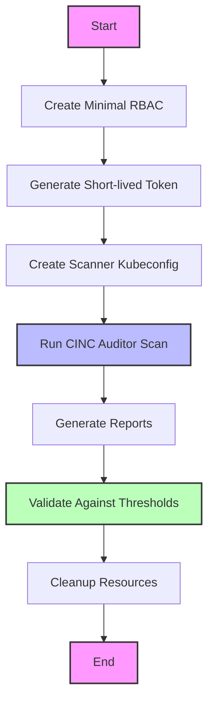
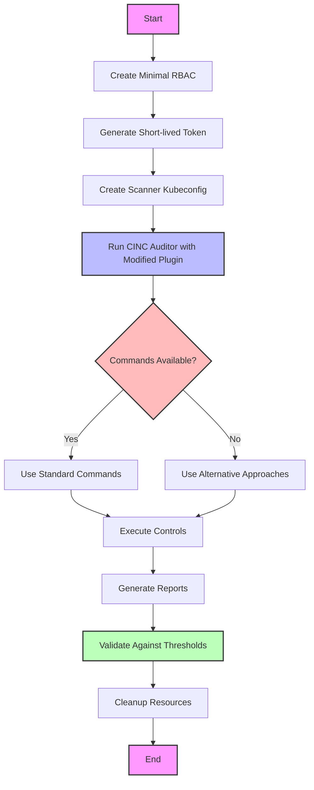
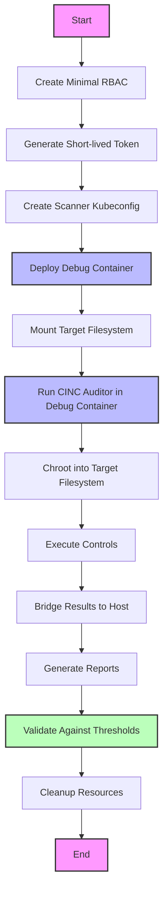
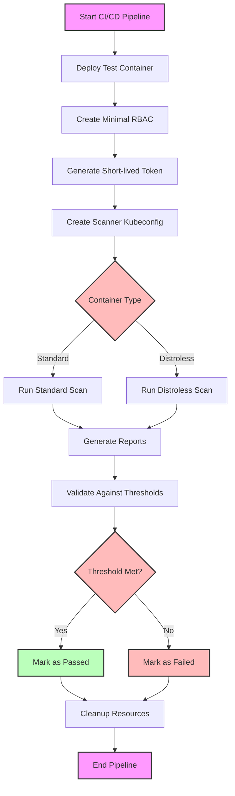
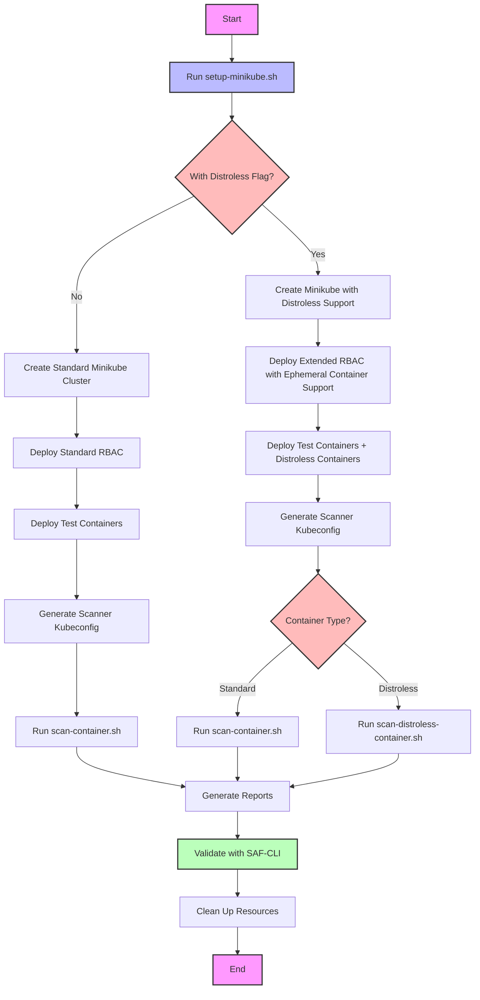
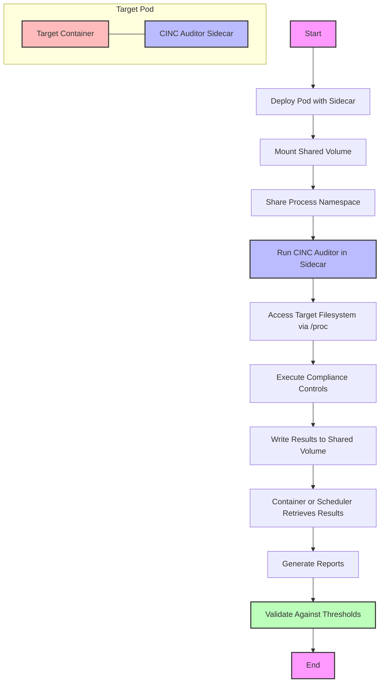
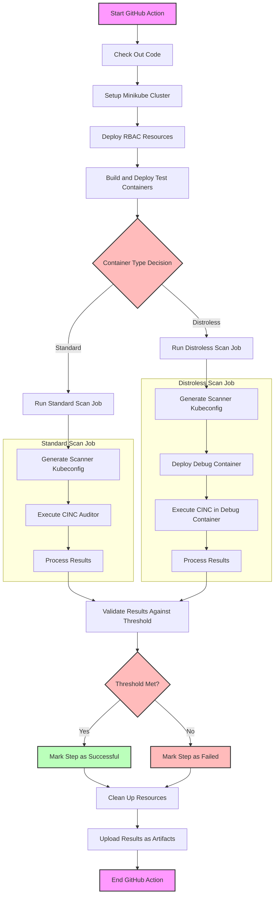
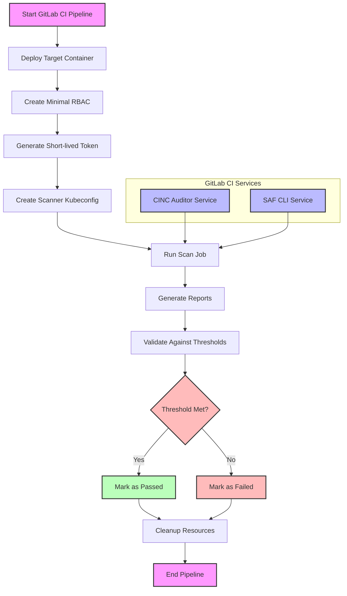

# Workflow Diagrams

This document provides workflow diagrams to help visualize the scanning process and approaches used in the Kubernetes CINC Secure Scanner. The diagrams are created using Mermaid syntax and can be rendered in GitHub and GitLab markdown viewers.

## Standard Container Scanning Workflow

## Distroless Container Scanning Approaches

### Approach 1: Modified Transport Plugin

This approach involves modifying the train-k8s-container plugin to support distroless containers by detecting when standard commands are unavailable and using alternative methods.

### Approach 2: Debug Container with CINC Auditor

This approach involves creating a debug container that mounts the target container's filesystem and scans it using chroot.

## CI/CD Integration Workflow

## Minikube Setup and Scanning Workflow

This diagram shows the complete workflow from setting up a Minikube environment to scanning containers.

## CINC Auditor Sidecar Container Approach

This diagram shows how a CINC Auditor sidecar container could be implemented for scanning.

## GitHub Actions Workflow

This diagram shows a detailed GitHub Actions workflow for container scanning.

## GitLab CI Integration with Services

This diagram shows how GitLab CI Services could be integrated into our scanning workflow.

